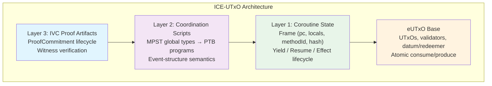
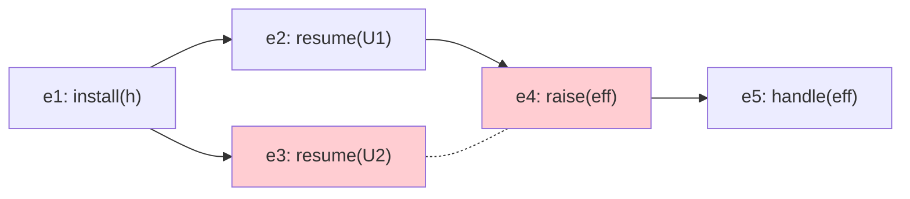
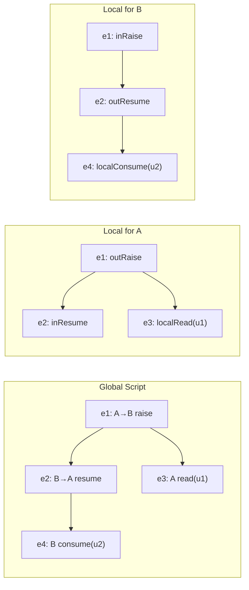
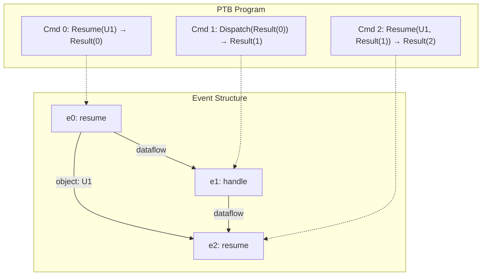
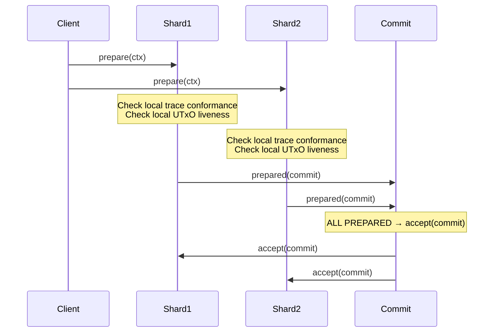
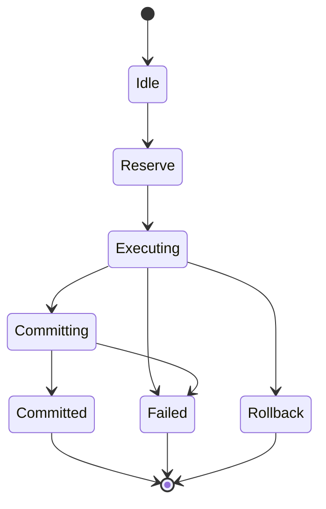
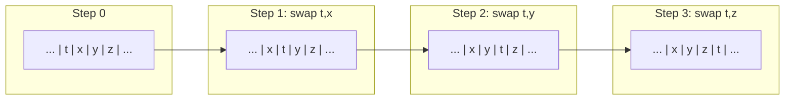
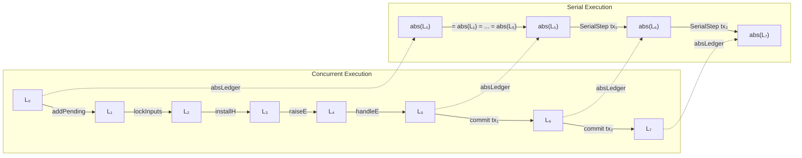
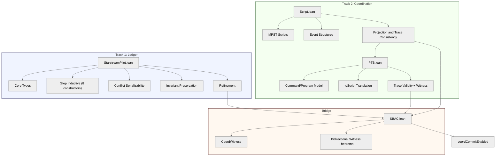

# 1. Introduction

## 1.1 The Problem: Transactions as Single-Shot Validators

In the extended UTxO (eUTxO) model pioneered by Cardano [Chakravarty et al., 2020], a transaction is a flat bundle: it consumes a set of input UTxOs, executes a validator for each, and produces a set of output UTxOs. Each validator is a pure function that receives its own datum, a redeemer supplied by the transaction author, and a read-only view of the transaction context. The validator returns a boolean: accept or reject. This model is elegant and compositional for simple transfers and single-step contracts, but it encounters fundamental limitations when applications demand richer interaction patterns.

**Multi-step interactions.** Consider a DeFi protocol in which two UTxOs must coordinate across several resume/yield cycles within a single atomic transaction. For instance, a collateralized loan liquidation may require: (1) reading an oracle UTxO for a price feed, (2) computing a liquidation amount in the borrower's UTxO, (3) transferring collateral to a liquidator UTxO, and (4) updating the protocol's global state UTxO --- all atomically. The eUTxO validator model has no notion of "pause and resume"; each validator executes exactly once, sees only its own datum, and cannot carry forward intermediate state.

**Cross-contract communication.** When two contracts need to exchange data mid-execution, the eUTxO model forces developers into one of two unsatisfying choices: encode the entire multi-contract interaction as a single monolithic validator (destroying modularity), or split the interaction across multiple transactions (destroying atomicity). Neither preserves both the modularity of separate contracts and the atomicity of a single transaction.

**Effect handling.** A UTxO frequently needs to request a service (an oracle lookup, a token burn authorization, a permission check) and receive a result before continuing its computation. The validator model provides no mechanism for structured effects: there is no way for a validator to "raise" a request, have it handled by some external service within the same transaction, and then "resume" with the result.

**Proof of coordination.** Even if one could engineer multi-step interactions through clever datum encoding, there is no standard way to *prove* that the interleaving was valid: that the schedule of operations respected causal dependencies and did not violate protocol invariants. The validity of the coordination is implicit in the validator logic, not an explicit, verifiable artifact.

The analogy is instructive: today's eUTxO validators are like sequential functions. What is needed is a model where transactions are *concurrent programs with communication*, and where the schedule itself is a *verified artifact*.

## 1.2 The Insight: Transactions as Multiparty Protocols

ICE-UTxO treats each transaction as an instance of a *multiparty session protocol*. This reframing resolves the limitations above by introducing three interlocking concepts:

**UTxO coroutines** are participants that can yield (pause execution) and resume, carrying their execution state as part of their UTxO datum. Concretely, each coroutine-enabled UTxO stores a *frame* (Definition 3.1) consisting of a program counter, local variables, a method identifier, and a hash binding the frame to its computational history. The UTxO lifecycle extends from `Created` through `Suspended_at_Yield` or `Suspended_at_Effect` to `Consumed` (the full lifecycle state machine is given in Section 4.1, Figure 7). A coroutine that yields produces a new UTxO with an updated frame; a coroutine that is consumed has completed its participation in the transaction.

**Effect handlers** are dynamically-scoped services installed by the coordination script. When a coroutine raises an effect (e.g., "I need the current ETH/USD price"), the effect propagates to the nearest installed handler for that interface. The handler processes the effect and resumes the coroutine with a result. This is the *algebraic effects* pattern from programming language theory [Plotkin and Pretnar, 2009], adapted to the blockchain setting. Handlers are installed and uninstalled explicitly via transaction commands, and their lifetimes are bounded by the transaction scope.

**Coordination scripts** are *global types* in the sense of multiparty session types (MPST) [Honda, Yoshida, and Carbone, 2016]. They specify the allowed interactions among roles as an *event structure* --- a partial order of events augmented with a conflict relation encoding mutual exclusion. The coordination script is the protocol; the compiled PTB program is a concrete schedule (a linearization of the event structure); and the IVC (incrementally verifiable computation) witness is a cryptographic certificate proving that the schedule conforms to the protocol. IVC proof generation is the dominant computational cost: each coroutine step produces an incremental proof that is composed with prior steps, with generation time proportional to the circuit complexity of the step function. Verification, by contrast, is constant-time regardless of the number of composed steps. The formalization abstracts over proof generation cost (see Section 9).

Each component addresses a distinct concern:
- MPST global types provide a specification language for multi-party coordination with well-studied safety and progress guarantees.
- Event structures provide partial-order semantics (not just total-order traces), modeling the independence of non-conflicting operations directly rather than through interleaving.
- PTB-style compilation provides a concrete, deterministic execution format amenable to on-chain validation.
- IVC/PCD (proof-carrying data) witnesses provide *proof-carrying transactions*: the transaction carries a cryptographic certificate of its own validity.

> **Core idea.** A transaction is a proof-carrying implementation of a multiparty protocol; the PTB program is the concrete schedule, and the IVC witness certifies its validity.

## 1.3 The Architecture: Three Layers on eUTxO

ICE-UTxO adds three layers to the eUTxO base model:

**Layer 1: Coroutine state on UTxOs.** Each UTxO optionally carries a *frame* $(pc, \mathit{locals}, \mathit{methodId}, \mathit{hash})$. The frame records the coroutine's suspension point, enabling it to be resumed in a future transaction step. The UTxO lifecycle extends the standard `Created`/`Consumed` states with intermediate states: `Suspended_at_Yield`, `Suspended_at_Effect`, `Reserved`, and `Executing`. This is the *process layer*.

**Layer 2: Transaction-level coordination.** A coordination script (global type) is compiled to a PTB-style program --- a sequence of commands with dataflow through temporary result registers $\mathit{Result}(i)$. Commands include `Resume`, `Raise`, `Install`, `Uninstall`, `Read`, `Consume`, `Produce`, `Lock`, and `Snapshot`. The PTB program replaces the flat validator model with a structured, typed schedule whose dataflow graph induces the event-structure order. This is the *protocol layer*.

**Layer 3: IVC proof artifacts.** The transaction carries proof commitments that certify the interleaving trace conforms to the coordination script. Each proof commitment has a lifecycle (`NotStarted` $\to$ `Generating` $\to$ `Verifying` $\to$ `Verified`). Validators check the proof, not re-execute the coroutine logic. This is the *verification layer*.

**Conservative extension.** When all three layers collapse --- no coroutines yield, no effects are raised, no coordination script is needed --- ICE-UTxO degenerates to standard eUTxO. Each input is validated once, the transaction applies atomically, and standard UTxO safety properties hold. The precise sense in which ICE-UTxO is a conservative extension is given in Section 4.5.



**Figure 1.** Architecture layers of ICE-UTxO. Layer 1 (coroutine state) extends UTxOs with frames; Layer 2 (coordination) compiles MPST global types to PTB programs; Layer 3 (verification) attaches IVC proof artifacts. The layered design ensures that when no coroutines yield and no effects are raised, all three layers collapse and ICE-UTxO degenerates to standard eUTxO.

## 1.4 Deployment Model: S-BAC for Cross-Shard Atomicity

When a transaction touches only *owned objects* (coroutine frames belonging to a single party), it can proceed on a fast path without full consensus. When it touches *shared objects* (effect handlers, shared state across shards), it requires consensus for atomic commit. ICE-UTxO adopts the Sharded Byzantine Atomic Commit (S-BAC) protocol from Chainspace [Al-Bassam et al., 2018]:

- Each shard checks its *local projection* of the coordination script during the prepare phase. The shard verifies that its local roles' traces conform to their projected local types and that local UTxOs are live.
- The IVC witness lets shards validate the interleaving without re-executing private computation; the witness serves as Chainspace-style *evidence*.
- If all shards prepare successfully, the transaction commits; if any shard aborts, all abort.

The mapping from Chainspace to ICE-UTxO is clean:

| Chainspace | ICE-UTxO |
|---|---|
| Object | Frame-carrying UTxO |
| Procedure bundle | PTB program + IVC witness |
| Checker | Witness verifier + ledger checks |
| S-BAC | Cross-shard atomic commit |

## 1.5 Formal Verification: Zero Sorry, Zero Axioms

The ICE-UTxO model has been fully formalized in Lean 4 in about 4,500 lines of code across eleven source files (including `test_axioms.lean`) plus `lakefile.lean`, organized in four core modules (`StarstreamPilot.lean`, `Script.lean`, `PTB.lean`, `SBAC.lean`) and supporting oracle modules. The mechanization achieves:

- **Zero sorry**: no admitted lemmas anywhere in the development.
- **Zero custom axioms**: only the standard Lean kernel axioms (`propext`, `Quot.sound`, `funext`).
- **Minimal classical reasoning**: `Classical.choice` is never invoked, and the development uses a single localized `classical` case split; the proofs are otherwise constructive.

Key mechanized results include: conflict serializability via a constructive bubble-sort argument, concurrent-to-serial refinement via stuttering simulation, MPST projection preserving traces, cross-role trace reconstruction from local conformance, and proof-gated commit guarantees. The entire development is machine-checked and largely constructive.

## 1.6 Contributions

This paper makes the following contributions:

1. **ICE-UTxO model.** A conservative extension of eUTxO with coroutines, algebraic effects, and proof-carrying transactions, formalized as a concurrent ledger with an 8-constructor small-step relation (Section 3--4).

2. **Coordination scripts.** A formal language for multiparty coordination based on MPST global types with event-structure semantics, including well-formedness rules, projection to local types, and local conformance checking (Section 3).

3. **PTB compilation.** Translation from coordination scripts to PTB-style bytecode with explicit dataflow through result registers, object access constraints, and handler lifetime management (Section 3).

4. **S-BAC integration.** Shard-local verification using projected coordination scripts, enabling cross-shard atomic commit without re-executing coroutine logic (Section 3, 6).

5. **Lean 4 mechanization.** Complete formal verification with zero sorry, zero custom axioms, and mostly constructive proofs (one localized classical split), including strong conflict serializability, concurrent-to-serial refinement, invariant preservation, and MPST-to-ledger bridge theorems (Section 7, Appendix A).

6. **Strong serializability proof.** A constructive bubble-sort proof that acyclic full-conflict precedence graphs imply all conflict-respecting permutations produce the same core state --- the universal diamond property for UTxO ledger histories (Section 5).

## 1.7 How to Read This Paper

**For blockchain developers**: Sections 1, 3.1--3.4, and 4.1--4.3 introduce the model and its operational behavior. The collateralized loan example in Sections 1.1 and 3.2 (Figure 3) provides a concrete running scenario; Section 3.5.5 shows how it compiles to a PTB program.

**For formal methods researchers**: Sections 3.3 (event-structure semantics), 5 (serializability via bubble-sort), and 6 (refinement) contain the main theoretical contributions. Section 7 documents the Lean mechanization.

**For protocol designers**: Sections 3.6 (S-BAC integration), 4.2 (security assumptions), and 6.2 (coordination witnesses) describe the deployment architecture and its trust boundaries.

**Prerequisites**: familiarity with UTxO-based ledgers (Section 2.1 provides a review), basic set theory, and comfort reading formal definitions. No Lean 4 expertise is required to follow the paper; Appendix A provides Lean signatures as reference.

## 1.8 Paper Roadmap

Section 2 reviews background on eUTxO, MPST, event structures, PTBs, and S-BAC. Section 3 presents the ICE-UTxO model in full: state components, coordination scripts, event-structure semantics, projection, PTB compilation, and S-BAC integration. Section 4 defines the operational semantics and proves ledger safety invariants. Section 5 establishes strong conflict serializability via the bubble-sort construction. Section 6 bridges the MPST coordination layer to the ledger commit mechanism through trace consistency and refinement theorems. Section 7 discusses the Lean 4 mechanization, including architecture, theorem inventory, lessons learned, and metrics. Section 8 surveys related work. Section 9 discusses limitations and future directions. Section 10 concludes.

**Acronyms and Abbreviations.**

| Acronym | Expansion |
|---|---|
| eUTxO | Extended Unspent Transaction Output |
| ICE | Interleaving Coroutine Effects |
| IVC | Incrementally Verifiable Computation |
| MPST | Multiparty Session Types |
| PCD | Proof-Carrying Data |
| PTB | Programmable Transaction Block |
| S-BAC | Sharded Byzantine Atomic Commit |
| ZK | Zero-Knowledge (proof) |

---

# 2. Background

This section reviews the five technical foundations that ICE-UTxO builds upon: extended UTxO ledgers, multiparty session types, event structures, programmable transaction blocks, and sharded Byzantine atomic commit.

## 2.1 Extended UTxO

Bitcoin's UTxO model represents value as *unspent transaction outputs*. Each UTxO carries a locking script; a transaction consumes UTxOs by providing unlocking scripts (witnesses) and produces fresh UTxOs. The model is naturally parallel --- distinct UTxOs are independent --- but expressiveness is limited to simple predicates over signatures and timelocks.

The *extended UTxO* (eUTxO) model [Chakravarty et al., 2020] augments each UTxO with a typed *datum* (persistent state) and each spending transaction with a *redeemer* (argument). A *validator* is a pure function
$$\mathit{validator} : \mathit{Datum} \times \mathit{Redeemer} \times \mathit{TxContext} \to \mathit{Bool}$$
where $\mathit{TxContext}$ provides a read-only view of the transaction's inputs, outputs, and metadata. Cardano implements eUTxO with Plutus validators.

The eUTxO model is the starting point for ICE-UTxO. We preserve its core invariant --- inputs are consumed atomically and outputs are fresh --- while extending it with coroutine state, effect handling, and proof-carrying transactions.

## 2.2 Multiparty Session Types

Multiparty session types (MPST) [Honda, Yoshida, and Carbone, 2016] provide a type discipline for communication protocols among multiple participants. A *global type* $G$ specifies the complete protocol from an omniscient perspective:
$$G ::= p \to q : \langle S \rangle . G \mid G_1 + G_2 \mid \mu X . G \mid X \mid \mathbf{end}$$
where $p \to q : \langle S \rangle$ denotes a message of type $S$ from role $p$ to role $q$.

*Projection* extracts from $G$ a *local type* $L_r = G \upharpoonright r$ for each role $r$, describing only the interactions visible to $r$. The fundamental metatheory guarantees:

- **Communication safety**: well-typed processes never encounter unexpected messages.
- **Protocol conformance**: each participant's behavior matches its local type.
- **Progress**: under suitable conditions, well-typed sessions do not deadlock.

Subsequent work extended MPST to handle interleaved sessions with global progress guarantees [Bettini et al., 2008; Coppo et al., 2013], rely/guarantee reasoning beyond syntactic duality [Scalas and Yoshida, 2018], and event-structure semantics for asynchronous protocols [Castellani, Dezani-Ciancaglini, and Giannini, 2024].

ICE-UTxO uses MPST global types as the specification language for coordination scripts, with event-structure semantics as the primary semantic domain.

## 2.3 Event Structures

An *event structure* [Winskel, 1986] is a triple $(E, \leq, \#)$ where:
- $E$ is a set of events,
- $\leq$ is a partial order (causality),
- $\#$ is a symmetric, irreflexive *conflict* relation,

subject to the axiom that conflict is *hereditary*: if $e \mathbin{\#} f$ and $e \leq e'$, then $e' \mathbin{\#} f$.

A *configuration* is a finite set $C \subseteq E$ that is:
1. **Conflict-free**: $\forall e, f \in C.\; \neg(e \mathbin{\#} f)$
2. **Down-closed**: $\forall e \in C.\; \forall e'.\; e' \leq e \implies e' \in C$

An event $e$ is *enabled* in configuration $C$ if $e \notin C$, all predecessors of $e$ are in $C$, and $e$ does not conflict with any event in $C$. A *valid trace* is a sequence $[e_1, \ldots, e_n]$ such that there exists a chain of configurations $\emptyset = C_0 \to C_1 \to \cdots \to C_n$ where each $C_i = C_{i-1} \cup \{e_i\}$ and $e_i$ is enabled in $C_{i-1}$.

Event structures generalize both interleaving and true-concurrency models. Every configuration has at least one linearization (valid trace), and independent events can be executed in any order.



**Figure 2.** Example event-structure DAG. Solid arrows denote causal order ($<$); the dashed line between $e_3$ and $e_4$ denotes conflict ($\#$), meaning a valid configuration may include one but not both. This structure illustrates how event structures capture both causal dependencies and mutual exclusion without resorting to total-order interleaving.

## 2.4 Programmable Transaction Blocks

Sui [Blackshear et al., 2023] introduced *Programmable Transaction Blocks* (PTBs) as a transaction format that goes beyond single function calls. A PTB is a sequence of commands $[c_0, \ldots, c_{n-1}]$ where each command $c_i$ draws inputs from two sources --- *objects* supplied by the transaction sender and *results* produced by earlier commands --- executes an action, and stores its output in register $\mathit{Result}(i)$:

```
Command[0]: Call(Module::function_a, obj1)       -> Result(0)
Command[1]: Call(Module::function_b, Result(0))   -> Result(1)
Command[2]: Call(Module::function_c, obj2, Result(1)) -> Result(2)
```

This *result chaining* composes multiple contract calls into a single atomic transaction with typed dataflow. The schedule is an explicit, inspectable artifact --- not an emergent property of VM execution --- which is what enables proof-carrying transactions: the PTB program *is* the proposed trace, and its structure can be statically analyzed for dependency and conflict edges before execution.

Sui further distinguishes *owned objects* (exclusive access, fast path without consensus) from *shared objects* (concurrent access, requires consensus for ordering). Owned objects take a fast path via Byzantine Consistent Broadcast, bypassing full consensus entirely; shared objects require total ordering through the consensus protocol. This dichotomy maps naturally to ICE-UTxO's coroutine frames (owned, single-writer) vs. effect handlers (shared, multi-accessor).

ICE-UTxO adopts the PTB pattern as a *compilation target* for coordination scripts: the global type compiles to a PTB-style program whose dataflow graph induces event-structure order edges. Section 3.5 formalizes this compilation and proves that well-formed PTB programs produce well-formed event structures.

## 2.5 Sharded Byzantine Atomic Commit (S-BAC)

Chainspace [Al-Bassam et al., 2018] introduced S-BAC for atomic transactions across shards in a Byzantine setting. The protocol operates in two phases:

1. **Prepare**: each concerned shard $s$ checks local validity --- the objects touched by the transaction on shard $s$ are active (not consumed or locked), the transaction's checker predicate passes for those objects, and the shard is willing to commit. The shard emits $\mathit{prepared}(\mathit{commit})$ or $\mathit{prepared}(\mathit{abort})$ with its signature.

2. **Accept**: if *all* concerned shards emit $\mathit{prepared}(\mathit{commit})$, the transaction commits and objects are consumed/created. If *any* shard emits $\mathit{prepared}(\mathit{abort})$, the transaction aborts and all locks are released.

Key properties:
- Objects are immutable once created; they transition from *active* to *inactive* upon consumption.
- The client executes procedures locally and provides *evidence* so that shards can run checkers without re-executing private computation.
- Objects are locked during the prepare/accept window to prevent conflicting concurrent commits.

ICE-UTxO adopts S-BAC for cross-shard atomic commit when a transaction's coordination script touches shared objects across multiple shards. The IVC witness serves as Chainspace-style evidence, enabling shard-local validation via projected coordination scripts.

---
# 3. The ICE-UTxO Model

This section presents the formal ICE-UTxO model. Definitions and theorems are numbered independently (e.g., Definition 3.17 and Theorem 3.1 coexist in Section 3.4); each counter is scoped to Section 3.

## 3.1 State Components

The ICE-UTxO model extends eUTxO with structured state for coroutines, effects, proofs, and coordination. Where the standard eUTxO model has only UTxOs and transactions, ICE-UTxO adds four new concepts: effects (requests from coroutines to services), handlers (services that process effects), proof commitments (IVC certificates tracking verification status), and an extended ledger with effect queues and handler stacks.

We use the following identifier domains, all drawn from $\mathbb{N}$: $\mathit{UTXOId}$, $\mathit{TxId}$, $\mathit{InterfaceId}$, $\mathit{ProcessId}$, $\mathit{CommitmentHash}$. The formalization does not impose size limits on frames or UTxO datums; in a deployment, maximum frame size would be bounded by transaction size limits (analogous to Cardano's max transaction size or Ethereum's block gas limit), and storage costs would be proportional to frame size.

**Definition 3.1 (Effect).** An effect is a triple $e = (\mathit{iface}, \mathit{source}, \mathit{tag})$ where $\mathit{iface} : \mathit{InterfaceId}$ identifies the target interface, $\mathit{source} : \mathit{UTXOId}$ identifies the raising coroutine, and $\mathit{tag} : \mathbb{N}$ distinguishes effect operations.

**Definition 3.2 (Handler).** A handler is a pair $h = (\mathit{iface}, \mathit{hid})$ where $\mathit{iface}$ identifies the interface and $\mathit{hid}$ is a unique handler identifier.

**Definition 3.3 (Proof Commitment).** A proof commitment records the status of an IVC/PCD proof:
$$p = (\mathit{proofKind}, \mathit{processId}, \mathit{commitHash}, \mathit{verifyKey}, \mathit{phase}, \mathit{stepNumber})$$
where $\mathit{proofKind} \in \{\text{IVC\_Step}, \text{IVC\_Accumulator}, \text{Witness}\}$ and $\mathit{phase}$ follows the lifecycle:
$$\text{NotStarted} \to \text{Generating} \to \text{Verifying} \to \text{Verified}$$
with failure edges from $\text{Generating}$ and $\text{Verifying}$ to $\text{Failed}$. The $\mathit{commitHash}$ field binds the proof to the transaction context; it is intended to be computed as a hash over the transaction's inputs, outputs, and coordination witness, providing anti-replay protection (a proof generated for one transaction context cannot be reused in another). The exact hash input is not formalized in the current mechanization (see Section 4.2, Security Assumption 1).

**Definition 3.4 (Transaction).** A transaction is:
$$\mathit{tx} = (\mathit{id}, \mathit{inputs}, \mathit{outputs}, \mathit{readSet}, \mathit{writeSet}, \mathit{proofCommitments}, \mathit{phase})$$
where $\mathit{inputs}, \mathit{outputs}, \mathit{readSet}, \mathit{writeSet} : \mathcal{P}_{\text{fin}}(\mathit{UTXOId})$, $\mathit{proofCommitments} : \text{List}(\mathit{ProofCommitment})$, and $\mathit{phase} \in \{\text{Idle}, \text{Reserve}, \text{Executing}, \text{Committing}, \text{Committed}, \text{Rollback}, \text{Failed}\}$.

**Definition 3.5 (Ledger).** The ledger state is:
$$L = (\mathit{utxos}, \mathit{consumed}, \mathit{locked}, \mathit{pending}, \mathit{history}, \mathit{effects}, \mathit{handlerStacks})$$
where:
- $\mathit{utxos}, \mathit{consumed}, \mathit{locked} : \mathcal{P}_{\text{fin}}(\mathit{UTXOId})$
- $\mathit{pending} : \mathcal{P}_{\text{fin}}(\mathit{Tx})$
- $\mathit{history} : \text{List}(\mathit{Tx})$ (committed transactions in order)
- $\mathit{effects} : \mathit{InterfaceId} \to \text{List}(\mathit{Effect})$ (pending effect queues)
- $\mathit{handlerStacks} : \mathit{InterfaceId} \to \text{List}(\mathit{Handler})$ (installed handler stacks)

The effects and handler stacks are organized per-interface as stacks, supporting dynamic installation and uninstallation of handlers. Frames are authenticated by the $\mathit{hash}$ field in Definition 3.1 (in the companion specification), which chains each frame to its computational history: a resumed coroutine can verify that its frame has not been tampered with by checking the hash against the preceding frame. In a deployment, the hash is checked by the IVC circuit (Layer 3) rather than by the ledger model itself; the formalization treats frame integrity as guaranteed by proof verification (Section 4.2).

## 3.2 Coordination Scripts as Global Types

A coordination script specifies the allowed interactions among roles in a transaction. We formalize scripts as labeled event structures with role annotations.

**Definition 3.6 (Role Kind).** $\mathit{RoleKind} ::= \text{utxo} \mid \text{iface} \mid \text{shard}$.

**Definition 3.7 (Action).** The action grammar labels events in a coordination script:

$$\begin{aligned}
\mathit{Action} ::=\; & r_1 \to r_2 : \texttt{raise}(i, \mathit{tag}) \\
\mid\; & r_1 \to r_2 : \texttt{resume}(i, \mathit{tag}) \\
\mid\; & r_1 \to r_2 : \texttt{install}(h) \\
\mid\; & r_1 \to r_2 : \texttt{uninstall}(i) \\
\mid\; & r : \texttt{read}(u) \mid r : \texttt{consume}(u) \mid r : \texttt{produce}(u) \\
\mid\; & r : \texttt{lock}(u) \mid r : \texttt{snapshot}(u)
\end{aligned}$$

Actions are either *communication actions* (with sender $r_1$ and receiver $r_2$) for raise/resume/install/uninstall, or *local actions* for UTxO operations performed by a single role. *(Mechanized: `inductive Action` in Script.lean; accessor functions for UTxO access, interface usage, and role participation are extended in PTB.lean.)*

**Definition 3.8 (Script).** A script is a tuple $S = (\mathit{roles}, \mathit{roleKind}, E, \mathit{lab}, {<}, {\#})$ where:
- $\mathit{roles} : \mathcal{P}_{\text{fin}}(\mathit{RoleId})$ and $\mathit{roleKind} : \mathit{RoleId} \to \mathit{RoleKind}$
- $E : \mathcal{P}_{\text{fin}}(\mathit{EventId})$ is the set of events
- $\mathit{lab} : \mathit{EventId} \to \mathit{Action}$ labels each event
- ${<} \subseteq E \times E$ is a strict partial order (causal dependencies)
- ${\#} \subseteq E \times E$ is a symmetric, irreflexive conflict relation

**Example.** A coordination script for a collateralized loan liquidation:

```
script LiquidationProtocol {
  roles: oracle: iface, borrower: utxo, liquidator: utxo, coordinator: shard;
  events:
    e1: coordinator -> oracle : install(priceHandler);
    e2: borrower -> oracle : raise(getPrice, ETH_USD);
    e3: oracle -> borrower : resume(priceResult, 1500);
    e4: borrower : consume(collateralUtxo);
    e5: liquidator : produce(liquidatedUtxo);
    e6: coordinator -> oracle : uninstall(priceHandler);
  constraints:
    e1 < e2; e2 < e3; e3 < e4; e4 < e5; e5 < e6; e1 < e6;
}
```

**Figure 3.** Example coordination script with action grammar. Events are labeled by actions and constraints specify causal order, requiring the price handler to be installed before the oracle interaction and uninstalled after all operations complete. This illustrates how coordination scripts serve as global types that govern the interaction pattern among UTxO coroutines within a single atomic transaction.

**Definition 3.9 (Well-Formedness).** A script $S$ is *well-formed*, written $\mathit{WF}(S)$, if all of the following hold:

- **WF-Order** (`orderDom`, `orderAcyclic`): ${<}$ is acyclic and irreflexive, and both endpoints of every edge are in $E$.
- **WF-Conflict** (`conflictDom`, `conflictIrrefl`, `conflictSymm`): ${\#}$ is symmetric and irreflexive, both endpoints are in $E$.
- **WF-Roles** (`rolesOK`): all roles referenced in event labels are declared in $\mathit{roles}$.
- **WF-RoleKind** (`roleKindOK`): UTxO operations ($\texttt{read}$, $\texttt{consume}$, etc.) are performed only by roles of kind $\text{utxo}$.

In the Lean formalization, well-formedness is a conjunction of these seven predicates, all defined in `Script.lean`.

## 3.3 Event-Structure Semantics

We equip scripts with standard event-structure semantics. Intuitively, a *configuration* is a snapshot of "what has happened so far" (a consistent set of completed events), *enablement* asks "what can happen next?" (an event whose prerequisites are met and that doesn't conflict with anything already done), and a *valid trace* is a complete record of events that could have been produced by following enablement rules from the empty state. The definitions below are mechanized in `Script.lean`.

**Definition 3.10 (Configuration).** A set $C \subseteq E$ is a *configuration* of script $S$ if:
1. $C \subseteq S.\mathit{events}$
2. $C$ is conflict-free: $\forall e, f \in C.\; \neg(e \mathbin{\#} f)$
3. $C$ is down-closed: $\forall e \in C.\; \forall e'.\; e' < e \implies e' \in C$

**Definition 3.11 (Enablement).** Event $e$ is *enabled* in configuration $C$, written $\mathit{enabled}(e, C)$, if:
1. $e \in S.\mathit{events}$ and $e \notin C$
2. $\forall e'.\; e' < e \implies e' \in C$ (all predecessors present)
3. $\forall f \in C.\; \neg(e \mathbin{\#} f)$ (no conflict with $C$)

**Definition 3.12 (Step and Valid Trace).** A step $C \to C'$ fires an enabled event: $\exists e.\; \mathit{enabled}(e, C) \wedge C' = C \cup \{e\}$. A *valid trace* is a sequence $[e_1, \ldots, e_n]$ admitting a chain $\emptyset = C_0 \to C_1 \to \cdots \to C_n$ of configurations.

These definitions are replicated for local scripts (`LocalScript`) with identical structure, ensuring the same semantic framework applies at both global and local levels.

## 3.4 Projection and Local Conformance

Projection extracts from a global script the view of a single role.

The role-kind system enforces a permission discipline on which actions each kind of role may perform:

| Action | `utxo` | `iface` | `shard` |
|---|---|---|---|
| `read`, `consume`, `produce`, `lock`, `snapshot` | yes | no | no |
| `raise` (sender) | yes | no | no |
| `resume` (sender) | no | yes | no |
| `install`, `uninstall` (sender) | no | no | yes |
| Any action (receiver) | yes | yes | yes |

This matrix is enforced by the **WF-RoleKind** predicate (Definition 3.9): UTxO operations are restricted to roles of kind `utxo`, effect handling to `iface` roles, and handler lifecycle management to `shard` roles. Any role kind may appear as a receiver.

**Definition 3.13 (Participation).** Role $r$ *participates* in event $e$ if $r$ appears as sender or receiver in $\mathit{lab}(e)$, or $\mathit{lab}(e)$ is a UTxO action performed by $r$. Formally, $r \in \mathit{participants}(\mathit{lab}(e))$, where $\mathit{participants}$ extracts the set of roles from an action.

**Definition 3.14 (Relevance).** Event $e$ is *relevant* to role $r$, written $\mathit{relevant}(r, e)$, if $\mathit{toLocal}(r, \mathit{lab}(e)) \neq \text{None}$, where $\mathit{toLocal}$ converts a global action to a local action from $r$'s perspective:
- $r_1 \to r_2 : \texttt{raise}(i, t)$ becomes $\texttt{outRaise}(r_2, i, t)$ if $r = r_1$, or $\texttt{inRaise}(r_1, i, t)$ if $r = r_2$.
- UTxO actions become local variants (e.g., $r : \texttt{read}(u)$ becomes $\texttt{localRead}(u)$).
- Otherwise $\text{None}$.

**Definition 3.15 (Projection).** Given script $S$ and role $r$, the projection $\mathit{Proj}(S, r)$ is the local script:
$$\mathit{Proj}(S, r) = (E_r, \mathit{lab}_r, {<_r}, {\#_r})$$
where $E_r = \{e \in E \mid \mathit{relevant}(r, e)\}$, and ${<_r}$, ${\#_r}$ are the restrictions of ${<}$, ${\#}$ to $E_r \times E_r$, and $\mathit{lab}_r(e) = \mathit{toLocal}(r, \mathit{lab}(e))$.



**Figure 4.** Projection example showing how a global script (left) decomposes into local scripts for role A (center) and role B (right). Each role sees only its own events --- $e_4$ is invisible to A and $e_3$ is invisible to B --- enabling shard-local verification against the projected type rather than the full global script.

**Definition 3.16 (Trace Projection).** $\mathit{traceProj}(S, r, \mathit{tr}) = \mathit{tr}.\texttt{filter}(\mathit{relevant}(r, \cdot))$.

**Definition 3.17 (Local Conformance).** Script $S$ *locally conforms* for role $r$ on trace $\mathit{tr}$, written $\mathit{localConform}(S, r, \mathit{tr})$, if $\mathit{Proj}(S, r)$ is well-formed and $\mathit{tr}$ is a valid trace of $\mathit{Proj}(S, r)$.

**Theorem 3.1 (Projection Preserves Well-Formedness).** If $\mathit{WF}(S)$ then $\mathit{WF}(\mathit{Proj}(S, r))$ for all roles $r$. *(Mechanized: `project_wellFormed`, Script.lean.)*

**Theorem 3.2 (Projection Preserves Traces).** If $\mathit{tr}$ is a valid trace of $S$, then $\mathit{traceProj}(S, r, \mathit{tr})$ is a valid trace of $\mathit{Proj}(S, r)$. *(Mechanized: `proj_validTrace`, Script.lean.)*

**Corollary 3.3 (Global Conformance Implies Local).** If $S$ globally conforms on trace $\mathit{tr}$, then $S$ locally conforms for every role $r$ on $\mathit{traceProj}(S, r, \mathit{tr})$. *(Mechanized: `proj_localConform_of_globalConform`, Script.lean.)*

## 3.5 PTB Compilation

A coordination script is compiled to a PTB-style program for deterministic execution. The PTB program is the *compilation target*; the script's event structure is the *semantic source*. This section formalizes the command model, the translation to event structures, and the key correctness theorems. All definitions and theorems in this section are mechanized in `PTB.lean` (609 lines).

**Section overview.** Section 3.5.1 defines the command and program data structures. Section 3.5.2 derives dependency and conflict relations from the program structure. Section 3.5.3 translates PTB programs to event-structure scripts and proves well-formedness. Section 3.5.4 establishes trace validity and witness construction theorems. Section 3.5.5 gives a worked example.

### 3.5.1 Command Model

**Definition 3.18 (Command).** A command is a triple $c = (\mathit{action}, \mathit{uses}, \mathit{conflicts})$ where $\mathit{action} : \mathit{Action}$ is the operation to perform, $\mathit{uses} : \mathcal{P}_{\text{fin}}(\mathbb{N})$ identifies result registers consumed as inputs, and $\mathit{conflicts} : \mathcal{P}_{\text{fin}}(\mathbb{N})$ records explicit conflict edges (from choice or guarded branches).

**Definition 3.19 (Program).** A PTB program is a list of commands $P = [c_0, \ldots, c_{n-1}]$. Command $c_i$ stores its output in register $\mathit{Result}(i)$, and may reference $\mathit{Result}(j)$ for $j \in c_i.\mathit{uses}$ as input. **Well-formedness constraint**: all result references must be backward-looking, i.e., $j < i$ for every $j \in c_i.\mathit{uses}$. This is enforced structurally by the $i < j$ guard in the `orderRel` definition (Definition 3.22), which ensures acyclicity of the induced event structure (Theorem 3.7). A PTB compiler should statically reject programs containing forward references.

**Definition 3.20 (Config).** A PTB configuration $(\mathit{roles}, \mathit{roleKind})$ maps identifiers to roles and roles to kinds, connecting the PTB to the coordination layer's role structure. (In the Lean mechanization, this corresponds to `structure Config` in PTB.lean; an extended variant `AccessConfig` adds `utxoRole` and `ifaceRole` mappings used by the witness construction theorems.)

### 3.5.2 Derived Relations

Given a program $P$, we derive three dependency relations (`dataDep`, `utxoDep`, `handlerDep`) that contribute to the causal order, plus one conflict marker (`explicitConflict`) for choice branches, and combine these into two structural relations: `orderRel` (causal order) and `conflictRel` (mutual exclusion). Each action $a$ exposes accessor functions: $a.\mathit{readUtxos}$, $a.\mathit{writeUtxos}$, $a.\mathit{consumedUtxos}$, $a.\mathit{ifaceUses}$, $a.\mathit{ifaceInstalls}$, $a.\mathit{ifaceUninstalls}$.

**Definition 3.21 (Dependencies).** For commands $c_i, c_j$ with $i < j$:

- $\mathit{dataDep}(i, j) \iff i \in c_j.\mathit{uses}$ — result register dependency
- $\mathit{utxoDep}(i, j) \iff c_i.\mathit{writeUtxos} \cap c_j.\mathit{utxoAccesses} \neq \emptyset \;\lor\; c_j.\mathit{writeUtxos} \cap c_i.\mathit{utxoAccesses} \neq \emptyset$ — read-write or write-write overlap
- $\mathit{handlerDep}(i, j) \iff c_i.\mathit{ifaceInstalls} \cap c_j.\mathit{ifaceUses} \neq \emptyset \;\lor\; c_i.\mathit{ifaceUses} \cap c_j.\mathit{ifaceUninstalls} \neq \emptyset$ — install-before-use or use-before-uninstall

**Definition 3.22 (Order Relation).** $\mathit{orderRel}(i, j) \iff i < |P| \;\wedge\; j < |P| \;\wedge\; i < j \;\wedge\; (\mathit{dataDep}(i,j) \lor \mathit{utxoDep}(i,j) \lor \mathit{handlerDep}(i,j))$.

**Definition 3.23 (Conflict Relation).** $\mathit{conflictRel}(i, j) \iff i < |P| \;\wedge\; j < |P| \;\wedge\; i \neq j \;\wedge\; (c_i.\mathit{consumedUtxos} \cap c_j.\mathit{consumedUtxos} \neq \emptyset \;\lor\; c_i.\mathit{ifaceInstalls} \cap c_j.\mathit{ifaceInstalls} \neq \emptyset \;\lor\; \mathit{explicitConflict}(i, j))$.

The conflict relation is symmetric (`conflictRel_symm`, PTB.lean) and irreflexive by the $i \neq j$ guard.

**Scalability.** Both `orderRel` and `conflictRel` are computed pairwise over the program's commands, yielding $O(n^2)$ relation checks for a program of $n$ commands. For the PTB programs arising in practice (typically 5--50 commands per transaction), this is negligible. For larger programs, the relation checks can be accelerated by indexing commands by their accessed UTxOs and interfaces, reducing the pairwise scan to checks between commands sharing a resource. The formalization does not model this optimization.

### 3.5.3 Translation to Event Structure

**Definition 3.24 (toScript).** Given configuration $\mathit{cfg}$ and program $P$, the induced script is:
$$\mathit{toScript}(\mathit{cfg}, P) = (\mathit{cfg}.\mathit{roles},\; \mathit{cfg}.\mathit{roleKind},\; \{0, \ldots, |P|-1\},\; \lambda i.\, c_i.\mathit{action},\; \mathit{orderRel},\; \mathit{conflictRel})$$

The definition directly transliterates `Program.toScript` in PTB.lean.

**Theorem 3.7 (toScript Well-Formedness).** If $P$ satisfies $\mathit{rolesOK}$ and $\mathit{roleKindOK}$ with respect to $\mathit{cfg}$, then $\mathit{toScript}(\mathit{cfg}, P)$ is well-formed in the sense of Definition 3.9.

*Proof sketch.* The seven well-formedness predicates decompose as follows. **WF-Order** and **WF-Conflict**: both endpoints are in $\{0, \ldots, |P|-1\}$ by the bound guards in the relation definitions. **WF-Irrefl** and **WF-Symm** for conflict: irreflexivity follows from $i \neq j$; symmetry from `conflictRel_symm`. **WF-Acyclic**: if $\mathit{orderRel}^+(i, i)$ held, then $i < i$ by transitivity of the $i < j$ constraint in each order edge — contradiction. **WF-Roles** and **WF-RoleKind**: by hypothesis. *(Mechanized: `Program.toScript_wellFormed`, PTB.lean; see Appendix A.9.)*



**Figure 5.** PTB compilation mapping commands to event structures. Left: three PTB commands with result chaining; right: the induced event structure with dataflow edges (from Result dependencies) and object-access edges (both access U1). This mapping shows how the concrete PTB execution format generates the causal order that the event-structure semantics requires.

### 3.5.4 Valid Traces and Witness Construction

The PTB program order $[0, 1, \ldots, n-1]$ is the *proposed trace*. The following theorems establish when this trace --- or a filtered sub-trace --- is valid with respect to the induced event structure.

**Theorem 3.8 (validTrace\_trace).** If $P$ has no conflicts ($\forall i, j.\; \neg\mathit{conflictRel}(i,j)$), then the full program-order trace $[0, \ldots, |P|-1]$ is a valid trace of $\mathit{toScript}(\mathit{cfg}, P)$.

*Proof sketch.* By induction on $|P|$. At step $k$, the configuration is $\{0, \ldots, k-1\}$. Event $k$ is enabled: (a) all predecessors under $\mathit{orderRel}$ have index $< k$ and are already in the configuration; (b) no conflict exists by hypothesis. *(Mechanized: `Program.validTrace_trace`, PTB.lean; see Appendix A.10.)*

**Theorem 3.9 (validTrace\_traceOf).** Given a predicate $\mathit{keep} : \mathbb{N} \to \mathit{Bool}$ such that $P$ is conflict-free on $\mathit{keep}$ and $\mathit{keep}$ is down-closed with respect to $\mathit{orderRel}$, the filtered trace $P.\mathit{traceOf}(\mathit{keep})$ is a valid trace of $\mathit{toScript}(\mathit{cfg}, P)$.

*Proof sketch.* As for Theorem 3.8, but the configuration at each step is the filtered prefix. Down-closure ensures predecessors are present; conflict-freedom on $\mathit{keep}$ ensures enablement. *(Mechanized: `Program.validTrace_traceOf`, PTB.lean.)*

**Theorem 3.10 (crossRoleSafe\_of\_access).** If every command's access roles are contained in its participant set ($\mathit{accessRolesOK}$) and explicit conflicts are shared ($\mathit{explicitConflictShared}$), then conflicting commands always share at least one role (they cannot involve disjoint-role pairs).

*Proof sketch.* For consumed-UTxO conflicts, the overlapping UTxO witnesses a shared role via $\mathit{utxoRole}$. For interface-install conflicts, the overlapping interface witnesses a shared role via $\mathit{ifaceRole}$. Explicit conflicts are shared by hypothesis. *(Mechanized: `Program.crossRoleSafe_of_access`, PTB.lean.)*

**Theorem 3.11 (witnessGlobalOK\_of).** If $P$ satisfies $\mathit{rolesOK}$, $\mathit{roleKindOK}$, $\mathit{conflictFree}(\mathit{keep})$, and $\mathit{downClosed}(\mathit{keep})$, then $\mathit{toWitness}(\mathit{cfg}, P, \mathit{keep})$ is globally OK: the induced script is well-formed and the filtered trace is valid.

*Proof.* Immediate from Theorems 3.7 and 3.9. *(Mechanized: `Program.witnessGlobalOK_of`, PTB.lean; see Appendix A.11.)*

### 3.5.5 Worked Example

Consider the collateralized loan scenario from Section 1, compiled to a 3-command PTB:

| $i$ | Command | Action | uses | conflicts |
|-----|---------|--------|------|-----------|
| 0 | Resume borrower coroutine | $\texttt{resume}(r_b, r_o, \mathit{oracle}, \mathit{getPrice})$ | $\emptyset$ | $\emptyset$ |
| 1 | Dispatch to price handler | $\texttt{raise}(r_o, r_h, \mathit{oracle}, \mathit{dispatch})$ | $\{0\}$ | $\emptyset$ |
| 2 | Resume with price result | $\texttt{resume}(r_h, r_b, \mathit{oracle}, \mathit{result})$ | $\{1\}$ | $\emptyset$ |

**Derived edges.** $\mathit{dataDep}(0,1)$ since $0 \in c_1.\mathit{uses}$; $\mathit{dataDep}(1,2)$ since $1 \in c_2.\mathit{uses}$; $\mathit{handlerDep}(0,2)$ since both access the oracle interface. Thus $\mathit{orderRel} = \{(0,1), (1,2), (0,2)\}$ and $\mathit{conflictRel} = \emptyset$.

**Induced script.** $\mathit{toScript}$ produces events $\{0,1,2\}$ with order $0 < 1 < 2$ (plus $0 < 2$) and no conflict. This is a total order, so the unique valid trace is $[0,1,2]$.

**Validity.** Since $\mathit{conflictRel} = \emptyset$, Theorem 3.8 applies directly: the program-order trace $[0,1,2]$ is valid. By Theorem 3.11, $\mathit{toWitness}(\mathit{cfg}, P, \lambda i.\, \mathit{true})$ is globally OK.

The PTB program order is the *proposed trace*. The IVC witness must demonstrate that this trace is a valid linearization of the event structure induced by the coordination script. Acyclicity of the induced order (guaranteed by Theorem 3.7) is a precondition for valid compilation; the PTB compiler rejects programs whose induced order graph contains cycles.

## 3.6 S-BAC Integration

When a transaction's coordination script touches shared objects across multiple shards, ICE-UTxO uses S-BAC for atomic commit. We define the structures connecting coordination witnesses to ledger commit.

**Definition 3.25 (S-BAC Configuration).** An S-BAC configuration is a pair $(\mathit{shardOfUtxo}, \mathit{rolesOfShard})$ mapping UTxOs to shards and shards to their associated roles.

**Definition 3.26 (Coordination Witness).** A coordination witness is a pair $W = (S, \mathit{tr})$ of a script $S$ and a trace $\mathit{tr}$.

**Definition 3.27 (Witness Predicates).**
- $\mathit{witnessGlobalOK}(W) \iff S.\mathit{globalConform}(\mathit{tr})$
- $\mathit{witnessLocalOK}(W) \iff \forall r \in S.\mathit{roles}.\; S.\mathit{localConform}(r, S.\mathit{traceProj}(r, \mathit{tr}))$
- $\mathit{witnessConsistent}(W) \iff S.\mathit{traceConsistent}(\mathit{tr})$

**Theorem 3.12 (Global Implies Local).** $\mathit{witnessGlobalOK}(W) \implies \mathit{witnessLocalOK}(W)$. *(Mechanized: `witnessLocalOK_of_global`, SBAC.lean.)*

**Theorem 3.13 (Consistent Implies Global).** If $S$ is well-formed and $\mathit{witnessConsistent}(W)$, then $\mathit{witnessGlobalOK}(W)$. *(Mechanized: `witnessGlobalOK_of_local_and_consistent`, SBAC.lean.)*

**Definition 3.28 (Coordination Transaction).** A coordination transaction pairs a ledger transaction with a witness: $\mathit{ctx} = (\mathit{tx}, W)$.

**Definition 3.29 (Coordinated Commit).** Commit is enabled if the ledger commit guard passes *and* the witness validates:
$$\mathit{coordCommitEnabled}(m, L, \mathit{ctx}) \iff \mathit{commitEnabledStrong}(m, L, \mathit{tx}) \wedge \mathit{witnessGlobalOK}(W)$$

**Definition 3.30 (Shard-Local Check).** During S-BAC prepare, shard $s$ checks:
1. **Local trace conformance**: for every role $r$ associated with $s$, $\mathit{localConform}(S, r, \mathit{traceProj}(S, r, \mathit{tr}))$.
2. **UTxO liveness**: inputs assigned to shard $s$ are in $L.\mathit{utxos}$.



**Figure 6.** S-BAC prepare flow for ICE-UTxO, where each shard independently verifies its local projection of the coordination script and local UTxO liveness during the prepare phase. This decomposition is the key to cross-shard atomicity: shard-local checks are sufficient when the global coordination witness is valid (Theorem 3.14).

**Theorem 3.14 (Local Sufficiency).** If $\mathit{coordCommitEnabled}(m, L, \mathit{ctx})$ holds, then $\mathit{coordCommitEnabledLocal}(m, L, \mathit{ctx})$ holds; that is, shard-local checks are sufficient when the global witness is valid. *(Mechanized: `coordCommitEnabledLocal_of_global`, SBAC.lean.)*

---

# 4. Operational Semantics and Ledger Safety

This section defines the small-step operational semantics for the ICE-UTxO ledger and establishes its safety invariants. All definitions and theorems are mechanized in `StarstreamPilot.lean`.

## 4.1 Transaction Lifecycle

*Running example.* Consider the collateralized loan liquidation from Section 1.1 and its PTB program from Section 3.5.5. The transaction would progress through the lifecycle below as follows: submit to pending (`addPending`), acquire locks on the oracle and borrower UTxOs (`lockInputs`), install the price handler (`installH`), raise the price query (`raiseE`), dispatch the handler (`handleE`), and finally commit with the IVC proof (`commit`).

A transaction proceeds through a lifecycle with seven phases:

1. **Idle**: not yet submitted to the ledger.
2. **Reserve**: select inputs, reserve them (locking mode) or take a snapshot (optimistic mode).
3. **Execute**: run the PTB program, producing effects and intermediate frames.
4. **Committing**: proofs are verified and commit preconditions are checked.
5. **Committed**: the transaction has been applied and added to history.
6. **Rollback**: abort and release locks (or discard optimistic effects).
7. **Failed**: execution or proof verification failed; the transaction cannot commit.



**Figure 7.** Transaction lifecycle state machine showing the seven phases from submission through commit or abort. The `ValidTxTransition` relation captures the intended phase discipline, but the `Step` constructors do not enforce it; phase ordering is a runtime responsibility (see Security Assumption 2).

**Definition 4.1 (Step).** The small-step relation $\mathit{Step} : \mathit{Mode} \to \mathit{Ledger} \to \mathit{Ledger} \to \text{Prop}$ has eight constructors:

| Constructor | Mode | Precondition | Effect |
|---|---|---|---|
| `addPending` | any | $\mathit{tx} \notin L.\mathit{pending}$, $\mathit{noDuplicatePendingProofs}(\mathit{tx})$ | Add $\mathit{tx}$ to pending set |
| `lockInputs` | locking | $\mathit{tx} \in \mathit{pending}$, inputs disjoint from locked, inputs live | $\mathit{locked} \mathrel{{:}{=}} \mathit{locked} \cup \mathit{tx.inputs}$ |
| `commit` | any | $\mathit{tx} \in \mathit{pending}$, $\mathit{commitEnabledStrong}$, $\mathit{precGraphAcyclicExt}(L.\mathit{history} \mathbin{+\!\!+} [\mathit{tx}])$, $\mathit{fullPrecGraphAcyclic}(L.\mathit{history} \mathbin{+\!\!+} [\mathit{tx}])$ | Apply commit (see below) |
| `abort` | any | $\mathit{tx} \in \mathit{pending}$ | Release locks, remove from pending |
| `installH` | any | (none) | Push handler onto interface stack |
| `uninstallH` | any | (none) | Pop handler from interface stack |
| `raiseE` | any | (none) | Push effect onto interface queue |
| `handleE` | any | Effect and handler present | Pop effect, route to handler |

The `commit` constructor requires the strongest preconditions: `commitEnabledStrong` (Section 4.2) and both acyclicity predicates (extended and full) after appending the transaction.

The `abort` constructor is intentionally nondeterministic: any pending transaction may abort at any time, modeling timeouts, cancellation, and resource limits. Safety is not "valid transactions must commit" but "only valid transactions *can* commit."

The `installH`, `uninstallH`, `raiseE`, and `handleE` constructors have no preconditions restricting their interleaving. In particular, an `uninstallH` step can remove a handler while a `raiseE` step targeting the same interface is pending. The model handles this by design: `handleE` requires both a pending effect and a handler to be present, so an uninstall-before-handle sequence simply leaves the effect unrouted, and the transaction must eventually abort or install a replacement handler. This is consistent with the nondeterministic abort semantics.

**Handler and effect scope.** In the mechanization, handler stacks and effect queues are ledger-level, per-interface structures ($L.\mathit{handlerStacks}$ and $L.\mathit{effects}$). They are not cleared by commit or abort; instead, the abstraction map (Definition 6.5) drops them when projecting to the serial specification, so these steps are treated as stuttering in the refinement proof. The formalization does not impose bounds on handler stack depth or effect queue length; in a deployment, resource limits (analogous to gas) would cap these to prevent unbounded accumulation. The model's safety properties hold regardless of queue depth, but a production implementation should enforce per-transaction limits on the number of `installH` and `raiseE` steps to prevent resource exhaustion.

Phantom reads (reading inconsistent intermediate state) cannot arise in the UTxO model because validators are pure functions of their input datums: reading the same UTxO twice yields the same datum. The conflict relation (Section 5.1) tracks write-write and read-write conflicts on UTxO *identity* (consumption and production of outputs), not on mutable state within a datum.

**Definition 4.2 (State Updates).**
$$\mathit{applyCommit}(L, \mathit{tx}) = L\left[\begin{array}{l}
\mathit{utxos} := (L.\mathit{utxos} \setminus \mathit{tx.inputs}) \cup \mathit{tx.outputs} \\
\mathit{consumed} := L.\mathit{consumed} \cup \mathit{tx.inputs} \\
\mathit{locked} := L.\mathit{locked} \setminus \mathit{tx.inputs} \\
\mathit{pending} := L.\mathit{pending} \setminus \{\mathit{tx}\} \\
\mathit{history} := L.\mathit{history} \mathbin{+\!\!+} [\mathit{tx}]
\end{array}\right]$$

$$\mathit{applyAbort}(L, \mathit{tx}) = L\left[\begin{array}{l}
\mathit{locked} := L.\mathit{locked} \setminus \mathit{tx.inputs} \\
\mathit{pending} := L.\mathit{pending} \setminus \{\mathit{tx}\}
\end{array}\right]$$

**Definition 4.3 (Multi-Step).** $\mathit{Steps} : \mathit{Mode} \to \mathit{Ledger} \to \mathit{Ledger} \to \text{Prop}$ is the reflexive-transitive closure of $\mathit{Step}$.

## 4.2 Commit Rule and Proof-Gating

The commit rule enforces that only proof-verified, structurally valid transactions can extend the ledger history.

**Definition 4.4 (All Proofs Verified).** A transaction has all proofs verified if its proof commitment list is non-empty and every commitment is in the `Verified` phase:
$$\mathit{allProofsVerified}(\mathit{tx}) \iff \mathit{tx.proofCommitments} \neq [] \wedge \forall p \in \mathit{tx.proofCommitments}.\; p.\mathit{phase} = \text{Verified}$$

> **Trust boundary.** The predicate $\mathit{allProofsVerified}$ checks phase flags set by an external ZK verifier. Cryptographic soundness --- that a `Verified` flag genuinely corresponds to a valid ZK proof --- is outside the scope of this formalization. The model proves: *if* the verifier sets flags correctly, *then* the ledger maintains its invariants.

**IVC proof failure and timeout.** A proof commitment that fails during generation or verification transitions to the `Failed` phase (Definition 3.3). Since `allProofsVerified` requires *every* commitment to be in the `Verified` phase, any single proof failure prevents the transaction from committing. The transaction remains in the pending set until it is aborted (via the `abort` constructor, which is always available). The formalization does not model proof generation time or timeouts; in a deployment, a proof generation timeout would trigger an abort, releasing any held locks. There is no partial-proof recovery: if $k$ of $n$ proofs verify but the remaining fail, the entire transaction must abort and retry.

**Security assumptions.** The formal guarantees established in this paper rest on three explicit assumptions that bound the trusted computing base:

1. **ZK verifier soundness.** The external ZK verification oracle is assumed to be sound: a proof commitment reaches the `Verified` phase only if the underlying computation genuinely satisfies the stated predicate. The mechanization treats `allProofsVerified` as an opaque predicate and does not model the cryptographic protocol. If this assumption is violated (e.g., a compromised verifier sets `Verified` flags without genuine proofs), all safety guarantees collapse: an attacker could commit transactions that bypass coordination checks entirely. The `commitHash` field in `ProofCommitment` (Definition 3.3) is intended to bind the proof to the transaction context, but the binding predicate is not formalized.

2. **Phase-transition integrity.** The `Step` inductive defines eight constructors but does not enforce that transaction phases progress in the correct order (e.g., that `lockInputs` precedes `commit`). The proofs are valid for any sequence of steps the inductive admits. In a deployment, the transaction executor (validator node or client runtime) is the trusted component responsible for enforcing the intended phase discipline. Enforcing phase progression at the type level would require an indexed inductive family `Step : TxPhase → Ledger → Ledger → Prop`; this refinement is left to future work.

3. **S-BAC shard honesty.** The cross-shard atomic commit protocol (Section 3.6) assumes that fewer than one-third of validators *per shard* are Byzantine (i.e., $f_s < n_s / 3$ for each shard $s$), consistent with the Chainspace fault model [Al-Bassam et al., 2018]. This is a per-shard threshold, not a global one: an adversary controlling fewer than $n_s/3$ validators in each of $k$ shards could in principle coordinate across shards, though this does not violate the per-shard assumption. Equivocation detection, data availability, and the TOCTOU window between the prepare and commit phases are not formalized. The mechanization proves properties of the ledger *given* that S-BAC delivers its specified guarantees.

**Definition 4.5 (Valid Transaction).** $\mathit{validTx}(L, \mathit{tx})$ requires:
- $\mathit{tx.inputs} \neq \emptyset$ and $\mathit{tx.outputs} \neq \emptyset$
- $\mathit{tx.inputs} \cap \mathit{tx.outputs} = \emptyset$ (inputs disjoint from outputs)
- $\mathit{tx.inputs} \subseteq L.\mathit{utxos}$ (inputs are live)
- $\mathit{tx.outputs} \cap (L.\mathit{utxos} \cup L.\mathit{consumed}) = \emptyset$ (outputs are fresh)

**Definition 4.6 (Commit Enabled --- Strong).** $\mathit{commitEnabledStrong}(m, L, \mathit{tx})$ holds if:
$$\mathit{allProofsVerified}(\mathit{tx}) \wedge \mathit{validTx}(L, \mathit{tx}) \wedge \mathit{tx.phase} = \text{Committing} \wedge \mathit{tx} \notin L.\mathit{history}$$
and additionally:
- **Locking mode**: $\mathit{tx.inputs} \subseteq L.\mathit{locked}$ and $\mathit{tx.readSet} \subseteq L.\mathit{utxos}$
- **Optimistic mode**: $\mathit{tx.readSet} \subseteq L.\mathit{utxos}$ and $\mathit{tx.outputs}$ are fresh

**Theorem 4.1 (Proof-Gated Commit).** Any step that extends the history requires proof verification:
$$\mathit{Step}(m, L, L') \wedge L'.\mathit{history} = L.\mathit{history} \mathbin{+\!\!+} [\mathit{tx}] \implies \mathit{proofOk}(\mathit{tx})$$

*Proof sketch.* Exhaustive case analysis on the eight `Step` constructors. Seven non-commit constructors leave the history unchanged, yielding a contradiction with the hypothesis $L'.\mathit{history} = L.\mathit{history} \mathbin{+\!\!+} [\mathit{tx}]$ via the lemma $\mathit{xs} \neq \mathit{xs} \mathbin{+\!\!+} [x]$. The commit constructor directly provides $\mathit{allProofsVerified}(\mathit{tx})$ from $\mathit{commitEnabledStrong}$. *(Mechanized: `commit_requires_proof`, StarstreamPilot.lean.)*

## 4.3 Concurrency Modes

ICE-UTxO supports two concurrency modes, selected per-transaction:

**Locking mode** ($m = \text{locking}$). Inputs are reserved before execution via the `lockInputs` step, which requires $\mathit{tx.inputs} \cap L.\mathit{locked} = \emptyset$ (no double-locking) and $\mathit{tx.inputs} \subseteq L.\mathit{utxos}$ (inputs live). At commit time, the commit guard checks $\mathit{tx.inputs} \subseteq L.\mathit{locked}$.

**Optimistic mode** ($m = \text{optimistic}$). No locks are acquired. Instead, at commit time, the guard checks that the read snapshot is still valid ($\mathit{tx.readSet} \subseteq L.\mathit{utxos}$) and outputs are still fresh. If the snapshot has been invalidated by a concurrent commit, the transaction fails.

Both modes are proof-gated: $\mathit{allProofsVerified}$ is required regardless of the concurrency mode.

**Adversarial contention in optimistic mode.** Under adversarial contention, the optimistic mode abort rate can approach 100%: an adversary who can commit transactions consuming UTxOs in a target transaction's read set can force repeated snapshot invalidation. The model captures this through the nondeterministic abort semantics --- the safety guarantee is that *only valid transactions can commit*, not that valid transactions *will* commit. Liveness under contention requires fairness assumptions outside the current formalization (see Section 9). In practice, a deployment would mitigate contention through backoff policies, priority queues, or fallback to locking mode for high-contention UTxOs.

## 4.4 Ledger Invariants

We define a composite ledger invariant and prove it is preserved by every step.

**Definition 4.7 (Ledger Invariant).** $\mathit{ledgerInvariant}(L)$ is the conjunction of:

1. **No double-spend**: $\mathit{Disjoint}(L.\mathit{utxos}, L.\mathit{consumed})$
2. **Locked subset active**: $L.\mathit{locked} \subseteq L.\mathit{utxos}$
3. **History nodup**: $L.\mathit{history}.\mathit{Nodup}$
4. **Committed implies verified**: $\forall \mathit{tx} \in L.\mathit{history}.\; \mathit{allProofsVerified}(\mathit{tx})$
5. **Extended precedence acyclic**: $\mathit{precGraphAcyclicExt}(L.\mathit{history})$
6. **Full precedence acyclic**: $\mathit{fullPrecGraphAcyclic}(L.\mathit{history})$

**Theorem 4.2 (Invariant Preservation).** Every step preserves the ledger invariant:
$$\mathit{Step}(m, L, L') \wedge \mathit{ledgerInvariant}(L) \implies \mathit{ledgerInvariant}(L')$$

*Proof sketch.* Floyd-Hoare style case analysis on the eight `Step` constructors:
- *addPending, installH, uninstallH, raiseE, handleE*: these steps do not modify $\mathit{utxos}$, $\mathit{consumed}$, or $\mathit{history}$, so all six invariant components are trivially preserved.
- *lockInputs*: $\mathit{locked}$ grows by $\mathit{tx.inputs}$, which are live ($\subseteq L.\mathit{utxos}$), preserving `lockedSubsetActive`. Other components unchanged.
- *abort*: $\mathit{locked}$ shrinks (subset preserved), pending shrinks, other components unchanged.
- *commit*: the most involved case. No-double-spend follows from `commit_preserves_no_double_spend`. Locked-subset-active follows because $L.\mathit{locked} \setminus \mathit{tx.inputs} \subseteq (L.\mathit{utxos} \setminus \mathit{tx.inputs}) \cup \mathit{tx.outputs}$. History nodup follows from the freshness guard $\mathit{tx} \notin L.\mathit{history}$ in `commitEnabledStrong`. Committed-implies-verified extends to the new history entry. Acyclicity is provided directly by the commit step's preconditions.

*(Mechanized: `step_preserves_invariant`, StarstreamPilot.lean.)*

**Lock lifetime.** The formalization does not impose lock expiration or time-based revocation. Locks persist until the holding transaction commits (releasing consumed inputs) or aborts (releasing all locked inputs). In practice, a deployment should enforce lock timeouts to prevent a crashed or malicious client from holding locks indefinitely. The model's safety properties are preserved under any abort policy, since the `abort` constructor is unconditionally available for any pending transaction. A timeout-based lock revocation is a special case of abort.

**Theorem 4.3 (No Double-Spend Preservation).**
$$\mathit{noDoubleSpend}(L) \wedge \mathit{outputsFresh}(L, \mathit{tx}) \wedge \mathit{inputsLive}(L, \mathit{tx}) \implies \mathit{noDoubleSpend}(\mathit{applyCommit}(L, \mathit{tx}))$$
*(Mechanized: `commit_preserves_no_double_spend`, StarstreamPilot.lean.)*

**Theorem 4.4 (Consumed Monotonicity).** The consumed set only grows: $\mathit{Step}(m, L, L') \implies L.\mathit{consumed} \subseteq L'.\mathit{consumed}$. This extends to multi-step: $\mathit{Steps}(m, L_0, L_n) \implies L_0.\mathit{consumed} \subseteq L_n.\mathit{consumed}$.
*(Mechanized: `consumed_monotone_step`, `consumed_monotone_steps`, StarstreamPilot.lean.)*

**Theorem 4.5 (Progress).** Any pending transaction can take a step (at minimum via abort):
$$\mathit{tx} \in L.\mathit{pending} \implies \exists L'.\; \mathit{Step}(m, L, L')$$
*(Mechanized: `pending_can_step`, StarstreamPilot.lean.)*

## 4.5 Reduction to eUTxO

When coroutines never yield, no effects are raised, and no coordination script is needed, ICE-UTxO reduces to standard eUTxO:

- The handler stacks and effect queues remain empty throughout execution.
- Each input UTxO is validated exactly once (no resume/yield cycle).
- The transaction applies atomically via a single `commit` step.
- The proof commitment degenerates to a trivial witness (single-step IVC proof).
- Standard UTxO safety properties (no double-spend, input liveness, output freshness) hold by Theorems 4.2--4.4.

This confirms that ICE-UTxO is a *conservative extension*: it adds new capabilities without breaking existing guarantees.

## 4.6 Conditional Liveness

The safety properties established above guarantee that only valid transactions can commit, but they do not guarantee that valid transactions *eventually do* commit. This section establishes conditional liveness properties under explicit fairness assumptions. The supporting lemmas are mechanized in Lean 4; the liveness theorems themselves are paper-level arguments grounded in these lemmas and validated by TLC model checking on bounded instances under the corresponding fairness conditions.

### 4.6.1 Fairness Assumptions

We adopt Lamport's temporal logic of actions (TLA) [Lamport, 1994] to state fairness conditions. For an action $A$:

- **Weak fairness** $\mathit{WF}(A)$: if $A$ is continuously enabled, it eventually fires. Formally, $\Box(\Box\,\mathit{ENABLED}(A) \Rightarrow \Diamond A)$.
- **Strong fairness** $\mathit{SF}(A)$: if $A$ is infinitely often enabled, it eventually fires. Formally, $\Box(\Box\Diamond\,\mathit{ENABLED}(A) \Rightarrow \Diamond A)$.

We assume:
1. $\mathit{WF}(\text{commit})$: if commit is continuously enabled for a transaction, the scheduler eventually executes it.
2. $\mathit{WF}(\text{abort})$: if abort is continuously enabled (i.e., a transaction remains pending), the scheduler eventually aborts it.
3. $\mathit{WF}(\text{handleE})$: if effect handling is continuously enabled for an interface, the scheduler eventually dispatches it.

These are scheduling policies, not ledger properties. They assert that the runtime does not starve enabled actions indefinitely.

### 4.6.2 Ledger-Level Progress (L1, L2)

**Theorem 4.6 (Eventual Commit Under Stability, L1).** Under $\mathit{WF}(\text{commit})$, if a transaction $\mathit{tx}$ remains pending and $\mathit{commitEnabledStrong}$ holds continuously (including both acyclicity conditions), then $\mathit{tx}$ eventually commits.

*Proof sketch.* By `commit_step_specific` (Lean), the commit step for $\mathit{tx}$ exists in every state where the preconditions hold, producing the specific successor state $\mathit{applyCommit}(L, \mathit{tx})$. Continuous enabledness plus $\mathit{WF}(\text{commit})$ forces the step to fire. By `commit_adds_to_history` (Lean), $\mathit{tx}$ enters the history. By `commit_removes_from_pending` (Lean), $\mathit{tx}$ leaves the pending set. $\square$

**Theorem 4.7 (Eventual Terminalization, L2).** Under $\mathit{WF}(\text{abort})$, every pending transaction eventually either commits or leaves the pending set.

*Proof sketch.* By `abort_enabled_of_pending` (Lean), abort is always enabled for any pending transaction. Under $\mathit{WF}(\text{abort})$, the abort step eventually fires unless another step (including commit) removes $\mathit{tx}$ from pending first. By `abort_removes_from_pending` (Lean), abort removes $\mathit{tx}$ from the pending set. In either case, $\mathit{tx}$ eventually leaves pending. $\square$

The starvation risk in optimistic concurrency control was identified by Kung and Robinson [1979]; the deadlock/livelock taxonomy for transaction processing is due to Bernstein, Hadzilacos, and Goodman [1987]. In the UTxO model, deadlock is impossible (no hold-and-wait), but livelock under contention is the real risk --- addressed here by the nondeterministic abort serving as a timeout-based abort policy [Gray and Reuter, 1993].

### 4.6.3 Effect-Handling Progress (L3)

**Theorem 4.8 (Effect Handling Progress, L3).** Under $\mathit{WF}(\text{handleE})$ for interface $i$, if a handler remains installed on $i$ and effects are pending on $i$, then the effect queue for $i$ eventually empties.

*Proof sketch.* By `handleEffect_succeeds` (Lean), $\text{handleE}$ is enabled when both an effect and a handler are present. By `handleEffect_decreases_effects` (Lean), each $\text{handleE}$ step strictly decreases the effect queue length for interface $i$. The queue length is a natural number, so by well-founded induction on $\mathbb{N}$, after at most $n$ steps (where $n$ is the initial queue length), the queue is empty. $\square$

This is a bounded liveness argument: the queue length serves as a variant function (ranking function), and the bound is computable from the initial state.

### 4.6.4 Coordination and Cross-Shard Progress (L4, L5)

**Proposition 4.9 (Coordination Completion, L4).** If a PTB program is conflict-free and all roles participate fairly, the induced event-structure trace can be extended to a complete configuration.

*Argument.* By `toScript_wellFormed` (Lean), the induced event structure has acyclic order (acyclicity follows from the $i < j$ constraint in `orderRel`). In any well-formed event structure, every non-maximal configuration has an enabled event --- a basic event-structure property following from acyclicity. Under fair role participation, enabled events are eventually executed. The trace extends until maximal. This follows the global progress argument of Coppo et al. [2016] instantiated in the event-structure setting of Castellani, Dezani-Ciancaglini, and Giannini [2024].

**Remark 4.10 (Cross-Shard Termination, L5).** Under partial synchrony (DLS model) with $f_s < n_s/3$ per shard, S-BAC eventually decides. This is a direct consequence of BFT consensus liveness per shard [Dwork, Lynch, and Stockmeyer, 1988] combined with the non-blocking atomic commit structure [Al-Bassam et al., 2018]. Cross-shard deadlock cannot arise because shards do not hold resources across transactions (Section 6.2).

### 4.6.5 Model Checking Validation

The liveness properties L1--L3 have been validated by TLC model checking on bounded instances (MAX\_UTXOS=3, MAX\_PENDING\_TXS=2) under the fairness assumptions stated above. The TLA+ specification defines `FairSpec` with weak fairness on commit, abort, and rollback actions, and `StrongFairSpec` with additional strong fairness on `HandleTxEffect`. TLC confirms that `LIVE_TxEventuallyCommits`, `LIVE_TxEventuallyTerminates`, `LIVE_EffectsEventuallyHandled`, and `LIVE_CanReturnToIdle` hold under these specifications. The TLA+ specification comprises approximately 4,600 lines across 18 modules, with 47 named safety invariants and 4 liveness properties.

---

# 5. Conflict Serializability

This section establishes the main serializability theorem: if the full-conflict precedence graph of a committed history is acyclic, then *all* conflict-respecting permutations of that history produce the same core state. We call this the *universal diamond property*, which is strictly stronger than the existential property that *some* serial order agrees. The proof proceeds by a constructive bubble-sort argument. All results are mechanized in `StarstreamPilot.lean`.

## 5.1 Precedence Graph and Conflict Relations

*Running example.* If two loan liquidation transactions target the same collateral UTxO, they conflict on that UTxO's identity (both list it in their input sets). The precedence graph would contain an edge from whichever committed first to the other. Acyclicity of this graph guarantees that the final ledger state is the same regardless of which committed first.

**Definition 5.1 (Conflicts).** Two transactions conflict if they have overlapping read/write sets:
$$\mathit{conflicts}(t_1, t_2) \iff (t_1.\mathit{writeSet} \cap t_2.\mathit{readSet}) \neq \emptyset \;\lor\; (t_1.\mathit{readSet} \cap t_2.\mathit{writeSet}) \neq \emptyset \;\lor\; (t_1.\mathit{writeSet} \cap t_2.\mathit{writeSet}) \neq \emptyset$$

Here $\mathit{readSet}$ and $\mathit{writeSet}$ are *declared* fields on the `Tx` structure (Definition 3.4); the conflict relation operates on these declared sets rather than on dynamically observed access patterns. In the Lean mechanization, we do not enforce any link between $\mathit{writeSet}$ and $\mathit{inputs}/\mathit{outputs}$; treating $\mathit{writeSet}$ as $\mathit{inputs} \cup \mathit{outputs}$ is a modeling assumption used in the paper's narrative, not a derived fact of the core proofs. For UTxO-style validators, purity supports the interpretation of $\mathit{readSet}$ as a snapshot of immutable UTxOs, but the mechanized model still treats it as declared.

**Definition 5.2 (Full Conflicts).** The symmetric, comprehensive conflict relation includes all pairwise resource overlaps:
$$\mathit{fullConflicts}(t_1, t_2) \iff \mathit{conflicts}(t_1, t_2) \lor \mathit{conflicts}(t_2, t_1) \lor (t_1.\mathit{outputs} \cap t_2.\mathit{inputs}) \neq \emptyset \lor (t_2.\mathit{outputs} \cap t_1.\mathit{inputs}) \neq \emptyset \lor (t_1.\mathit{outputs} \cap t_2.\mathit{outputs}) \neq \emptyset$$

**Theorem 5.1 (Symmetry).** $\mathit{fullConflicts}(t_1, t_2) \implies \mathit{fullConflicts}(t_2, t_1)$. *(Mechanized: `fullConflicts_symm`.)*

**Definition 5.3 (Precedence).** For a history $\mathit{hist}$, define $\mathit{before}(\mathit{hist}, t_1, t_2) \iff \mathit{idxOf}(t_1) < \mathit{idxOf}(t_2)$ and:
$$\mathit{fullPrecEdge}(\mathit{hist}, t_1, t_2) \iff \mathit{before}(\mathit{hist}, t_1, t_2) \wedge \mathit{fullConflicts}(t_1, t_2)$$

**Definition 5.4 (Acyclicity).** $\mathit{fullPrecGraphAcyclic}(\mathit{hist}) \iff \forall t.\; \neg\, \mathit{TransGen}(\mathit{fullPrecEdge}(\mathit{hist}))(t, t)$.

## 5.2 Core State Abstraction and Commutativity

The key insight enabling serializability proofs is to project away the history from the ledger, yielding a *core state* where non-conflicting commits can be shown to commute.

**Definition 5.5 (Core State).** $\mathit{CoreState} = (\mathit{utxos} : \mathcal{P}_{\text{fin}}(\mathit{UTXOId}),\; \mathit{consumed} : \mathcal{P}_{\text{fin}}(\mathit{UTXOId}))$. The projection $\mathit{coreOf}(L) = (L.\mathit{utxos}, L.\mathit{consumed})$ extracts core state from a ledger.

**Definition 5.6 (Core Commit).** $\mathit{applyCoreCommit}(s, \mathit{tx}) = ((s.\mathit{utxos} \setminus \mathit{tx.inputs}) \cup \mathit{tx.outputs},\; s.\mathit{consumed} \cup \mathit{tx.inputs})$.

**Theorem 5.2 (Core Commutativity).** Non-conflicting transactions commute at the core state level:
$$\neg\,\mathit{fullConflicts}(t_1, t_2) \implies \mathit{applyCoreCommit}(\mathit{applyCoreCommit}(s, t_1), t_2) = \mathit{applyCoreCommit}(\mathit{applyCoreCommit}(s, t_2), t_1)$$

*Proof sketch.* Since $t_1$ and $t_2$ do not fully conflict, from the five negated disjuncts we extract in particular: $t_1.\mathit{outputs} \cap t_2.\mathit{inputs} = \emptyset$ and $t_2.\mathit{outputs} \cap t_1.\mathit{inputs} = \emptyset$. The proof then proceeds by extensional reasoning on `Finset` membership for both the `utxos` and `consumed` components of `CoreState`. For `utxos`, the key is that $(A \setminus B_1) \cup C_1) \setminus B_2) \cup C_2 = ((A \setminus B_2) \cup C_2) \setminus B_1) \cup C_1$ when $C_1 \cap B_2 = \emptyset$ and $C_2 \cap B_1 = \emptyset$. For `consumed`, union is commutative and associative. *(Mechanized: `core_commute`, StarstreamPilot.lean.)*

**Theorem 5.3 (Adjacent Swap).** Swapping adjacent non-conflicting transactions preserves core history:
$$\neg\,\mathit{fullConflicts}(t_1, t_2) \implies \mathit{applyCoreHistory}(s, \mathit{pre} \mathbin{+\!\!+} [t_1, t_2] \mathbin{+\!\!+} \mathit{suf}) = \mathit{applyCoreHistory}(s, \mathit{pre} \mathbin{+\!\!+} [t_2, t_1] \mathbin{+\!\!+} \mathit{suf})$$

*Proof.* Unfold `applyCoreHistory` as a left fold, factor through `pre`, apply `core_commute` at the pivot, then fold through `suf`. *(Mechanized: `core_swap_nonconflicting`.)*

## 5.3 Strong Serializability via Bubble-Sort

We now build the machinery to prove that *all* conflict-respecting permutations produce the same core state.

**Definition 5.7 (Conflict Equivalence).** The inductive relation $\mathit{ConflictEquiv}$ on transaction lists is generated by:
- $\mathit{refl}$: $\mathit{ConflictEquiv}(\ell, \ell)$
- $\mathit{swap}$: $\neg\,\mathit{fullConflicts}(t_1, t_2) \implies \mathit{ConflictEquiv}(\mathit{pre} \mathbin{+\!\!+} [t_1, t_2] \mathbin{+\!\!+} \mathit{suf},\; \mathit{pre} \mathbin{+\!\!+} [t_2, t_1] \mathbin{+\!\!+} \mathit{suf})$
- $\mathit{trans}$: $\mathit{ConflictEquiv}(\ell_1, \ell_2) \wedge \mathit{ConflictEquiv}(\ell_2, \ell_3) \implies \mathit{ConflictEquiv}(\ell_1, \ell_3)$

**Theorem 5.4 (Conflict Equivalence Preserves Core State).**
$$\mathit{ConflictEquiv}(\ell_1, \ell_2) \implies \mathit{applyCoreHistory}(s, \ell_1) = \mathit{applyCoreHistory}(s, \ell_2)$$

*Proof.* By induction on the derivation: `refl` is trivial; `swap` follows from `core_swap_nonconflicting`; `trans` is transitivity of equality. *(Mechanized: `conflict_equiv_same_core`.)*

**Lemma 5.5 (Bubble Past Suffix).** If $t$ does not fully conflict with any element of $\mathit{suf}$, then:
$$\mathit{ConflictEquiv}(\mathit{pre} \mathbin{+\!\!+} [t] \mathbin{+\!\!+} \mathit{suf},\; \mathit{pre} \mathbin{+\!\!+} \mathit{suf} \mathbin{+\!\!+} [t])$$

*Proof.* By induction on $\mathit{suf}$:
- Base ($\mathit{suf} = []$): trivial.
- Step ($\mathit{suf} = x :: \mathit{xs}$): first swap $t$ past $x$ (they don't conflict), then recursively bubble $t$ past $\mathit{xs}$ with prefix $\mathit{pre} \mathbin{+\!\!+} [x]$. Chain via transitivity.

*(Mechanized: `bubble_past_suffix`.)*



**Figure 8.** Bubble-sort swap illustration. Transaction $t$ does not conflict with $x$, $y$, or $z$, so iterated adjacent transpositions move $t$ past each non-conflicting neighbor while preserving core state at each step. This is the key inductive step in the strong serializability proof: any two conflict-respecting permutations can be connected by a sequence of such swaps.

**Definition 5.8 (Respects Conflict Order).**
$$\mathit{respectsConflictOrder}(\mathit{order}, \mathit{hist}) \iff \forall t_1, t_2.\; \mathit{fullConflicts}(t_1, t_2) \wedge \mathit{before}(\mathit{hist}, t_1, t_2) \implies \mathit{before}(\mathit{order}, t_1, t_2)$$

**Definition 5.9 (Strong Core Serializability).**
$$\mathit{strongCoreSerializable}(s_0, \mathit{hist}) \iff \forall \mathit{order}.\; \mathit{Perm}(\mathit{order}, \mathit{hist}) \wedge \mathit{respectsConflictOrder}(\mathit{order}, \mathit{hist}) \implies \mathit{applyCoreHistory}(s_0, \mathit{order}) = \mathit{applyCoreHistory}(s_0, \mathit{hist})$$

**Theorem 5.6 (Acyclic Implies Strong Serializability).** *Main theorem.*
$$\mathit{hist.Nodup} \wedge \mathit{fullPrecGraphAcyclic}(\mathit{hist}) \implies \mathit{strongCoreSerializable}(s_0, \mathit{hist})$$

*Proof.* By strong induction on $|\mathit{hist}|$ using `List.reverseRecOn`.

**Base case** ($\mathit{hist} = []$): any permutation of $[]$ is $[]$; trivial.

**Inductive case** ($\mathit{hist} = \mathit{init} \mathbin{+\!\!+} [t]$): given a conflict-respecting permutation $\mathit{order}$ of $\mathit{init} \mathbin{+\!\!+} [t]$:

1. **Locate $t$**: since $t \in \mathit{order}$, write $\mathit{order} = \mathit{pre} \mathbin{+\!\!+} [t] \mathbin{+\!\!+} \mathit{suf}$.

2. **Suffix is non-conflicting**: for each $x \in \mathit{suf}$, we have $\mathit{before}(\mathit{order}, t, x)$. If $\mathit{fullConflicts}(t, x)$ held, then by symmetry $\mathit{fullConflicts}(x, t)$, and since $x \in \mathit{init}$ (it's not $t$ due to Nodup) we would have $\mathit{before}(\mathit{hist}, x, t)$, so $\mathit{respectsConflictOrder}$ would force $\mathit{before}(\mathit{order}, x, t)$ --- contradicting $\mathit{before}(\mathit{order}, t, x)$. Hence $\neg\,\mathit{fullConflicts}(t, x)$ for all $x \in \mathit{suf}$.

3. **Bubble $t$ to end**: by Lemma 5.5, $\mathit{ConflictEquiv}(\mathit{order}, \mathit{pre} \mathbin{+\!\!+} \mathit{suf} \mathbin{+\!\!+} [t])$.

4. **Core state equivalence**: by Theorem 5.4, $\mathit{applyCoreHistory}(s_0, \mathit{order}) = \mathit{applyCoreHistory}(s_0, \mathit{pre} \mathbin{+\!\!+} \mathit{suf} \mathbin{+\!\!+} [t])$.

5. **Apply IH**: $\mathit{pre} \mathbin{+\!\!+} \mathit{suf}$ is a permutation of $\mathit{init}$ that respects its conflict order. By the induction hypothesis, $\mathit{applyCoreHistory}(s_0, \mathit{pre} \mathbin{+\!\!+} \mathit{suf}) = \mathit{applyCoreHistory}(s_0, \mathit{init})$.

6. **Chain**: $\mathit{applyCoreHistory}(s_0, \mathit{order}) = \mathit{applyCoreHistory}(s_0, \mathit{pre} \mathbin{+\!\!+} \mathit{suf} \mathbin{+\!\!+} [t]) = \mathit{applyCoreHistory}(\mathit{applyCoreHistory}(s_0, \mathit{pre} \mathbin{+\!\!+} \mathit{suf}), [t]) = \mathit{applyCoreHistory}(\mathit{applyCoreHistory}(s_0, \mathit{init}), [t]) = \mathit{applyCoreHistory}(s_0, \mathit{init} \mathbin{+\!\!+} [t])$.

*(Mechanized: `acyclic_strong_serializable`, StarstreamPilot.lean. Line counts are measured from the Lean source file and include the theorem statement, all tactic blocks, and auxiliary `have`/`suffices` steps within the proof body.)*

**Corollary 5.7 (Strong Serializability from Ledger Invariant).**
Since $\mathit{ledgerInvariant}(L)$ includes history nodup, we can state the corollary without an extra hypothesis:
$$\mathit{ledgerInvariant}(L) \implies \mathit{strongCoreSerializable}(\mathit{coreOf}(L_0), L.\mathit{history})$$
*(Mechanized: `acyclic_precgraph_strong_serializable`.)*

The universal diamond property: the committed history's core state is an invariant of the conflict-order class. Any two conflict-respecting serializations produce identical UTxO and consumed sets. By contrast, classical conflict serializability only asserts the existence of *some* equivalent serial order.

---

# 6. MPST-to-Ledger Bridge

This section connects the MPST coordination layer (Section 3) to the ledger commit mechanism (Section 4) through trace consistency, coordination witnesses, and a concurrent-to-serial refinement theorem.

## 6.1 Trace Consistency and Cross-Role Reconstruction

A central question is: can shard-local verification (checking each role's local trace) reconstruct the global trace consistency needed for commit? We formalize this via two notions.

**Definition 6.1 (Before).** $\mathit{Before}(\mathit{tr}, a, b) \iff \exists \ell_1, \ell_2.\; \mathit{tr} = \ell_1 \mathbin{+\!\!+} [a] \mathbin{+\!\!+} \ell_2 \wedge b \in \ell_2$.

**Definition 6.2 (Trace Consistency).** A trace $\mathit{tr}$ is *consistent* with script $S$, written $S.\mathit{traceConsistent}(\mathit{tr})$, if:
1. $\mathit{tr}$ is duplicate-free ($\mathit{tr.Nodup}$)
2. All events in $\mathit{tr}$ are in $S.\mathit{events}$
3. No event in $\mathit{tr}$ conflicts with any other event in $\mathit{tr}$ (pairwise $\neg(e \mathbin{\#} f) \wedge \neg(f \mathbin{\#} e)$)
4. For every order edge $e' < e$ with $e \in \mathit{tr}$, either $e'$ is already executed (in the accumulated configuration) or $\mathit{Before}(\mathit{tr}, e', e)$

We now introduce a second property, *cross-role consistency*, that together with local conformance (Definition 3.17) enables shard-local reconstruction of global traces (Theorem 6.1). Intuitively, this property ensures that events visible to disjoint role sets can be ordered consistently across shards without requiring global communication.

**Verification protocol.** In the S-BAC architecture, cross-role consistency is checked during the prepare phase. Each shard verifies local conformance for its own roles (Definition 3.17). The cross-role consistency property (Definition 6.3 below) is ensured by the coordination witness attached to the transaction: the IVC proof certifies that the trace was produced by a valid PTB execution, and Theorem 3.10 (`crossRoleSafe_of_access`) guarantees that conflicting commands always share at least one role. Together, these ensure that the only ordering constraints between disjoint-role events are causal dependencies, which are witnessed by the trace order itself. No additional inter-shard communication is needed beyond the S-BAC prepare/commit protocol.

**Definition 6.3 (Cross-Role Consistency).** A trace $\mathit{tr}$ is *cross-role consistent* if:
1. Events with disjoint role sets do not conflict: $\mathit{disjointRoles}(e, f) \implies \neg(e \mathbin{\#} f) \wedge \neg(f \mathbin{\#} e)$
2. Order between disjoint-role events is witnessed: $\mathit{disjointRoles}(e', e) \wedge e' < e \wedge e \in \mathit{tr} \implies \mathit{Before}(\mathit{tr}, e', e)$

**Theorem 6.1 (Local + Cross-Role $\Rightarrow$ Global Consistency).**
$$\mathit{WF}(S) \wedge \mathit{tr.Nodup} \wedge (\forall r \in S.\mathit{roles}.\; \mathit{localConform}(S, r, \mathit{traceProj}(S, r, \mathit{tr}))) \wedge \mathit{crossRoleConsistent}(S, \mathit{tr}) \implies S.\mathit{traceConsistent}(\mathit{tr})$$

*Proof sketch.* The main challenge is establishing pairwise conflict-freedom and order-respect in the global trace from local and cross-role evidence.

For *conflict-freedom*: given events $a, b$ in $\mathit{tr}$, either they share a role or have disjoint roles. If disjoint, cross-role consistency directly gives $\neg(a \mathbin{\#} b)$. If they share a role $r$, then $a$ and $b$ both appear in $\mathit{traceProj}(S, r, \mathit{tr})$, and $a$ precedes $b$ in the projected trace. Local conformance for $r$ implies the local trace is conflict-free, so $\neg(b \mathbin{\#} a)$ in the local script, which lifts to $\neg(b \mathbin{\#} a)$ globally (since local conflict is the restriction of global conflict). Symmetry gives the other direction.

For *order-respect*: given $e' < e$ with $e \in \mathit{tr}$, again case-split on whether $e'$ and $e$ share a role. If disjoint, cross-role consistency provides $\mathit{Before}(\mathit{tr}, e', e)$. If shared via role $r$, both events are relevant to $r$, so the order edge projects to the local script, and local trace validity (all predecessors present) ensures $e'$ appears before $e$ in the projected trace, which lifts to the global trace via `before_of_filter`.

*(Mechanized: `traceConsistent_of_local_and_cross`, Script.lean.)*

**Theorem 6.2 (Consistent Implies Valid Trace).** $S.\mathit{traceConsistent}(\mathit{tr}) \implies S.\mathit{validTrace}(\mathit{tr})$.

*Proof.* By induction on $\mathit{tr}$, converting consistency evidence into enablement at each step: predecessors present (from order-respect), no conflicts (from pairwise conflict-freedom), event membership (from events check). *(Mechanized: `traceConsistent_implies_validTrace`.)*

## 6.2 Coordination Witness and Commit

The SBAC bridge layer connects coordination witnesses to ledger commit guards.

**Theorem 6.3 (Bidirectional Witness Theorems).**
1. $\mathit{witnessGlobalOK}(W) \implies \mathit{witnessLocalOK}(W)$ *(top-down: global conformance projects to local)*
2. $\mathit{WF}(W.\mathit{script}) \wedge \mathit{witnessConsistent}(W) \implies \mathit{witnessGlobalOK}(W)$ *(bottom-up: local consistency reconstructs global)*

These are the two directions of the bridge:
- **Top-down** (Theorem 3.12): a globally valid witness can be verified shard-locally. This enables the S-BAC architecture where each shard checks only its roles.
- **Bottom-up** (Theorem 3.13): if the witness trace is consistent (which can be checked by combining local conformance with cross-role evidence), global conformance follows.

**Theorem 6.4 (Coordinated Commit Implies Local Commit).**
$$\mathit{coordCommitEnabled}(m, L, \mathit{ctx}) \implies \mathit{coordCommitEnabledLocal}(m, L, \mathit{ctx})$$

This justifies the S-BAC architecture: if the global commit guard passes, then every shard's local check also passes. *(Mechanized: `coordCommitEnabledLocal_of_global`.)*

**Cross-shard deadlock.** The S-BAC protocol is deadlock-free by construction: each transaction is submitted to all relevant shards simultaneously during the prepare phase, and shards respond independently with prepare-ok or abort. There is no circular wait because shards do not hold resources across transactions --- a shard either prepares (tentatively accepting) or aborts, and the final commit/abort decision is made by the coordinator after collecting all shard responses. If any shard aborts, all shards abort. The formalization models this as a single global commit predicate (`coordCommitEnabled`) that requires all shard-local checks to pass; the two-phase structure of the network protocol is not formalized, but the absence of cross-shard lock holding eliminates the precondition for deadlock.

## 6.3 Concurrent-to-Serial Refinement

We prove that the concurrent ICE-UTxO semantics refines a serial specification where transactions commit atomically one at a time.

**Definition 6.4 (Serial Step).** A serial step atomically commits a proof-verified, valid transaction:
$$\mathit{SerialStep}(m, L, L') \iff \exists \mathit{tx}.\; \mathit{allProofsVerified}(\mathit{tx}) \wedge \mathit{validTx}(L, \mathit{tx}) \wedge \mathit{tx.phase} = \text{Committing} \wedge L' = \mathit{applyCommit}(L, \mathit{tx})$$

**Definition 6.5 (Abstraction Map).** The abstraction map projects concurrent state to serial state by zeroing out concurrency-control fields:
$$\mathit{absLedger}(L) = L[\mathit{locked} := \emptyset,\; \mathit{pending} := \emptyset,\; \mathit{effects} := \lambda\_.\, [],\; \mathit{handlerStacks} := \lambda\_.\, []]$$

**Definition 6.6 (Stuttering).** A step is *stuttering* if $\mathit{absLedger}(L) = \mathit{absLedger}(L')$. Stuttering steps change only the concurrency-control fields (locks, pending set, effects, handlers) without modifying the core UTxO/consumed/history state.

**Theorem 6.5 (Concurrent Refines Serial).**
$$\mathit{Steps}(m, L_0, L_n) \wedge \mathit{ledgerInvariant}(L_0) \implies \mathit{SerialSteps}(m, \mathit{absLedger}(L_0), \mathit{absLedger}(L_n))$$

*Proof.* By induction on the `Steps` derivation. At each step, apply `step_preserves_invariant` to maintain the invariant for the induction hypothesis. Then case-split on the step constructor:

- **Stuttering cases** (7 of 8): `addPending`, `lockInputs`, `abort`, `installH`, `uninstallH`, `raiseE`, `handleE`. Each has a dedicated lemma showing $\mathit{absLedger}(L) = \mathit{absLedger}(L')$. The serial trace is unchanged.
- **Visible case** (1 of 8): `commit`. The commit step produces a `SerialStep` in the abstract trace. We construct it from the commit preconditions: $\mathit{allProofsVerified}$, $\mathit{validTx}$ (which transfers through the abstraction), phase = Committing, and $\mathit{absLedger}(\mathit{applyCommit}(L, \mathit{tx})) = \mathit{applyCommit}(\mathit{absLedger}(L), \mathit{tx})$.

*(Mechanized: `concurrent_refines_serial`, StarstreamPilot.lean.)*



**Figure 9.** Refinement diagram showing how concrete concurrent steps (top) map to abstract serial steps (bottom) via the abstraction function $\mathit{absLedger}$. Non-commit steps are stuttering (the abstract state is unchanged), while commit steps produce visible `SerialStep` transitions. This stuttering simulation is the basis of Theorem 6.5, which establishes that every concurrent execution refines the serial specification.

**Theorem 6.6 (Circuit Witness Implies Serial Step).**
$$\mathit{refinementWitness}(m, L, \mathit{tx}) \implies \mathit{SerialStep}(m, L, \mathit{applyCommit}(L, \mathit{tx}))$$

This connects the IVC circuit layer to serializability: a transaction with a valid circuit witness (all proofs verified, all proofs well-formed, valid transaction, correct phase) produces a valid serial step. *(Mechanized: `circuit_witness_implies_serial_step`.)*

---

# 7. Lean Mechanization

The formal development accompanying this paper comprises about 4,500 lines of Lean 4 across eleven source files (including `test_axioms.lean`) plus `lakefile.lean`. The core ICE-UTxO mechanization mirrors the two-track architecture (ledger + coordination) with a small SBAC bridge, and a separate Oracle track formalizes the proof-verification oracle. The mechanization serves two purposes: it provides machine-checked evidence that the core safety properties hold without hidden assumptions, and it stress-tests the model by forcing every case split, every commutativity argument, and every invariant-preservation step through Lean's kernel. This section describes the architecture of the development, catalogs the principal theorems, reports quantitative metrics, and reflects on what the mechanization effort revealed about the model itself.

### 7.1 Architecture

#### File Structure

The Lean development is organized into four core files plus an Oracle subtrack:

1. **`StarstreamPilot.lean`** -- The main concurrent ledger model. This file defines the core types (`Tx`, `Ledger`, `Effect`, `Handler`, `ProofCommitment`), the state-update functions, the `Step` inductive type with eight constructors spanning the full transaction lifecycle, the precedence and conflict graphs, the `CoreState` abstraction, and all ledger-level theorems including conflict serializability, invariant preservation, and the refinement theorem relating concurrent and serial executions.

2. **`Starstream/Coordination/Script.lean`** -- The MPST coordination layer. This file introduces `Action` and `LocalAction` types, the `Script` and `LocalScript` structures, event-structure semantics (configurations, enablement, traces), the projection function from global to local scripts, and the trace-consistency theorems that guarantee cross-role coherence.

3. **`Starstream/Coordination/PTB.lean`** -- The PTB compilation layer. This file defines the `Command` and `Program` structures, four dependency relations (`dataDep`, `utxoDep`, `handlerDep`, `explicitConflict`), the derived `orderRel` and `conflictRel`, the `toScript` translation from programs to event structures, and the correctness theorems: `toScript_wellFormed` (compilation produces well-formed scripts), `validTrace_trace` and `validTrace_traceOf` (program-order traces are valid), `crossRoleSafe_of_access` (conflicting commands share roles), and `witnessGlobalOK_of` (well-formed programs produce valid coordination witnesses).

4. **`Starstream/Coordination/SBAC.lean`** -- The SBAC bridge connecting the two tracks. This file defines `CoordWitness`, the shard-local checking predicates, and the bidirectional witness theorems that allow global coordination guarantees to be decomposed into local shard checks and reconstructed.

5. **`Starstream/Oracle/*.lean`** -- The Oracle track. `Idealized.lean` and `API.lean` define an executable oracle model, while `Proofs/PhaseA-D.lean` contain correctness lemmas for the oracle phases. This track is currently independent of the ledger/coordination proofs.

The file `test_axioms.lean` exists solely to print axiom usage for audit, and `lakefile.lean` is the build configuration.

#### Two-Track Design

The mechanization follows a deliberate two-track architecture that separates concerns while providing a precise connection point:

**Track 1 (Ledger).** This track formalizes the transaction lifecycle from submission through proof verification, commit, and potential abort. The central objects are the `Step` inductive (eight constructors, one per state transition) and the six-part ledger invariant comprising no-double-spend, locked-subset-active, history nodup, committed-implies-verified, extended precedence acyclicity, and full precedence acyclicity. The culminating results are `step_preserves_invariant` (every step maintains the invariant) and `concurrent_refines_serial` (the concurrent execution model refines a serial specification via stuttering simulation).

**Track 2 (Coordination).** This track formalizes the MPST-based coordination protocol. Scripts describe the intended communication patterns among roles; event structures give a partial-order semantics to script execution; projection maps global scripts to local views; and trace consistency ensures that independently observed local traces are compatible with some global execution. The main results are `proj_localConform_of_globalConform` (projection preserves conformance) and `traceConsistent_of_local_and_cross` (local conformance plus cross-role consistency implies global consistency).

**Connection point.** The two tracks meet at the type `CoordTx`, which bundles a transaction `Tx` with a coordination witness `CoordWitness`. The predicate `coordCommitEnabled` requires *both* `commitEnabledStrong` (the ledger-track precondition: proof verification, transaction validity, phase/freshness checks, and mode-specific read/output constraints) *and* `witnessGlobalOK` (the coordination-track precondition: the witness certifies that all relevant roles have reached agreement per the MPST protocol). This decomposition is the formal embodiment of the paper's central claim: proof-carrying transactions require both computational correctness (via ZK proofs checked by the ledger) and coordination correctness (via session-typed protocols).



**Figure 10.** Module dependency graph of the Lean mechanization. Arrows indicate import dependencies; the absence of edges between Track 1 and Track 2 (except through the SBAC bridge) reflects the architectural separation that enabled independent development. The `coordCommitEnabled` predicate at the bottom is the sole point where both tracks' preconditions are conjoined. (The Oracle track is omitted for readability.)

### 7.2 Theorem Inventory

Table 1 catalogs the principal theorems in the development, grouped by track. The "Technique" column records the dominant proof strategy; in practice most proofs combine several techniques, but we report the one that required the most effort or ingenuity.

**Table 1.** Principal theorems in the Lean mechanization of ICE-UTxO, grouped by module.

| **Theorem** | **File** | **Statement (informal)** | **Technique** |
|---|---|---|---|
| `core_commute` | `StarstreamPilot` | Non-conflicting transactions commute at the `CoreState` level: if two transactions touch disjoint UTxO sets, applying them in either order yields the same core state. | Finset extensionality |
| `acyclic_strong_serializable` | `StarstreamPilot` | If the conflict graph over a set of committed transactions is acyclic, then *all* conflict-respecting permutations yield the same `CoreState`. | Bubble-sort induction |
| `commit_requires_proof` | `StarstreamPilot` | Only proof-verified transactions can extend the committed history; no `Step` constructor permits a commit without the proof-verified flag being set. | 8-way case analysis on `Step` |
| `step_preserves_invariant` | `StarstreamPilot` | Every `Step` constructor preserves the six-part ledger invariant (no double-spend, locked-subset-active, history nodup, committed-implies-verified, extended precedence acyclicity, full precedence acyclicity). | Floyd-Hoare-style case analysis |
| `concurrent_refines_serial` | `StarstreamPilot` | The concurrent execution model (arbitrary interleaving of `Step` transitions) refines the serial specification (one transaction at a time, in conflict-compatible order). | Stuttering simulation |
| `commit_preserves_no_double_spend` | `StarstreamPilot` | After a commit step, no UTxO is consumed by two distinct committed transactions. | Finset resource accounting |
| `proj_localConform_of_globalConform` | `Script` | If a global trace conforms to a global script, then its projection to any role conforms to the corresponding local script. | Structural induction on projection |
| `traceConsistent_of_local_and_cross` | `Script` | If each role's local trace conforms to its local script, and cross-role consistency holds at every shared synchronization point, then there exists a global trace consistent with the global script. | Decidable case split (localized `classical`) |
| `toScript_wellFormed` | `PTB` | If a PTB program satisfies role and role-kind conditions, the induced event-structure script is well-formed. Acyclicity follows from the $i < j$ constraint in `orderRel`. | 7-way predicate decomposition |
| `validTrace_trace` | `PTB` | The full program-order trace $[0, \ldots, n{-}1]$ is a valid trace of the induced script when the program has no conflicts. | Induction on program length |
| `witnessGlobalOK_of` | `PTB` | A well-formed, conflict-free PTB program produces a globally valid coordination witness (well-formed script + valid trace). | Composition of `toScript_wellFormed` and `validTrace_traceOf` |
| `witnessLocalOK_of_global` | `SBAC` | A globally valid coordination witness projects to a locally valid witness at every shard. | Direct from projection definition |
| `witnessGlobalOK_of_local_and_consistent` | `SBAC` | If each shard's local witness is valid and the witnesses are mutually consistent (well-formedness), then the global witness is valid. | Direct from consistency theorem |
| `commit_adds_to_history` | `StarstreamPilot` | After a commit step, the committed transaction appears in the history. | Simplification on `applyCommit` |
| `abort_removes_from_pending` | `StarstreamPilot` | After an abort step, the aborted transaction is no longer in the pending set. | Simplification on `applyAbort` |
| `handleEffect_decreases_effects` | `StarstreamPilot` | Each effect-handling step strictly decreases the effect queue length for the target interface (variant function for L3). | Case analysis on `handleEffect` |

Several entries in Table 1 deserve further comment. The theorem `acyclic_strong_serializable` is the strongest serializability result in the development. An earlier version, `coreSerializable`, established serializability using the identity permutation -- a statement that, while technically correct, is vacuously easy to prove and does not capture the intended guarantee that *all* conflict-compatible orderings agree. Community review identified this weakness. The replacement proof proceeds by bubble-sort induction: given any two conflict-respecting permutations, one can be transformed into the other by a sequence of adjacent transpositions of non-conflicting transactions, each of which preserves `CoreState` by `core_commute`. This argument required approximately 400 lines of auxiliary lemmas establishing properties of adjacent transpositions on lists, the well-foundedness of the bubble-sort measure, and the lifting of pairwise commutativity to global state equivalence.

The theorem `traceConsistent_of_local_and_cross` is notable for being a point where classical reasoning might seem necessary: one must decide, for each synchronization point, which roles participate. In practice, this case split is decidable (role sets are finite); the proof uses a single localized `classical` invocation to discharge the split and does not introduce `Classical.choice`. This is consistent with the broader constructivity discipline discussed in Section 7.3.

The liveness support lemmas (`commit_adds_to_history`, `abort_removes_from_pending`, `handleEffect_decreases_effects`, and four others) provide the finite-state foundations for the conditional liveness arguments in Section 4.6. They are single-step lemmas about enabledness and state effects, requiring no temporal logic or coinduction. The liveness theorems themselves are paper-level arguments that combine these mechanized lemmas with fairness assumptions (Section 4.6.1).

**TLA+ specification.** A parallel TLA+ specification (~4,600 lines across 18 modules) provides a complementary formal artifact. The TLA+ model defines 47 named safety invariants and 3 liveness properties (`LIVE_TxEventuallyTerminates`, `LIVE_EffectsEventuallyHandled`, `LIVE_CanReturnToIdle`), validated by TLC model checking on bounded instances under weak and strong fairness conditions. The TLA+ and Lean artifacts are cross-referenced in Section 4.6: Lean provides universal proofs of the supporting lemmas, while TLA+ validates the complete liveness properties on finite instances with explicit fairness.

The bridge theorems `witnessLocalOK_of_global` and `witnessGlobalOK_of_local_and_consistent` are deliberately short -- each is a direct consequence of the projection and consistency definitions, respectively. Their brevity is a feature, not a deficiency: it indicates that the two-track decomposition aligns with the natural structure of the model, so that the connection point requires minimal proof effort.

### 7.3 Lessons Learned

#### What Worked Well

**Constructivity discipline.** The development avoids `Classical.choice` and keeps classical reasoning isolated: a single local `classical` invocation appears in `Script.lean` (line 622) to split on finite role sets. This was a deliberate design choice that required care at several points -- particularly in conflict-graph reasoning, where case splits on whether two transactions conflict must be resolved by decidability instances on finite sets rather than by appeal to the law of excluded middle. The payoff is twofold: most theorems in the development have computational content in principle, and the axiom footprint is minimal (only the three standard Lean axioms: `propext`, `Quot.sound`, `funext`).[^classical]

[^classical]: The lone `classical` block in `Script.lean` (line 622) discharges a decidable case split over finite role sets. It does not introduce `Classical.choice` into the axiom footprint.

**The two-track architecture.** Separating ledger semantics from coordination semantics and connecting them through a narrow bridge (`CoordTx` and `coordCommitEnabled`) proved highly effective for managing proof complexity. Each track could be developed and debugged independently; changes to the event-structure semantics in Track 2 did not require re-checking any ledger proofs in Track 1, and vice versa. The bridge theorems are short and direct, which is a sign that the decomposition is natural rather than forced.

**Bubble-sort serializability.** The decision to prove strong serializability via bubble-sort induction, rather than relying on a topological-sort argument, produced a proof that is both more constructive and more informative. The bubble-sort proof explicitly constructs the sequence of transpositions witnessing state equivalence, whereas a topological-sort argument would merely assert the existence of a compatible linear order. The roughly 400 lines of auxiliary infrastructure (transposition lemmas, measure functions, induction principles for list permutations) are reusable and may be of independent interest for other conflict-serializability proofs in Lean.

#### Challenges

**The identity-permutation false start.** The most instructive episode in the mechanization was the initial `coreSerializable` theorem, which stated serializability using the identity permutation. The theorem was technically true and Lean accepted it without complaint, but it failed to capture the intended semantic guarantee. This illustrates a well-known hazard of mechanized verification: the type-checker guarantees that the proof is correct, but it cannot guarantee that the *statement* is the right one. Adversarial review -- whether by human experts or by structured rubric -- remains essential for catching specification-level errors that mechanical verification alone cannot detect.

**Nat-aliased identifiers.** All identifier types (`TxId`, `UTxOId`, `RoleId`, `ShardId`, etc.) are defined as `abbrev Nat`, which means Lean's type system does not distinguish them. A `TxId` can be silently used where a `UTxOId` is expected without any type error. This has no effect on the soundness of the existing proofs, but it weakens the specification's ability to catch modeling errors during development. Refactoring to use opaque types or newtypes is planned for a future revision.

**Floyd-Hoare case analysis at scale.** The proof of `step_preserves_invariant` requires analyzing each of the eight `Step` constructors against each of the six invariant conjuncts, yielding 48 proof obligations. While each obligation is individually straightforward, managing the combinatorial explosion required careful use of Lean's tactic combinators and occasional manual intervention. A more structured approach using a custom tactic framework for state-machine invariants would reduce this burden in future work.

### 7.4 Limitations

The mechanization has several known limitations that bound the strength of the guarantees it provides:

1. **ZK circuit soundness is assumed.** The predicate `allProofsVerified` is an oracle: it checks a phase flag set by an external ZK verifier, but the soundness of the ZK verification circuit itself is not modeled or proved. The mechanization establishes a conditional guarantee: *if* the external verifier is sound, *then* the ledger satisfies its safety properties.

2. **Phase transitions are not enforced in Step constructors.** The `Step` inductive defines eight constructors but does not enforce that transitions occur in the correct order. A more refined encoding using indexed inductive families would close this gap.

3. **Liveness and progress.** The mechanization provides finite-state supporting lemmas for the conditional liveness arguments in Section 4.6 (enabledness, step effects, variant functions), but the liveness theorems themselves are paper-level arguments. Full mechanization of temporal liveness --- requiring coinductive trace reasoning or a temporal logic embedding in Lean 4 --- remains future work.

4. **No computational extraction.** All predicates are `Prop`-valued. While the proofs are constructive, extracting executable code would require refactoring to `Bool`-valued or `Decidable` predicates. This has not been attempted.

5. **No language semantics for coordination effects.** The coordination layer models scripts and traces at the ledger level but does not formalize the programming-language semantics of coroutines or channels. The mechanization proves properties of the *footprint* of coordination on the ledger, not of the coordination *implementation*.

### 7.5 Metrics

Table 2 summarizes the quantitative characteristics of the Lean development. Counts include `lakefile.lean` and `test_axioms.lean`.

**Table 2.** Quantitative metrics for the Lean mechanization. Line counts were obtained via `wc -l` on source files; declaration counts were obtained by grepping for `theorem`, `lemma`, `def`, `instance`, and `example` keywords at the declaration level. Approximate counts (indicated by ~) reflect that some inline declarations in `where` clauses may not be captured by simple keyword matching.

| **Metric** | **Value** |
|---|---|
| Total lines of Lean 4 | ~4,590 |
| Total declarations | ~312 |
| -- Theorems | ~102 |
| -- Lemmas | ~49 |
| -- Definitions | ~159 |
| -- Instances | 0 |
| -- Examples | 0 |
| `sorry` occurrences | 0 |
| Custom axioms | 0 |
| `Classical.choice` invocations | 0 |
| `classical` tactic uses | 1 (`Script.lean`:622) |
| Standard axioms used | `propext`, `Quot.sound`, `funext` |

The zero count for `sorry` (Lean's escape hatch for incomplete proofs) and for custom axioms means the entire development is kernel-checked end-to-end, with no admitted gaps. The zero count for `Classical.choice` is particularly noteworthy given that the development imports Mathlib, which makes classical reasoning freely available; the single `classical` use is a localized decidable split, and the rest of the development relies on explicit decidability instances.

The axiom footprint -- `propext` (propositional extensionality), `Quot.sound` (quotient soundness), and `funext` (function extensionality) -- constitutes the standard Lean 4 trusted base. These axioms are shared by every Lean development that uses the standard library; our mechanization adds nothing to the trusted computing base beyond what Lean itself assumes.

To provide a multi-dimensional assessment of the mechanization quality beyond what line counts and axiom audits can convey, we report grades from a structured multi-persona review process in which five expert personas evaluated the development along orthogonal axes.

**Table 3.** Proof quality assessment by reviewer dimension.

| **Reviewer Persona** | **Focus** | **Grade** |
|---|---|---|
| Proof Theorist | Logical structure, axiom discipline, constructivity | A- |
| Mathlib Veteran | Idiomatic Lean style, library integration, naming conventions | B |
| Adversarial Reviewer | Specification adequacy, vacuous-truth risks, coverage gaps | D+ |
| Formalization Expert | Architecture, modularity, proof engineering practices | B+ |
| Constructivist | Classical-logic avoidance, computational content | A- |
| **Overall** | | **B+** |

The high marks from the Proof Theorist and Constructivist personas reflect the development's strong axiom discipline and mostly constructive proofs (with one localized classical split). The Formalization Expert's B+ acknowledges the clean two-track architecture while noting the `Nat`-aliasing issue and the lack of custom tactic automation for repetitive invariant proofs. The Mathlib Veteran's B reflects that the development is largely self-contained rather than building extensively on Mathlib's algebraic or order-theoretic libraries -- a pragmatic choice given the domain-specific nature of the formalization, but one that limits reusability and may lead to duplicated proof infrastructure.

The Adversarial Reviewer's D+ is the most informative grade and merits direct discussion. It reflects several substantive concerns: the identity-permutation serializability theorem (since replaced, but indicative of ongoing specification risk), the oracle treatment of ZK verification, the absence of phase-transition enforcement at the type level, and the `Nat`-aliased identifiers that weaken the specification's self-checking capacity. These are genuine weaknesses, and we present this grade transparently rather than eliding it. We view the D+ not as an indictment of the mechanization but as evidence that adversarial review is effective at surfacing specification-level issues that mechanical verification alone cannot catch. The gap between "the proofs are correct" (which Lean's kernel guarantees) and "the theorems say what we mean" (which requires human judgment and domain expertise) is precisely where adversarial review adds irreplaceable value.

**Summary.** The Lean mechanization provides machine-checked evidence for the core safety properties of ICE-UTxO: proof-carrying commit, conflict serializability, invariant preservation, and the coordination-ledger bridge. The two-track architecture cleanly separates concerns and connects them through a narrow, well-defined interface. The development is largely constructive (one localized classical split), axiom-minimal, and free of escape hatches. Its principal limitations -- the oracle treatment of ZK soundness, the lack of phase-transition enforcement, and the absence of liveness guarantees -- are explicitly documented and represent well-scoped assumptions rather than overlooked gaps. Perhaps most valuably, the mechanization effort itself surfaced a specification error (the identity-permutation serializability statement) that was invisible to informal reasoning, underscoring the complementary roles of formal verification and adversarial review in establishing confidence in a complex system model.

---

# 8. Related Work

ICE-UTxO sits at the intersection of multiparty session types, UTxO-based blockchain models, sharded consensus, and mechanized verification of concurrent systems. We organise the related literature along these four axes, devoting the most space to session-type theory, which is closest to our contribution.

---

## 8.1 Multiparty Session Types

### Foundational Theory

The multiparty session type (MPST) discipline originates with Honda, Yoshida, and Carbone [Honda et al., 2016], who introduced *global types* as choreographic specifications from which local endpoint types are obtained by *projection*. Their framework guarantees communication safety, session fidelity, and progress for asynchronous sessions with arbitrarily many participants. ICE-UTxO adopts the global-type/projection architecture wholesale but departs in two critical ways: (i) our global types are indexed by *UTxO references* rather than channel names, so that each protocol step is anchored to an on-chain datum; and (ii) projection targets *transaction validator scripts* rather than process calculi, yielding proof obligations that are discharged at ledger-submission time rather than at compile time.

Bejleri, Denielou, and Yoshida [Bejleri et al., 2019] provide a comprehensive survey of the MPST landscape, classifying systems by their type discipline, communication medium, and verification strategy. In the taxonomy they propose, ICE-UTxO occupies a novel cell: it is an *asynchronous, event-structure-based* system whose communication medium is a *shared ledger* rather than point-to-point channels or shared memory. Our work thus extends the MPST design space along a dimension that the survey identifies as open.

### Interleaving and Global Progress

Bettini, Coppo, D'Antoni, De Luca, Dezani-Ciancaglini, and Yoshida [Bettini et al., 2008] study *global progress* for multiparty sessions that are dynamically interleaved on shared channels. Their key insight is that progress requires not only local typing but also a global ordering condition on channel usage. Coppo, Dezani-Ciancaglini, Padovani, and Yoshida [Coppo et al., 2013] subsequently show that this ordering can be *inferred* rather than annotated, using a constraint-based analysis.

ICE-UTxO faces a structurally analogous problem: multiple protocol instances may share UTxO outputs, creating potential deadlocks at the ledger level. Our solution is to encode the global ordering directly in the *event-structure causal order* (Section 3) and to enforce it via S-BAC lock acquisition (Section 6). The key difference is that in our setting the "channels" are UTxO cells whose consumption is *atomic and irrevocable*, which simplifies the progress argument but introduces the need for cross-shard coordination that classical MPST avoids.

### Beyond Duality

Scalas and Yoshida [Scalas and Yoshida, 2019] generalise binary session types beyond syntactic duality using a *rely/guarantee* formulation inspired by concurrent separation logic. Their framework allows one endpoint's type to be verified independently under assumptions about the other's behaviour, enabling modular reasoning about open systems. ICE-UTxO draws on this philosophy when it decomposes a global protocol into per-validator proof obligations (Section 4): each validator's correctness proof *relies* on the structural guarantees of the UTxO model (uniqueness of consumption) and *guarantees* local adherence to the projected session type. Our setting is inherently multiparty, however, so the rely/guarantee decomposition is driven by projection from a global type rather than by binary co-typing.

### Event-Structure Semantics

Castellani, Dezani-Ciancaglini, and Giannini [Castellani et al., 2024] develop an *event-structure semantics* for asynchronous multiparty session types, replacing the traditional operational semantics based on labelled transition systems with a denotational model in which communication actions are events related by causality and conflict. This is the single most closely related work to ours. Their event structures capture the true concurrency inherent in asynchronous multiparty interaction, avoiding the artificial interleaving that LTS-based semantics impose.

ICE-UTxO builds directly on this line of work. Our *transaction event structures* (Section 3) instantiate the Castellani--Dezani-Ciancaglini--Giannini framework in a blockchain setting: events are ledger transitions (transaction submissions), causality is the UTxO spend relation, and conflict arises when two transactions attempt to consume the same output. We extend their model in three ways. First, we add *algebraic effects* to events, allowing each transaction to carry computational side-effects (e.g., coroutine suspension and resumption) that are interpreted by the ledger runtime. Second, we annotate events with *proof witnesses*, transforming the event structure from a semantic domain into a *proof-carrying* artefact that the ledger can verify. Third, we provide a *mechanised* (Lean 4) equivalence proof between the event-structure semantics and the operational semantics of our extended UTxO ledger, whereas Castellani et al.'s results are paper-based.

### Monitoring and Hybrid Verification

Bocchi, Chen, Denielou, Honda, and Yoshida [Bocchi et al., 2017] introduce *monitors* derived from multiparty session types for verifying communication at runtime. Monitors are finite-state automata generated from projected local types that observe messages as they pass through a communication medium, raising alarms on protocol violations. Neykova, Bocchi, and Yoshida [Neykova et al., 2017] extend this approach to *timed* multiparty sessions, where monitors enforce both ordering and deadline constraints on messages.

ICE-UTxO adopts a conceptually similar runtime-verification architecture, but the "monitor" is the ledger's transaction-validation logic itself. Each transaction carries a proof witness that is checked by the validator script before the transaction is admitted to the chain. This design has two advantages over the classical monitoring approach: (i) invalid transitions are *rejected* rather than merely flagged, providing enforcement rather than detection; and (ii) the monitor's correctness is itself mechanically verified (our Lean 4 development proves that the validator accepts exactly the transitions permitted by the projected local type).

Hu and Yoshida [Hu and Yoshida, 2016] propose *hybrid session verification*, combining static typing of the protocol skeleton with runtime checking of data-dependent branching. Their system generates endpoint APIs from Scribble protocol descriptions, ensuring that the communication structure is type-safe while leaving payload validation to runtime checks. ICE-UTxO follows a broadly similar hybrid strategy: the *structural* properties of the protocol (ordering, participation, branching topology) are verified statically by our Lean 4 metatheory, while *payload* properties (datum validity, value conservation) are checked dynamically by on-chain validators using proof-carrying witnesses.

### Tooling and Code Generation

The *Scribble* protocol description language [Yoshida et al., 2014] provides a practical surface syntax for global types and has been adopted across several MPST toolchains. *NuScr* [Zhou et al., 2020] extends Scribble with a CFSM-based backend that supports automated protocol validation and endpoint code generation. ICE-UTxO's protocol description layer (Section 3) is inspired by Scribble's design but targets a different backend: instead of generating communicating finite-state machines, our compiler produces *Plutus validator scripts* annotated with proof obligations.

Voinea, Dardha, and Gay [Voinea et al., 2020] present *StMungo*, a tool that translates Scribble protocols into *typestate* specifications for Java, enforcing session discipline through object-oriented type systems. King, Ng, and Yoshida [King et al., 2019] apply MPST to web development, using static linearity checking to prevent protocol violations in browser-server interactions. Miu, Ferreira, Yoshida, and Zhou [Miu et al., 2020; Miu et al., 2021] extend this line to TypeScript, generating WebSocket-based communication code from Scribble protocols with full type safety.

These tools demonstrate the practical viability of MPST-based code generation across language ecosystems. ICE-UTxO contributes to this tradition by targeting *blockchain validator scripts* as the generated artefact---a domain where code-generation correctness is especially critical because deployed validators cannot be patched and govern the movement of real assets. Unlike StMungo or the TypeScript generators, our generated code carries *machine-checkable proofs* of protocol conformance, reflecting the higher assurance requirements of the ledger setting.

### Adaptation and Replication

Harvey, Fowler, Lindley, and Gay [Harvey et al., 2021] introduce *connection actions* that allow multiparty sessions to adapt at runtime by adding or removing participants. Their system extends MPST with explicit join and leave operations, preserving type safety across dynamic reconfiguration. ICE-UTxO supports a limited form of adaptation through its *coroutine suspension* mechanism (Section 3): a protocol participant may suspend, allowing another party to resume the coroutine in a later transaction. However, we do not currently support arbitrary participant addition or removal; extending our framework with Harvey et al.'s connection actions is an interesting direction for future work.

Le Brun, Fowler, and Dardha [Le Brun et al., 2025] extend MPST with *replication* (the "bang" operator from the pi-calculus), enabling protocols that spawn unboundedly many sub-sessions. This is relevant to ICE-UTxO because blockchain protocols often involve unbounded repetition---for instance, a payment channel that processes arbitrarily many off-chain updates before settling on-chain. Our current formalisation handles bounded unfolding of recursive types; incorporating Le Brun et al.'s replication would allow us to model genuinely unbounded protocol families.

Tirore, Bengtson, and Carbone [Tirore et al., 2025] provide the first *mechanised* proof of subject reduction for multiparty session types, formalised in Coq. Their work addresses a longstanding gap in the MPST literature, where metatheoretic results have traditionally been proved only on paper. ICE-UTxO shares this commitment to mechanised metatheory but targets a different set of properties: rather than subject reduction for a process calculus, we mechanise *ledger-level safety and progress* for an extended UTxO model. Our formalisation is carried out in Lean 4 rather than Coq, and is constructive throughout with zero uses of sorry or unverified axioms. We view our work and Tirore et al.'s as complementary: their mechanised subject reduction could serve as a certified front-end that feeds into our ledger-level back-end.

---

## 8.2 UTxO Models and Blockchain Verification

The *unspent transaction output* (UTxO) model was introduced with Bitcoin [Nakamoto, 2008], where each transaction consumes a set of outputs produced by previous transactions and creates new ones. Bitcoin's scripting language is intentionally limited, supporting only simple predicate checks (e.g., signature verification). This simplicity makes Bitcoin transactions easy to validate in parallel---a property that ICE-UTxO inherits and exploits---but precludes the expression of complex multi-step protocols within the scripting layer itself.

Chakravarty, Chapman, MacKenzie, Melkonian, Mueller, Peyton Jones, and Thompson [Chakravarty et al., 2020] introduce the *extended UTxO* (eUTxO) model that underlies Cardano. eUTxO enriches Bitcoin's UTxO model with *datums* (state attached to outputs) and *validator scripts* (arbitrary programs that guard output consumption). The authors provide a small-step operational semantics for eUTxO and prove basic safety properties (value conservation, no double spending). ICE-UTxO extends eUTxO in three directions: (i) we add *coroutine state* to datums, enabling multi-step protocols to be encoded as suspended computations that resume across transactions; (ii) we introduce *algebraic effects* into the validator execution model, allowing validators to perform structured side-effects (yield, resume, emit) that are interpreted by the ledger runtime; and (iii) we require each transaction to carry a *proof witness* demonstrating conformance to a projected session type, transforming validators from mere predicates into proof checkers.

The *Agda formalisation* of UTxO ledger rules by Melkonian, Swierstra, and others [Melkonian et al., 2019] provides a mechanically verified reference semantics for the Cardano ledger. Their development covers the core UTxO transition rules and several ledger-level invariants. ICE-UTxO's Lean 4 formalisation covers analogous ground but extends the model with session-type indexing and proof-carrying transactions, and additionally proves the correspondence between event-structure and operational semantics---a result not addressed in the Agda development.

Sui's *Move* language [Blackshear et al., 2022] adopts an *object-centric* model that shares structural similarities with eUTxO: objects are analogous to UTxO outputs, and *programmable transaction blocks* (PTBs) allow multiple object operations to be composed atomically within a single transaction. Move's linear type system ensures that objects cannot be duplicated or discarded, providing resource-safety guarantees at the language level. ICE-UTxO differs from Move in its verification strategy: where Move relies on a bytecode verifier and linear type system to enforce resource safety, we employ multiparty session types to enforce *protocol-level* safety---ensuring not only that individual resources are used correctly but that the overall multi-party interaction adheres to a choreographic specification. The two approaches are potentially complementary, and integrating session-type discipline into a Move-like language is an intriguing avenue for future work.

---

## 8.3 Sharded Consensus

Al-Bassam, Sonnino, Bano, Hrycyszyn, and Danezis [Al-Bassam et al., 2018] introduce *Chainspace*, a sharded smart-contract platform that uses *Sharded Byzantine Atomic Commit* (S-BAC) to execute transactions spanning multiple shards. S-BAC decomposes cross-shard transactions into per-shard sub-transactions that are individually validated and then atomically committed or aborted via a two-phase protocol run across shard committees. ICE-UTxO adopts S-BAC as its cross-shard coordination primitive (Section 6) but adds a layer of protocol-level verification that Chainspace lacks: each sub-transaction carries a proof witness derived from the MPST projection, and the atomic-commit decision incorporates witness validation alongside the usual safety checks. This means that ICE-UTxO's cross-shard transactions are guaranteed to respect not only ledger-level invariants (no double spending, value conservation) but also application-level protocol structure (session fidelity, progress).

Classical distributed-systems literature offers several atomic-commit protocols relevant to our setting. The *two-phase commit* (2PC) protocol [Gray, 1978] provides atomicity but is blocking: if the coordinator fails after sending prepare messages, participants may be unable to make progress. *Three-phase commit* (3PC) [Skeen, 1981] eliminates the blocking window under a crash-failure model but does not tolerate Byzantine faults. *Atomix* and related BFT atomic-commit protocols [Kokoris-Kogias et al., 2018] extend atomic commit to adversarial settings, as does S-BAC.

ICE-UTxO's use of S-BAC follows the BFT atomic-commit line, but our contribution is orthogonal to the choice of commit protocol: we show how to *layer session-type verification on top of any atomic-commit primitive*, so that the commit decision reflects protocol-level correctness in addition to data-level consistency. In principle, our proof-carrying transaction architecture could be instantiated over 2PC, 3PC, or any other atomic-commit protocol, though the fault-tolerance guarantees would vary accordingly.

---

## 8.4 Mechanized Proofs of Concurrent Systems

*IronFleet* [Hawblitzel, Howell, Kapritsos, Lorch, Parno, Roberts, Setty, and Zill, 2015] demonstrates end-to-end verification of practical distributed systems in Dafny, covering both a Paxos-based replicated state machine and a sharded key-value store. IronFleet's methodology decomposes verification into a *protocol layer* (modelled as a state machine and verified for safety and liveness) and an *implementation layer* (verified to faithfully implement the protocol). ICE-UTxO adopts a similar two-layer decomposition---our event-structure semantics serves as the protocol layer, and the UTxO operational semantics serves as the implementation layer---but differs in two respects. First, our protocol layer is derived from multiparty session types rather than hand-written state machines, providing a more structured and compositional specification language. Second, our mechanisation targets Lean 4 rather than Dafny, enabling us to exploit dependent types and the Calculus of Inductive Constructions for proof terms that are themselves first-class data---a property we exploit when embedding proof witnesses into transactions.

*Verdi* [Wilcox, Woos, Panchekha, Tatlock, and Anderson, 2015] provides a Coq framework for implementing and verifying distributed systems using *verified system transformers*. A verified system transformer takes a system proven correct under one fault model and produces a system correct under a strictly stronger fault model---for example, transforming a system verified under a reliable-network assumption into one that tolerates network partitions. This compositional approach to fault tolerance is appealing, and ICE-UTxO's architecture exhibits a loose analogue: our event-structure metatheory is proven under an idealised model (no Byzantine faults, atomic ledger transitions), and the S-BAC layer provides the "transformer" that lifts these guarantees to a Byzantine fault-tolerant setting. However, we do not yet formally verify the S-BAC layer itself; doing so using Verdi-style transformers is a natural direction for future work.

*Aneris* [Krogh-Jespersen, Timany, Ohlenbusch, Gregersen, and Birkedal, 2020] builds on the Iris separation-logic framework in Coq to provide a program logic for reasoning about distributed systems that combine both local concurrent and network-level behaviour. Aneris supports node-local fine-grained concurrency via Iris's invariants and ghost state, while modelling network communication through a dedicated socket API with an associated protocol logic. ICE-UTxO's verification needs differ from Aneris's sweet spot: our system's concurrency is mediated entirely by the ledger (UTxO consumption is the sole synchronisation primitive), so we do not require Iris's fine-grained local-concurrency reasoning. On the other hand, Aneris's protocol logic for network communication could complement our work if extended to model ledger-mediated interaction, and its support for compositional invariants could help verify the S-BAC coordinator logic that we currently leave as a trusted component.

Across all three systems---IronFleet, Verdi, and Aneris---the verification target is a *general-purpose* distributed system. ICE-UTxO exploits the specific structure of UTxO ledgers (unique consumption, deterministic validation, immutable history) to obtain a simpler and more automated proof strategy. Our Lean 4 development completes with zero uses of sorry or unverified axioms, and the entire metatheory---covering session fidelity, progress, and the event-structure/operational-semantics correspondence---is constructive, meaning that proof witnesses can be extracted and embedded in transactions as first-class data. This *proof-carrying* property is the central novelty of ICE-UTxO relative to the mechanised-verification literature: rather than verifying a system implementation once and trusting it thereafter, we verify each individual protocol step at the moment it is submitted to the ledger.

---

# 9. Discussion and Future Work

The ICE-UTxO model and its Lean mechanization establish a formal foundation for proof-carrying transactions with multiparty coordination. Several important directions remain open.

**Full language semantics.** The current formalization captures the *ledger-level footprint* of coroutines and effects --- frame state, yield/resume events, effect raise/handle events --- but does not formalize the *computational semantics* of the coroutine programs themselves. A full language semantics would define the operational behavior of coroutine bodies (instruction execution, stack management, yield points) and prove that well-typed programs produce effects consistent with their coordination scripts. This would close the gap between the protocol-level model and the execution-level reality.

**IVC circuit soundness.** The predicate `allProofsVerified` is an oracle: it checks phase flags set by an external ZK verifier, but the formalization does not prove that the ZK verification algorithm is sound. A complete end-to-end proof would require mechanizing the ZK arithmetization (e.g., PLONK/Halo2) and proving a linkage theorem: the circuit constraints imply the protocol predicates checked by the ledger. This is a substantial undertaking that requires integrating formal methods for both interactive proofs and programming language semantics.

**Liveness and progress.** Section 4.6 establishes conditional liveness properties under explicit fairness assumptions: eventual commit under stability (Theorem 4.6), eventual terminalization (Theorem 4.7), and effect-handling progress (Theorem 4.8). The supporting lemmas are mechanized in Lean 4; the liveness theorems are paper-level arguments grounded in these lemmas and validated by TLC model checking under the corresponding fairness conditions. Full mechanization of temporal liveness in Lean 4 --- requiring either coinductive trace reasoning or a temporal logic embedding --- remains future work. Similarly, cross-shard liveness (L5) depends on BFT consensus guarantees outside the ledger model's scope.

**Computational extraction.** All predicates in the formalization are `Prop`-valued, not `Bool`-valued. While this is standard for specification-level formalization, it prevents direct computational execution within Lean (e.g., via `#eval`). Adding `Bool`-valued versions of key predicates (`allProofsVerifiedBool`, `conflictsBool`, `isAcyclicBool`) with proven equivalence to their `Prop` counterparts would enable executable validators and property-based testing within the Lean environment.

**Resource accounting.** The formalization does not model gas, compute budgets, or memory limits. In a deployment, each step (especially `raiseE`, `installH`, and `handleE`) would consume metered resources, and transactions exceeding their budget would abort. The effect queue and handler stack are unbounded in the formal model; a production system would impose per-transaction caps (e.g., maximum effect queue depth, maximum handler stack depth, maximum number of coroutine yields). Adding a gas or resource parameter to the `Step` relation --- e.g., $\mathit{Step} : \mathit{Mode} \to \mathbb{N} \to \mathit{Ledger} \to \mathit{Ledger} \to \text{Prop}$ with a fuel argument decremented at each step --- would formalize resource exhaustion as an abort condition without affecting the existing safety theorems.

**Real-world integration.** Connecting ICE-UTxO to actual eUTxO implementations (Cardano's Plutus, or a Sui-style PTB runtime) requires bridging the gap between the idealized model and concrete blockchain constraints: gas limits, transaction size bounds, serialization formats, and network protocols. The S-BAC integration is specified logically but not at the network protocol level.

**Phase transition enforcement.** The `ProofPhase` and `TxPhase` state machines are defined as inductive types with valid transition relations, but the `Step` constructors do not enforce that phase transitions follow these relations. A transaction could, in principle, have its proof phase set to `Verified` without going through `Generating` and `Verifying`. This is documented as a trust boundary (the external verifier enforces it), but tightening the formalization to enforce phase transitions in the step relation would strengthen the guarantees.

**Type-safe identifiers.** All identifier types (`UTXOId`, `TxId`, `InterfaceId`, `ProcessId`, `CommitmentHash`) are aliases for `Nat`. This means the type checker cannot catch errors where, say, a `UTXOId` is passed where a `TxId` is expected. Replacing these with wrapper structures (e.g., `structure UTXOId where val : Nat`) would add compile-time type safety at the cost of additional coercions in the proof development.

**Conflict-downward closure.** The current well-formedness rules for scripts do not enforce that conflict is *hereditary* (downward-closed under causality), as required by Winskel's original event structures. The formalization checks symmetry and irreflexivity but not $e \mathbin{\#} f \wedge e' < e \implies e' \mathbin{\#} f$. Adding this constraint would bring the model into full alignment with the event-structure literature and may enable additional metatheoretic results.

**Scaling the formalization.** At about 4,500 lines, the formalization is manageable but would benefit from closer integration with Mathlib. Several hand-proved lemmas duplicate existing Mathlib results, and the broad `import Mathlib` could be replaced with targeted imports to reduce compile times and make dependencies explicit.

---

# 10. Conclusion

We have presented ICE-UTxO, a conservative extension of the extended UTxO model that equips transactions with coroutines, algebraic effects, and proof-carrying semantics. The model treats each transaction as an instance of a multiparty session protocol: coordination scripts specify allowed interactions as MPST global types with event-structure semantics; PTB-style compilation produces concrete, deterministic schedules; and IVC proof artifacts certify that the schedule conforms to the protocol.

The formal architecture comprises three layers on top of eUTxO: (1) coroutine state on UTxOs, enabling pause/resume semantics via frames; (2) transaction-level coordination via compiled PTB programs with explicit dataflow; and (3) IVC proof artifacts that gate commit behind cryptographic verification. When no coroutines yield and no effects are raised, the three layers collapse and ICE-UTxO degenerates to standard eUTxO.

The model has been fully mechanized in Lean 4 across about 4,500 lines of code with zero sorry, zero custom axioms, and no `Classical.choice` (one localized `classical` split). Key mechanized results include:

- **Strong conflict serializability**: a constructive bubble-sort proof showing that acyclic full-conflict precedence graphs imply all conflict-respecting permutations of the committed history produce the same core UTxO state --- the universal diamond property.
- **Concurrent-to-serial refinement**: a stuttering simulation proving that every concurrent execution maps to a serial execution under the abstraction map.
- **MPST-to-ledger bridge**: bidirectional theorems connecting local trace conformance (per-role, per-shard) to global trace consistency, enabling S-BAC-style shard-local verification.
- **Proof-gated commits**: only transactions with verified proof commitments can extend the ledger history.
- **Invariant preservation**: the six-part ledger invariant (no double-spend, locked subset active, history nodup, committed implies verified, extended precedence acyclicity, full precedence acyclicity) is preserved by every step of the operational semantics.

The strong serializability theorem via bubble-sort is, to our knowledge, the first constructive, machine-checked proof of this property for a UTxO-based ledger with concurrent interleaving semantics. The combination of MPST coordination scripts with event-structure semantics and S-BAC deployment provides a principled path from protocol specification to shard-local verification.

ICE-UTxO demonstrates that the gap between single-shot UTxO validators and rich multi-step, multi-party interactions can be bridged without abandoning the UTxO model's core strengths: atomicity, parallelism, and deterministic validation. By making the transaction schedule an explicit, proof-carrying artifact, ICE-UTxO turns coordination from an implicit encoding challenge into a first-class, formally verified component of the ledger.

---

# Appendix A: Lean 4 Theorem Statements

This appendix reproduces the type signatures of thirteen key theorems from the ICE-UTxO Lean 4 mechanization. All theorems are fully proved with zero sorry and zero custom axioms.

**Reading Lean signatures.** Each `theorem` declaration has the form `theorem name (params) (hypotheses) : conclusion`. Parenthesized arguments `(x : Type)` are explicit parameters; hypotheses named `h...` are assumptions. The colon separates hypotheses from the conclusion (the property being proved). `List Tx` is a list of transactions, `Finset UTXOId` is a finite set of UTxO identifiers, and `→` denotes implication. The `¬` symbol is negation. No Lean programming knowledge is needed to read these signatures as mathematical statements.

### Ledger Semantics (Track 1: StarstreamPilot.lean)

Theorems A.1--A.6 concern the concurrent ledger model: conflict serializability, proof-gated commit, invariant preservation, and the concurrent-to-serial refinement. These results establish that the ICE-UTxO ledger satisfies standard safety properties under arbitrary interleaving of the eight `Step` constructors.

## A.1 Core Commutativity

Non-conflicting transactions commute at the core state level. This is the algebraic heart of the serializability argument.

```lean
-- StarstreamPilot.lean:491
theorem core_commute (s : CoreState) (t1 t2 : Tx)
    (hnc : ¬ fullConflicts t1 t2) :
    applyCoreCommit (applyCoreCommit s t1) t2 =
    applyCoreCommit (applyCoreCommit s t2) t1
```

## A.2 Strong Serializability via Bubble-Sort

Acyclic full-conflict precedence graphs imply all conflict-respecting permutations produce the same core state. This is the universal diamond property.

```lean
-- StarstreamPilot.lean:720
theorem acyclic_strong_serializable (s₀ : CoreState) (hist : List Tx)
    (hnodup : hist.Nodup)
    (hacyc : fullPrecGraphAcyclic hist) :
    strongCoreSerializable s₀ hist
```

## A.3 Proof-Gated Commit

Any step that extends the ledger history must have verified proof commitments. Established by exhaustive case analysis on the 8-constructor `Step` inductive.

```lean
-- StarstreamPilot.lean:1074
theorem commit_requires_proof {m l l' tx} :
    Step m l l' →
    l'.history = l.history ++ [tx] →
    proofOk tx
```

## A.4 Invariant Preservation

Every step of the operational semantics preserves the six-part ledger invariant. Floyd-Hoare style case analysis on all step constructors.

```lean
-- StarstreamPilot.lean:1321
theorem step_preserves_invariant {m : Mode} {l l' : Ledger}
    (hstep : Step m l l')
    (hinv : ledgerInvariant l) :
    ledgerInvariant l'
```

## A.5 Concurrent-to-Serial Refinement

Every concurrent execution refines the serial specification via a stuttering simulation. Non-commit steps are stuttering; commit steps produce serial steps.

```lean
-- StarstreamPilot.lean:1480
theorem concurrent_refines_serial {m : Mode} {l₀ lₙ : Ledger}
    (hexec : Steps m l₀ lₙ)
    (hinv : ledgerInvariant l₀) :
    SerialSteps m (absLedger l₀) (absLedger lₙ)
```

## A.6 No Double-Spend Preservation

The no-double-spend invariant is preserved through commit operations, given that outputs are fresh and inputs are live.

```lean
-- StarstreamPilot.lean:1110
theorem commit_preserves_no_double_spend {l : Ledger} {tx : Tx}
    (hinv : noDoubleSpend l)
    (hfresh : outputsFresh l tx)
    (hlive : inputsLive l tx) :
    noDoubleSpend (applyCommit l tx)
```

### Coordination Layer (Track 2: Script.lean)

Theorems A.7--A.8 concern the MPST coordination layer: projection from global to local scripts and reconstruction of global trace consistency from local conformance. These results ensure that the per-role, per-shard view of a protocol is consistent with the global specification.

## A.7 Projection Preserves Local Conformance

Global conformance of a script on a trace implies local conformance for every role on the projected trace.

```lean
-- Script.lean:880
theorem proj_localConform_of_globalConform (s : Script) (r : RoleId)
    (tr : List EventId)
    (h : s.globalConform tr) :
    s.localConform r (s.traceProj r tr)
```

## A.8 Cross-Role Trace Reconstruction

Local conformance for all roles, combined with cross-role consistency, implies global trace consistency. This is the bottom-up direction of the MPST-to-ledger bridge.

```lean
-- Script.lean:615
theorem traceConsistent_of_local_and_cross (s : Script) (tr : List EventId)
    (hwf : s.wellFormed)
    (hnd : tr.Nodup)
    (hevents : ∀ e, e ∈ tr → e ∈ s.events)
    (hlocal : ∀ r ∈ s.roles, Script.localConform s r (s.traceProj r tr))
    (hcross : s.crossRoleConsistent tr) :
    s.traceConsistent tr
```

### PTB Compilation (PTB.lean)

Theorems A.9--A.11 concern the PTB compilation layer: translation from PTB programs to event-structure scripts, validity of program-order traces, and construction of globally valid coordination witnesses from well-formed programs. These results establish that the concrete PTB execution format correctly induces the event-structure semantics required by the coordination layer.

## A.9 PTB-to-Script Well-Formedness

A PTB program with valid role assignments produces a well-formed event-structure script. Acyclicity of the induced order follows from the $i < j$ constraint.

```lean
-- PTB.lean:302
theorem Program.toScript_wellFormed
    (cfg : Config) (p : Program)
    (hroles : p.rolesOK cfg)
    (hkind : p.roleKindOK cfg) :
    (p.toScript cfg).wellFormed
```

## A.10 Program-Order Trace Validity

The full program-order trace is a valid trace of the induced script when no conflicts exist. This is the base case for the PTB-as-proposed-trace argument.

```lean
-- PTB.lean:375
theorem Program.validTrace_trace
    (cfg : Config) (p : Program)
    (hno : p.noConflicts) :
    Script.validTrace (p.toScript cfg) (p.trace)
```

## A.11 Witness Construction

A well-formed, conflict-free PTB program produces a globally valid coordination witness, combining script well-formedness with trace validity.

```lean
-- PTB.lean:595
theorem Program.witnessGlobalOK_of
    (cfg : AccessConfig) (p : Program) (keep : Nat → Bool)
    (hroles : p.rolesOK cfg.toConfig)
    (hkind : p.roleKindOK cfg.toConfig)
    (hconf : p.conflictFree keep)
    (hdown : p.downClosed keep) :
    witnessGlobalOK (Program.toWitness cfg p keep)
```

### S-BAC Bridge (SBAC.lean)

Theorems A.12--A.13 connect Track 1 and Track 2 through the coordination witness. Together they establish a bidirectional bridge: global witness validity decomposes into local validity (top-down), and local validity with consistency reconstructs global validity (bottom-up).

## A.12 Global Witness Implies Local Witness

A globally valid coordination witness projects to valid local witnesses for all roles. This is the top-down direction enabling S-BAC shard-local verification.

```lean
-- SBAC.lean:36
theorem witnessLocalOK_of_global (w : CoordWitness)
    (h : witnessGlobalOK w) :
    witnessLocalOK w
```

## A.13 Consistent Witness Implies Global Conformance

A well-formed script with a consistent witness trace implies global conformance. Combined with Theorem A.8, this closes the bidirectional bridge.

```lean
-- SBAC.lean:41
theorem witnessGlobalOK_of_local_and_consistent (w : CoordWitness)
    (hwf : w.script.wellFormed)
    (hcons : witnessConsistent w) :
    witnessGlobalOK w
```

---

**Summary of mechanization metrics:**

| Metric | Value |
|---|---|
| Total lines of Lean 4 | 4,502 |
| Declarations | ~303 |
| Theorems | ~95 |
| Lemmas | ~49 |
| Definitions | ~159 |
| Instances | 0 |
| Examples | 0 |
| Sorry count | 0 |
| Custom axioms | 0 |
| `Classical.choice` invocations | 0 |
| `classical` tactic uses | 1 (`Script.lean`:622) |
| Standard axioms | `propext`, `Quot.sound`, `funext` |

---

# References

[Al-Bassam et al., 2018] Mustafa Al-Bassam, Alberto Sonnino, Shehar Bano, Dave Hrycyszyn, and George Danezis. Chainspace: A Sharded Smart Contracts Platform. In *Proceedings of the Network and Distributed System Security Symposium (NDSS)*, 2018.

[Bejleri et al., 2019] Andi Bejleri, Pierre-Malo Denielou, and Nobuko Yoshida. A Survey of Multiparty Session Types. *ACM Computing Surveys*, 2019.

[Bernstein et al., 1987] Philip A. Bernstein, Vassos Hadzilacos, and Nathan Goodman. *Concurrency Control and Recovery in Database Systems*. Addison-Wesley, 1987.

[Bettini et al., 2008] Lorenzo Bettini, Mario Coppo, Loris D'Antoni, Marco De Luca, Mariangiola Dezani-Ciancaglini, and Nobuko Yoshida. Global Progress in Dynamically Interleaved Multiparty Sessions. In *CONCUR*, 2008.

[Blackshear et al., 2022] Sam Blackshear, Todd Nowacki, Shaz Qadeer, John Mitchell, and Tim Zakian. Move: A Language with Programmable Resources. 2022.

[Blackshear et al., 2023] Sam Blackshear et al. Sui: A Next-Generation Smart Contract Platform with High Throughput, Low Latency, and an Asset-Oriented Programming Model. 2023.

[Bocchi et al., 2017] Laura Bocchi, Tzu-Chun Chen, Pierre-Malo Denielou, Kohei Honda, and Nobuko Yoshida. Monitoring Networks through Multiparty Session Types. *Theoretical Computer Science*, 669:33--58, 2017.

[Castellani et al., 2024] Ilaria Castellani, Mariangiola Dezani-Ciancaglini, and Paola Giannini. Event-Structure Semantics for Multiparty Sessions. *Journal of Logical and Algebraic Methods in Programming*, 2024.

[Chakravarty et al., 2020] Manuel M. T. Chakravarty, James Chapman, Kenneth MacKenzie, Orestis Melkonian, Michael Peyton Jones, and Philip Wadler. The Extended UTxO Model. In *Financial Cryptography Workshops*, 2020.

[Coppo et al., 2013] Mario Coppo, Mariangiola Dezani-Ciancaglini, Luca Padovani, and Nobuko Yoshida. Inference of Global Progress Properties for Dynamically Interleaved Multiparty Sessions. In *COORDINATION*, 2013.

[Coppo et al., 2016] Mario Coppo, Mariangiola Dezani-Ciancaglini, Nobuko Yoshida, and Luca Padovani. Global Progress for Dynamically Interleaved Multiparty Sessions. *Mathematical Structures in Computer Science*, 26(2):238--302, 2016.

[Dwork et al., 1988] Cynthia Dwork, Nancy Lynch, and Larry Stockmeyer. Consensus in the Presence of Partial Synchrony. *Journal of the ACM*, 35(2):288--323, 1988.

[Gray, 1978] Jim Gray. Notes on Data Base Operating Systems. In *Operating Systems: An Advanced Course*, pages 393--481. Springer, 1978.

[Gray and Reuter, 1993] Jim Gray and Andreas Reuter. *Transaction Processing: Concepts and Techniques*. Morgan Kaufmann, 1993.

[Harvey et al., 2021] Paul Harvey, Simon Fowler, Sam Lindley, and Simon J. Gay. Multiparty Session Types with Connection Actions. *Journal of Logical and Algebraic Methods in Programming*, 2021.

[Hawblitzel et al., 2015] Chris Hawblitzel, Jon Howell, Manos Kapritsos, Jacob R. Lorch, Bryan Parno, Michael L. Roberts, Srinath Setty, and Brian Zill. IronFleet: Proving Practical Distributed Systems Correct. In *SOSP*, 2015.

[Honda et al., 2016] Kohei Honda, Nobuko Yoshida, and Marco Carbone. Multiparty Asynchronous Session Types. *Journal of the ACM*, 63(1):1--67, 2016.

[Hu and Yoshida, 2016] Raymond Hu and Nobuko Yoshida. Hybrid Session Verification through Endpoint API Generation. In *FASE*, 2016.

[King et al., 2019] Jonathan King, Nicholas Ng, and Nobuko Yoshida. Multiparty Session Type-Safe Web Development with Static Linearity. In *ECOOP*, 2019.

[Kokoris-Kogias et al., 2018] Eleftherios Kokoris-Kogias, Philipp Jovanovic, Linus Gasser, Nicolas Gailly, Ewa Syta, and Bryan Ford. OmniLedger: A Secure, Scale-Out, Decentralized Ledger via Sharding. In *IEEE S&P*, 2018.

[Krogh-Jespersen et al., 2020] Morten Krogh-Jespersen, Amin Timany, Marit Edna Ohlenbusch, Simon Oddershede Gregersen, and Lars Birkedal. Aneris: A Mechanised Logic for Modular Reasoning about Distributed Systems. In *ESOP*, 2020.

[Kung and Robinson, 1979] H. T. Kung and John T. Robinson. On Optimistic Methods for Concurrency Control. *ACM Transactions on Database Systems*, 6(2):213--226, 1979.

[Lamport, 1994] Leslie Lamport. The Temporal Logic of Actions. *ACM Transactions on Programming Languages and Systems*, 16(3):872--923, 1994.

[Le Brun et al., 2025] Matthew Le Brun, Simon Fowler, and Ornela Dardha. Multiparty Session Types with Replication. 2025.

[Melkonian et al., 2019] Orestis Melkonian, Wouter Swierstra, and Manuel M. T. Chakravarty. Formal Verification of a UTxO-Based Blockchain Ledger in Agda. 2019.

[Miu et al., 2020] Anson Miu, Francisco Ferreira, Nobuko Yoshida, and Fangyi Zhou. Communication-Safe Web Programming in TypeScript with Routed Multiparty Session Types. In *CC*, 2020.

[Miu et al., 2021] Anson Miu, Francisco Ferreira, Nobuko Yoshida, and Fangyi Zhou. Generating Interactive WebSocket Applications in TypeScript. In *ECOOP*, 2021.

[Nakamoto, 2008] Satoshi Nakamoto. Bitcoin: A Peer-to-Peer Electronic Cash System. 2008.

[Neykova et al., 2017] Rumyana Neykova, Laura Bocchi, and Nobuko Yoshida. Timed Runtime Monitoring for Multiparty Conversations. *Formal Aspects of Computing*, 29(5):877--910, 2017.

[Plotkin and Pretnar, 2009] Gordon Plotkin and Matija Pretnar. Handlers of Algebraic Effects. In *ESOP*, 2009.

[Scalas and Yoshida, 2018] Alceste Scalas and Nobuko Yoshida. Lightweight Session Programming in Scala. In *ECOOP*, 2018.

[Scalas and Yoshida, 2019] Alceste Scalas and Nobuko Yoshida. Less is More: Multiparty Session Types Revisited. *Proceedings of the ACM on Programming Languages*, 3(POPL):30, 2019.

[Skeen, 1981] Dale Skeen. Nonblocking Commit Protocols. In *SIGMOD*, 1981.

[Tirore et al., 2025] Dawit Tirore, Jesper Bengtson, and Marco Carbone. Mechanised Multiparty Session Types. 2025.

[Voinea et al., 2020] A. Laura Voinea, Ornela Dardha, and Simon J. Gay. Typechecking Java Protocols with [StMungo]. In *FORTE*, 2020.

[Wilcox et al., 2015] James R. Wilcox, Doug Woos, Pavel Panchekha, Zachary Tatlock, and Xi Wang. Verdi: A Framework for Implementing and Formally Verifying Distributed Systems. In *PLDI*, 2015.

[Winskel, 1986] Glynn Winskel. Event Structures. In *Petri Nets: Applications and Relationships to Other Models of Concurrency*, pages 325--392. Springer, 1986.

[Yoshida et al., 2014] Nobuko Yoshida, Raymond Hu, Rumyana Neykova, and Nicholas Ng. The Scribble Protocol Language. In *TGC*, 2014.

[Zhou et al., 2020] Fangyi Zhou, Francisco Ferreira, Raymond Hu, Rumyana Neykova, and Nobuko Yoshida. NuScr: A Toolkit for Multiparty Session Type Toolchains. 2020.
