# 1. Introduction

## 1.1 The Problem: Transactions as Single-Shot Validators

In the extended UTxO (eUTxO) model pioneered by Cardano [Chakravarty et al., 2020], a transaction is a flat bundle: it consumes a set of input UTxOs, executes a validator for each, and produces a set of output UTxOs. Each validator is a pure function that receives its own datum, a redeemer supplied by the transaction author, and a read-only view of the transaction context. The validator returns a boolean: accept or reject. This model is elegant and compositional for simple transfers and single-step contracts, but it encounters fundamental limitations when applications demand richer interaction patterns.

**Multi-step interactions.** Consider a DeFi protocol in which two UTxOs must coordinate across several resume/yield cycles within a single atomic transaction. For instance, a collateralized loan liquidation may require: (1) reading an oracle UTxO for a price feed, (2) computing a liquidation amount in the borrower's UTxO, (3) transferring collateral to a liquidator UTxO, and (4) updating the protocol's global state UTxO --- all atomically. The eUTxO validator model has no notion of "pause and resume"; each validator executes exactly once, sees only its own datum, and cannot carry forward intermediate state.

**Cross-contract communication.** When two contracts need to exchange data mid-execution, the eUTxO model forces developers into one of two unsatisfying choices: encode the entire multi-contract interaction as a single monolithic validator (destroying modularity), or split the interaction across multiple transactions (destroying atomicity). Neither preserves both the modularity of separate contracts and the atomicity of a single transaction.

**Effect handling.** A UTxO frequently needs to request a service (an oracle lookup, a token burn authorization, a permission check) and receive a result before continuing its computation. The validator model provides no mechanism for structured effects: there is no way for a validator to "raise" a request, have it handled by some external service within the same transaction, and then "resume" with the result.

**Proof of coordination.** Even if one could engineer multi-step interactions through clever datum encoding, there is no standard way to *prove* that the interleaving was valid: that the schedule of operations respected causal dependencies and did not violate protocol invariants. The validity of the coordination is implicit in the validator logic, not an explicit, verifiable artifact.

The analogy is instructive: today's eUTxO validators are like sequential functions. What is needed is a model where transactions are *concurrent programs with communication*, and where the schedule itself is a *verified artifact*.

## 1.2 The Insight: Transactions as Multiparty Protocols

ICE-UTxO treats each transaction as an instance of a *multiparty session protocol*. This reframing resolves the limitations above by introducing three interlocking concepts:

**UTxO coroutines** are participants that can yield (pause execution) and resume, carrying their execution state as part of their UTxO datum. Concretely, each coroutine-enabled UTxO stores a *frame* (Definition 3.1) consisting of a program counter, local variables, a method identifier, and a hash binding the frame to its computational history. The UTxO lifecycle extends from `Created` through `Suspended_at_Yield` or `Suspended_at_Effect` to `Consumed` (the full lifecycle state machine is given in Section 4.1, Figure 7). A coroutine that yields produces a new UTxO with an updated frame; a coroutine that is consumed has completed its participation in the transaction.

**Effect handlers** are dynamically-scoped services installed by the coordination script. When a coroutine raises an effect (e.g., "I need the current ETH/USD price"), the effect propagates to the nearest installed handler for that interface. The handler processes the effect and resumes the coroutine with a result. This is the *algebraic effects* pattern from programming language theory [Plotkin and Pretnar, 2009], adapted to the blockchain setting. Handlers are installed and uninstalled explicitly via transaction commands, and their lifetimes are bounded by the transaction scope.

**Coordination scripts** are *global types* in the sense of multiparty session types (MPST) [Honda, Yoshida, and Carbone, 2016]. They specify the allowed interactions among roles as an *event structure* --- a partial order of events augmented with a conflict relation encoding mutual exclusion. The coordination script is the protocol; the compiled PTB program is a concrete schedule (a linearization of the event structure); and the IVC (incrementally verifiable computation) witness is a cryptographic certificate proving that the schedule conforms to the protocol. IVC proof generation is the dominant computational cost: each coroutine step produces an incremental proof that is composed with prior steps, with generation time proportional to the circuit complexity of the step function. Verification, by contrast, is constant-time regardless of the number of composed steps. The formalization abstracts over proof generation cost (see Section 9).

Each component addresses a distinct concern:
- MPST global types provide a specification language for multi-party coordination with well-studied safety and progress guarantees.
- Event structures provide partial-order semantics (not just total-order traces), modeling the independence of non-conflicting operations directly rather than through interleaving.
- PTB-style compilation provides a concrete, deterministic execution format amenable to on-chain validation.
- IVC/PCD (proof-carrying data) witnesses provide *proof-carrying transactions*: the transaction carries a cryptographic certificate of its own validity.

> **Core idea.** A transaction is a proof-carrying implementation of a multiparty protocol; the PTB program is the concrete schedule, and the IVC witness certifies its validity.

## 1.3 The Architecture: Three Layers on eUTxO

ICE-UTxO adds three layers to the eUTxO base model:

**Layer 1: Coroutine state on UTxOs.** Each UTxO optionally carries a *frame* $(pc, \mathit{locals}, \mathit{methodId}, \mathit{hash})$. The frame records the coroutine's suspension point, enabling it to be resumed in a future transaction step. The UTxO lifecycle extends the standard `Created`/`Consumed` states with intermediate states: `Suspended_at_Yield`, `Suspended_at_Effect`, `Reserved`, and `Executing`. This is the *process layer*.

**Layer 2: Transaction-level coordination.** A coordination script (global type) is compiled to a PTB-style program --- a sequence of commands with dataflow through temporary result registers $\mathit{Result}(i)$. Commands include `Resume`, `Raise`, `Install`, `Uninstall`, `Read`, `Consume`, `Produce`, `Lock`, and `Snapshot`. The PTB program replaces the flat validator model with a structured, typed schedule whose dataflow graph induces the event-structure order. This is the *protocol layer*.

**Layer 3: IVC proof artifacts.** The transaction carries proof commitments that certify the interleaving trace conforms to the coordination script. Each proof commitment has a lifecycle (`NotStarted` $\to$ `Generating` $\to$ `Verifying` $\to$ `Verified`). Validators check the proof, not re-execute the coroutine logic. This is the *verification layer*.

**Conservative extension.** When all three layers collapse --- no coroutines yield, no effects are raised, no coordination script is needed --- ICE-UTxO degenerates to standard eUTxO. Each input is validated once, the transaction applies atomically, and standard UTxO safety properties hold. The precise sense in which ICE-UTxO is a conservative extension is given in Section 4.5.

```mermaid
graph TB
    subgraph "ICE-UTxO Architecture"
        L3["Layer 3: IVC Proof Artifacts<br/>ProofCommitment lifecycle<br/>Witness verification"]
        L2["Layer 2: Coordination Scripts<br/>MPST global types → PTB programs<br/>Event-structure semantics"]
        L1["Layer 1: Coroutine State<br/>Frame (pc, locals, methodId, hash)<br/>Yield / Resume / Effect lifecycle"]
        L0["eUTxO Base<br/>UTxOs, validators, datum/redeemer<br/>Atomic consume/produce"]
    end
    L3 --> L2
    L2 --> L1
    L1 --> L0

    style L3 fill:#e1f5fe
    style L2 fill:#f3e5f5
    style L1 fill:#e8f5e9
    style L0 fill:#fff3e0
```

**Figure 1.** Architecture layers of ICE-UTxO. Layer 1 (coroutine state) extends UTxOs with frames; Layer 2 (coordination) compiles MPST global types to PTB programs; Layer 3 (verification) attaches IVC proof artifacts. The layered design ensures that when no coroutines yield and no effects are raised, all three layers collapse and ICE-UTxO degenerates to standard eUTxO.

## 1.4 Deployment Model: S-BAC for Cross-Shard Atomicity

When a transaction touches only *owned objects* (coroutine frames belonging to a single party), it can proceed on a fast path without full consensus. When it touches *shared objects* (effect handlers, shared state across shards), it requires consensus for atomic commit. ICE-UTxO adopts the Sharded Byzantine Atomic Commit (S-BAC) protocol from Chainspace [Al-Bassam et al., 2018]:

- Each shard checks its *local projection* of the coordination script during the prepare phase. The shard verifies that its local roles' traces conform to their projected local types and that local UTxOs are live.
- The IVC witness lets shards validate the interleaving without re-executing private computation; the witness serves as Chainspace-style *evidence*.
- If all shards prepare successfully, the transaction commits; if any shard aborts, all abort.

The mapping from Chainspace to ICE-UTxO is clean:

| Chainspace | ICE-UTxO |
|---|---|
| Object | Frame-carrying UTxO |
| Procedure bundle | PTB program + IVC witness |
| Checker | Witness verifier + ledger checks |
| S-BAC | Cross-shard atomic commit |

## 1.5 Formal Verification: Zero Sorry, Zero Axioms

The ICE-UTxO model has been fully formalized in Lean 4 in about 4,500 lines of code across eleven source files (including `test_axioms.lean`) plus `lakefile.lean`, organized in four core modules (`StarstreamPilot.lean`, `Script.lean`, `PTB.lean`, `SBAC.lean`) and supporting oracle modules. The mechanization achieves:

- **Zero sorry**: no admitted lemmas anywhere in the development.
- **Zero custom axioms**: only the standard Lean kernel axioms (`propext`, `Quot.sound`, `funext`).
- **Minimal classical reasoning**: `Classical.choice` is never invoked, and the development uses a single localized `classical` case split; the proofs are otherwise constructive.

Key mechanized results include: conflict serializability via a constructive bubble-sort argument, concurrent-to-serial refinement via stuttering simulation, MPST projection preserving traces, cross-role trace reconstruction from local conformance, and proof-gated commit guarantees. The entire development is machine-checked and largely constructive.

## 1.6 Contributions

This paper makes the following contributions:

1. **ICE-UTxO model.** A conservative extension of eUTxO with coroutines, algebraic effects, and proof-carrying transactions, formalized as a concurrent ledger with an 8-constructor small-step relation (Section 3--4).

2. **Coordination scripts.** A formal language for multiparty coordination based on MPST global types with event-structure semantics, including well-formedness rules, projection to local types, and local conformance checking (Section 3).

3. **PTB compilation.** Translation from coordination scripts to PTB-style bytecode with explicit dataflow through result registers, object access constraints, and handler lifetime management (Section 3).

4. **S-BAC integration.** Shard-local verification using projected coordination scripts, enabling cross-shard atomic commit without re-executing coroutine logic (Section 3, 6).

5. **Lean 4 mechanization.** Complete formal verification with zero sorry, zero custom axioms, and mostly constructive proofs (one localized classical split), including strong conflict serializability, concurrent-to-serial refinement, invariant preservation, and MPST-to-ledger bridge theorems (Section 7, Appendix A).

6. **Strong serializability proof.** A constructive bubble-sort proof that acyclic full-conflict precedence graphs imply all conflict-respecting permutations produce the same core state --- the universal diamond property for UTxO ledger histories (Section 5).

## 1.7 How to Read This Paper

**For blockchain developers**: Sections 1, 3.1--3.4, and 4.1--4.3 introduce the model and its operational behavior. The collateralized loan example in Sections 1.1 and 3.2 (Figure 3) provides a concrete running scenario; Section 3.5.5 shows how it compiles to a PTB program.

**For formal methods researchers**: Sections 3.3 (event-structure semantics), 5 (serializability via bubble-sort), and 6 (refinement) contain the main theoretical contributions. Section 7 documents the Lean mechanization.

**For protocol designers**: Sections 3.6 (S-BAC integration), 4.2 (security assumptions), and 6.2 (coordination witnesses) describe the deployment architecture and its trust boundaries.

**Prerequisites**: familiarity with UTxO-based ledgers (Section 2.1 provides a review), basic set theory, and comfort reading formal definitions. No Lean 4 expertise is required to follow the paper; Appendix A provides Lean signatures as reference.

## 1.8 Paper Roadmap

Section 2 reviews background on eUTxO, MPST, event structures, PTBs, and S-BAC. Section 3 presents the ICE-UTxO model in full: state components, coordination scripts, event-structure semantics, projection, PTB compilation, and S-BAC integration. Section 4 defines the operational semantics and proves ledger safety invariants. Section 5 establishes strong conflict serializability via the bubble-sort construction. Section 6 bridges the MPST coordination layer to the ledger commit mechanism through trace consistency and refinement theorems. Section 7 discusses the Lean 4 mechanization, including architecture, theorem inventory, lessons learned, and metrics. Section 8 surveys related work. Section 9 discusses limitations and future directions. Section 10 concludes.

**Acronyms and Abbreviations.**

| Acronym | Expansion |
|---|---|
| eUTxO | Extended Unspent Transaction Output |
| ICE | Interleaving Coroutine Effects |
| IVC | Incrementally Verifiable Computation |
| MPST | Multiparty Session Types |
| PCD | Proof-Carrying Data |
| PTB | Programmable Transaction Block |
| S-BAC | Sharded Byzantine Atomic Commit |
| ZK | Zero-Knowledge (proof) |
