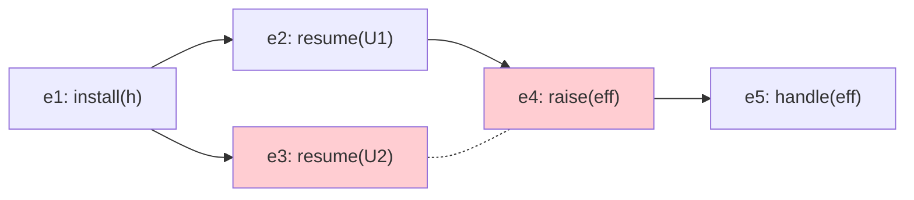

# 2. Background

This section reviews the five technical foundations that ICE-UTxO builds upon: extended UTxO ledgers, multiparty session types, event structures, programmable transaction blocks, and sharded Byzantine atomic commit.

## 2.1 Extended UTxO

Bitcoin's UTxO model represents value as *unspent transaction outputs*. Each UTxO carries a locking script; a transaction consumes UTxOs by providing unlocking scripts (witnesses) and produces fresh UTxOs. The model is naturally parallel --- distinct UTxOs are independent --- but expressiveness is limited to simple predicates over signatures and timelocks.

The *extended UTxO* (eUTxO) model [Chakravarty et al., 2020] augments each UTxO with a typed *datum* (persistent state) and each spending transaction with a *redeemer* (argument). A *validator* is a pure function
$$\mathit{validator} : \mathit{Datum} \times \mathit{Redeemer} \times \mathit{TxContext} \to \mathit{Bool}$$
where $\mathit{TxContext}$ provides a read-only view of the transaction's inputs, outputs, and metadata. Cardano implements eUTxO with Plutus validators.

The eUTxO model is the starting point for ICE-UTxO. We preserve its core invariant --- inputs are consumed atomically and outputs are fresh --- while extending it with coroutine state, effect handling, and proof-carrying transactions.

## 2.2 Multiparty Session Types

Multiparty session types (MPST) [Honda, Yoshida, and Carbone, 2016] provide a type discipline for communication protocols among multiple participants. A *global type* $G$ specifies the complete protocol from an omniscient perspective:
$$G ::= p \to q : \langle S \rangle . G \mid G_1 + G_2 \mid \mu X . G \mid X \mid \mathbf{end}$$
where $p \to q : \langle S \rangle$ denotes a message of type $S$ from role $p$ to role $q$.

*Projection* extracts from $G$ a *local type* $L_r = G \upharpoonright r$ for each role $r$, describing only the interactions visible to $r$. The fundamental metatheory guarantees:

- **Communication safety**: well-typed processes never encounter unexpected messages.
- **Protocol conformance**: each participant's behavior matches its local type.
- **Progress**: under suitable conditions, well-typed sessions do not deadlock.

Subsequent work extended MPST to handle interleaved sessions with global progress guarantees [Bettini et al., 2008; Coppo et al., 2013], rely/guarantee reasoning beyond syntactic duality [Scalas and Yoshida, 2018], and event-structure semantics for asynchronous protocols [Castellani, Dezani-Ciancaglini, and Giannini, 2024].

ICE-UTxO uses MPST global types as the specification language for coordination scripts, with event-structure semantics as the primary semantic domain.

## 2.3 Event Structures

An *event structure* [Winskel, 1986] is a triple $(E, \leq, \#)$ where:
- $E$ is a set of events,
- $\leq$ is a partial order (causality),
- $\#$ is a symmetric, irreflexive *conflict* relation,

subject to the axiom that conflict is *hereditary*: if $e \mathbin{\#} f$ and $e \leq e'$, then $e' \mathbin{\#} f$.

A *configuration* is a finite set $C \subseteq E$ that is:
1. **Conflict-free**: $\forall e, f \in C.\; \neg(e \mathbin{\#} f)$
2. **Down-closed**: $\forall e \in C.\; \forall e'.\; e' \leq e \implies e' \in C$

An event $e$ is *enabled* in configuration $C$ if $e \notin C$, all predecessors of $e$ are in $C$, and $e$ does not conflict with any event in $C$. A *valid trace* is a sequence $[e_1, \ldots, e_n]$ such that there exists a chain of configurations $\emptyset = C_0 \to C_1 \to \cdots \to C_n$ where each $C_i = C_{i-1} \cup \{e_i\}$ and $e_i$ is enabled in $C_{i-1}$.

Event structures generalize both interleaving and true-concurrency models. Every configuration has at least one linearization (valid trace), and independent events can be executed in any order.



**Figure 2.** Example event-structure DAG. Solid arrows denote causal order ($<$); the dashed line between $e_3$ and $e_4$ denotes conflict ($\#$), meaning a valid configuration may include one but not both. This structure illustrates how event structures capture both causal dependencies and mutual exclusion without resorting to total-order interleaving.

## 2.4 Programmable Transaction Blocks

Sui [Blackshear et al., 2023] introduced *Programmable Transaction Blocks* (PTBs) as a transaction format that goes beyond single function calls. A PTB is a sequence of commands $[c_0, \ldots, c_{n-1}]$ where each command $c_i$ draws inputs from two sources --- *objects* supplied by the transaction sender and *results* produced by earlier commands --- executes an action, and stores its output in register $\mathit{Result}(i)$:

```
Command[0]: Call(Module::function_a, obj1)       -> Result(0)
Command[1]: Call(Module::function_b, Result(0))   -> Result(1)
Command[2]: Call(Module::function_c, obj2, Result(1)) -> Result(2)
```

This *result chaining* composes multiple contract calls into a single atomic transaction with typed dataflow. The schedule is an explicit, inspectable artifact --- not an emergent property of VM execution --- which is what enables proof-carrying transactions: the PTB program *is* the proposed trace, and its structure can be statically analyzed for dependency and conflict edges before execution.

Sui further distinguishes *owned objects* (exclusive access, fast path without consensus) from *shared objects* (concurrent access, requires consensus for ordering). Owned objects take a fast path via Byzantine Consistent Broadcast, bypassing full consensus entirely; shared objects require total ordering through the consensus protocol. This dichotomy maps naturally to ICE-UTxO's coroutine frames (owned, single-writer) vs. effect handlers (shared, multi-accessor).

ICE-UTxO adopts the PTB pattern as a *compilation target* for coordination scripts: the global type compiles to a PTB-style program whose dataflow graph induces event-structure order edges. Section 3.5 formalizes this compilation and proves that well-formed PTB programs produce well-formed event structures.

## 2.5 Sharded Byzantine Atomic Commit (S-BAC)

Chainspace [Al-Bassam et al., 2018] introduced S-BAC for atomic transactions across shards in a Byzantine setting. The protocol operates in two phases:

1. **Prepare**: each concerned shard $s$ checks local validity --- the objects touched by the transaction on shard $s$ are active (not consumed or locked), the transaction's checker predicate passes for those objects, and the shard is willing to commit. The shard emits $\mathit{prepared}(\mathit{commit})$ or $\mathit{prepared}(\mathit{abort})$ with its signature.

2. **Accept**: if *all* concerned shards emit $\mathit{prepared}(\mathit{commit})$, the transaction commits and objects are consumed/created. If *any* shard emits $\mathit{prepared}(\mathit{abort})$, the transaction aborts and all locks are released.

Key properties:
- Objects are immutable once created; they transition from *active* to *inactive* upon consumption.
- The client executes procedures locally and provides *evidence* so that shards can run checkers without re-executing private computation.
- Objects are locked during the prepare/accept window to prevent conflicting concurrent commits.

ICE-UTxO adopts S-BAC for cross-shard atomic commit when a transaction's coordination script touches shared objects across multiple shards. The IVC witness serves as Chainspace-style evidence, enabling shard-local validation via projected coordination scripts.
