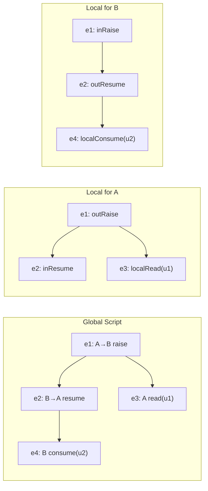
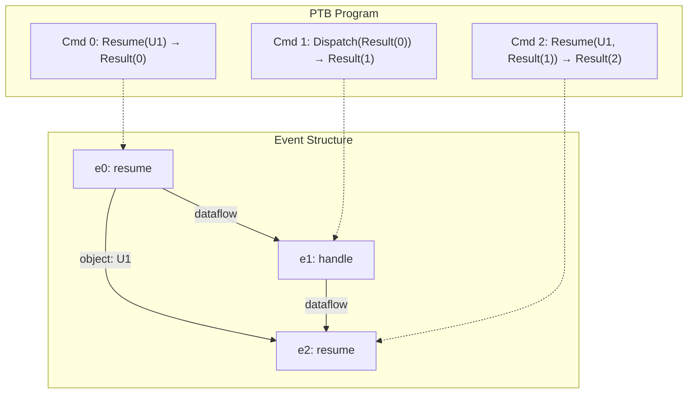
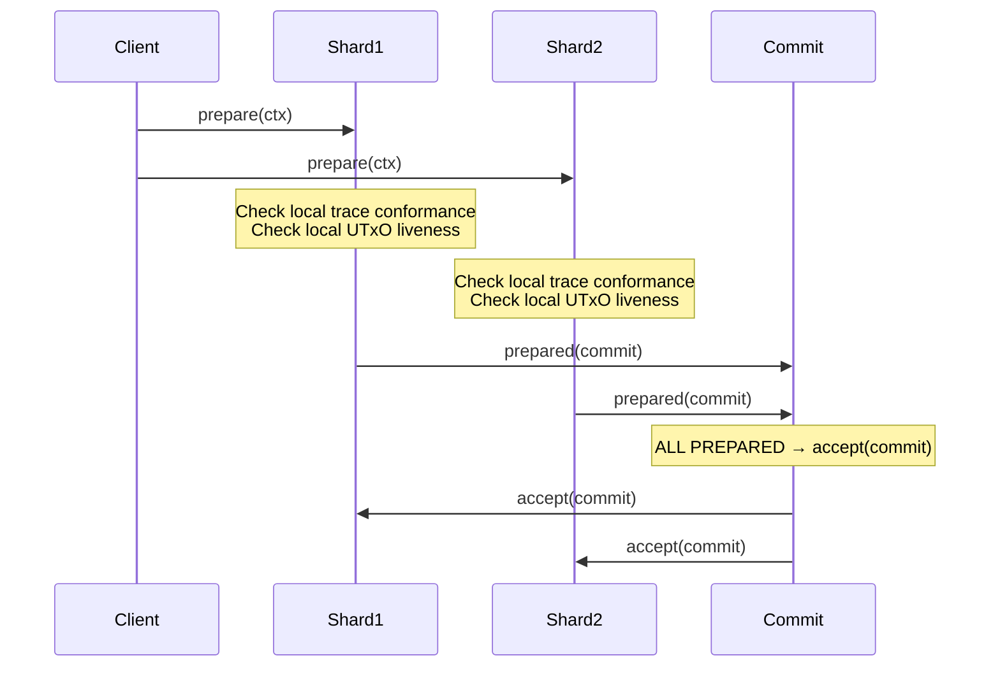

# 3. The ICE-UTxO Model

This section presents the formal ICE-UTxO model. Definitions and theorems are numbered independently (e.g., Definition 3.17 and Theorem 3.1 coexist in Section 3.4); each counter is scoped to Section 3.

## 3.1 State Components

The ICE-UTxO model extends eUTxO with structured state for coroutines, effects, proofs, and coordination. Where the standard eUTxO model has only UTxOs and transactions, ICE-UTxO adds four new concepts: effects (requests from coroutines to services), handlers (services that process effects), proof commitments (IVC certificates tracking verification status), and an extended ledger with effect queues and handler stacks.

We use the following identifier domains, all drawn from $\mathbb{N}$: $\mathit{UTXOId}$, $\mathit{TxId}$, $\mathit{InterfaceId}$, $\mathit{ProcessId}$, $\mathit{CommitmentHash}$. The formalization does not impose size limits on frames or UTxO datums; in a deployment, maximum frame size would be bounded by transaction size limits (analogous to Cardano's max transaction size or Ethereum's block gas limit), and storage costs would be proportional to frame size.

**Definition 3.1 (Effect).** An effect is a triple $e = (\mathit{iface}, \mathit{source}, \mathit{tag})$ where $\mathit{iface} : \mathit{InterfaceId}$ identifies the target interface, $\mathit{source} : \mathit{UTXOId}$ identifies the raising coroutine, and $\mathit{tag} : \mathbb{N}$ distinguishes effect operations.

**Definition 3.2 (Handler).** A handler is a pair $h = (\mathit{iface}, \mathit{hid})$ where $\mathit{iface}$ identifies the interface and $\mathit{hid}$ is a unique handler identifier.

**Definition 3.3 (Proof Commitment).** A proof commitment records the status of an IVC/PCD proof:
$$p = (\mathit{proofKind}, \mathit{processId}, \mathit{commitHash}, \mathit{verifyKey}, \mathit{phase}, \mathit{stepNumber})$$
where $\mathit{proofKind} \in \{\text{IVC\_Step}, \text{IVC\_Accumulator}, \text{Witness}\}$ and $\mathit{phase}$ follows the lifecycle:
$$\text{NotStarted} \to \text{Generating} \to \text{Verifying} \to \text{Verified}$$
with failure edges from $\text{Generating}$ and $\text{Verifying}$ to $\text{Failed}$. The $\mathit{commitHash}$ field binds the proof to the transaction context; it is intended to be computed as a hash over the transaction's inputs, outputs, and coordination witness, providing anti-replay protection (a proof generated for one transaction context cannot be reused in another). The exact hash input is not formalized in the current mechanization (see Section 4.2, Security Assumption 1).

**Definition 3.4 (Transaction).** A transaction is:
$$\mathit{tx} = (\mathit{id}, \mathit{inputs}, \mathit{outputs}, \mathit{readSet}, \mathit{writeSet}, \mathit{proofCommitments}, \mathit{phase})$$
where $\mathit{inputs}, \mathit{outputs}, \mathit{readSet}, \mathit{writeSet} : \mathcal{P}_{\text{fin}}(\mathit{UTXOId})$, $\mathit{proofCommitments} : \text{List}(\mathit{ProofCommitment})$, and $\mathit{phase} \in \{\text{Idle}, \text{Reserve}, \text{Executing}, \text{Committing}, \text{Committed}, \text{Rollback}, \text{Failed}\}$.

**Definition 3.5 (Ledger).** The ledger state is:
$$L = (\mathit{utxos}, \mathit{consumed}, \mathit{locked}, \mathit{pending}, \mathit{history}, \mathit{effects}, \mathit{handlerStacks})$$
where:
- $\mathit{utxos}, \mathit{consumed}, \mathit{locked} : \mathcal{P}_{\text{fin}}(\mathit{UTXOId})$
- $\mathit{pending} : \mathcal{P}_{\text{fin}}(\mathit{Tx})$
- $\mathit{history} : \text{List}(\mathit{Tx})$ (committed transactions in order)
- $\mathit{effects} : \mathit{InterfaceId} \to \text{List}(\mathit{Effect})$ (pending effect queues)
- $\mathit{handlerStacks} : \mathit{InterfaceId} \to \text{List}(\mathit{Handler})$ (installed handler stacks)

The effects and handler stacks are organized per-interface as stacks, supporting dynamic installation and uninstallation of handlers. Frames are authenticated by the $\mathit{hash}$ field in Definition 3.1 (in the companion specification), which chains each frame to its computational history: a resumed coroutine can verify that its frame has not been tampered with by checking the hash against the preceding frame. In a deployment, the hash is checked by the IVC circuit (Layer 3) rather than by the ledger model itself; the formalization treats frame integrity as guaranteed by proof verification (Section 4.2).

## 3.2 Coordination Scripts as Global Types

A coordination script specifies the allowed interactions among roles in a transaction. We formalize scripts as labeled event structures with role annotations.

**Definition 3.6 (Role Kind).** $\mathit{RoleKind} ::= \text{utxo} \mid \text{iface} \mid \text{shard}$.

**Definition 3.7 (Action).** The action grammar labels events in a coordination script:

$$\begin{aligned}
\mathit{Action} ::=\; & r_1 \to r_2 : \texttt{raise}(i, \mathit{tag}) \\
\mid\; & r_1 \to r_2 : \texttt{resume}(i, \mathit{tag}) \\
\mid\; & r_1 \to r_2 : \texttt{install}(h) \\
\mid\; & r_1 \to r_2 : \texttt{uninstall}(i) \\
\mid\; & r : \texttt{read}(u) \mid r : \texttt{consume}(u) \mid r : \texttt{produce}(u) \\
\mid\; & r : \texttt{lock}(u) \mid r : \texttt{snapshot}(u)
\end{aligned}$$

Actions are either *communication actions* (with sender $r_1$ and receiver $r_2$) for raise/resume/install/uninstall, or *local actions* for UTxO operations performed by a single role. *(Mechanized: `inductive Action` in Script.lean; accessor functions for UTxO access, interface usage, and role participation are extended in PTB.lean.)*

**Definition 3.8 (Script).** A script is a tuple $S = (\mathit{roles}, \mathit{roleKind}, E, \mathit{lab}, {<}, {\#})$ where:
- $\mathit{roles} : \mathcal{P}_{\text{fin}}(\mathit{RoleId})$ and $\mathit{roleKind} : \mathit{RoleId} \to \mathit{RoleKind}$
- $E : \mathcal{P}_{\text{fin}}(\mathit{EventId})$ is the set of events
- $\mathit{lab} : \mathit{EventId} \to \mathit{Action}$ labels each event
- ${<} \subseteq E \times E$ is a strict partial order (causal dependencies)
- ${\#} \subseteq E \times E$ is a symmetric, irreflexive conflict relation

**Example.** A coordination script for a collateralized loan liquidation:

```
script LiquidationProtocol {
  roles: oracle: iface, borrower: utxo, liquidator: utxo, coordinator: shard;
  events:
    e1: coordinator -> oracle : install(priceHandler);
    e2: borrower -> oracle : raise(getPrice, ETH_USD);
    e3: oracle -> borrower : resume(priceResult, 1500);
    e4: borrower : consume(collateralUtxo);
    e5: liquidator : produce(liquidatedUtxo);
    e6: coordinator -> oracle : uninstall(priceHandler);
  constraints:
    e1 < e2; e2 < e3; e3 < e4; e4 < e5; e5 < e6; e1 < e6;
}
```

**Figure 3.** Example coordination script with action grammar. Events are labeled by actions and constraints specify causal order, requiring the price handler to be installed before the oracle interaction and uninstalled after all operations complete. This illustrates how coordination scripts serve as global types that govern the interaction pattern among UTxO coroutines within a single atomic transaction.

**Definition 3.9 (Well-Formedness).** A script $S$ is *well-formed*, written $\mathit{WF}(S)$, if all of the following hold:

- **WF-Order** (`orderDom`, `orderAcyclic`): ${<}$ is acyclic and irreflexive, and both endpoints of every edge are in $E$.
- **WF-Conflict** (`conflictDom`, `conflictIrrefl`, `conflictSymm`): ${\#}$ is symmetric and irreflexive, both endpoints are in $E$.
- **WF-Roles** (`rolesOK`): all roles referenced in event labels are declared in $\mathit{roles}$.
- **WF-RoleKind** (`roleKindOK`): UTxO operations ($\texttt{read}$, $\texttt{consume}$, etc.) are performed only by roles of kind $\text{utxo}$.

In the Lean formalization, well-formedness is a conjunction of these seven predicates, all defined in `Script.lean`.

## 3.3 Event-Structure Semantics

We equip scripts with standard event-structure semantics. Intuitively, a *configuration* is a snapshot of "what has happened so far" (a consistent set of completed events), *enablement* asks "what can happen next?" (an event whose prerequisites are met and that doesn't conflict with anything already done), and a *valid trace* is a complete record of events that could have been produced by following enablement rules from the empty state. The definitions below are mechanized in `Script.lean`.

**Definition 3.10 (Configuration).** A set $C \subseteq E$ is a *configuration* of script $S$ if:
1. $C \subseteq S.\mathit{events}$
2. $C$ is conflict-free: $\forall e, f \in C.\; \neg(e \mathbin{\#} f)$
3. $C$ is down-closed: $\forall e \in C.\; \forall e'.\; e' < e \implies e' \in C$

**Definition 3.11 (Enablement).** Event $e$ is *enabled* in configuration $C$, written $\mathit{enabled}(e, C)$, if:
1. $e \in S.\mathit{events}$ and $e \notin C$
2. $\forall e'.\; e' < e \implies e' \in C$ (all predecessors present)
3. $\forall f \in C.\; \neg(e \mathbin{\#} f)$ (no conflict with $C$)

**Definition 3.12 (Step and Valid Trace).** A step $C \to C'$ fires an enabled event: $\exists e.\; \mathit{enabled}(e, C) \wedge C' = C \cup \{e\}$. A *valid trace* is a sequence $[e_1, \ldots, e_n]$ admitting a chain $\emptyset = C_0 \to C_1 \to \cdots \to C_n$ of configurations.

These definitions are replicated for local scripts (`LocalScript`) with identical structure, ensuring the same semantic framework applies at both global and local levels.

## 3.4 Projection and Local Conformance

Projection extracts from a global script the view of a single role.

The role-kind system enforces a permission discipline on which actions each kind of role may perform:

| Action | `utxo` | `iface` | `shard` |
|---|---|---|---|
| `read`, `consume`, `produce`, `lock`, `snapshot` | yes | no | no |
| `raise` (sender) | yes | no | no |
| `resume` (sender) | no | yes | no |
| `install`, `uninstall` (sender) | no | no | yes |
| Any action (receiver) | yes | yes | yes |

This matrix is enforced by the **WF-RoleKind** predicate (Definition 3.9): UTxO operations are restricted to roles of kind `utxo`, effect handling to `iface` roles, and handler lifecycle management to `shard` roles. Any role kind may appear as a receiver.

**Definition 3.13 (Participation).** Role $r$ *participates* in event $e$ if $r$ appears as sender or receiver in $\mathit{lab}(e)$, or $\mathit{lab}(e)$ is a UTxO action performed by $r$. Formally, $r \in \mathit{participants}(\mathit{lab}(e))$, where $\mathit{participants}$ extracts the set of roles from an action.

**Definition 3.14 (Relevance).** Event $e$ is *relevant* to role $r$, written $\mathit{relevant}(r, e)$, if $\mathit{toLocal}(r, \mathit{lab}(e)) \neq \text{None}$, where $\mathit{toLocal}$ converts a global action to a local action from $r$'s perspective:
- $r_1 \to r_2 : \texttt{raise}(i, t)$ becomes $\texttt{outRaise}(r_2, i, t)$ if $r = r_1$, or $\texttt{inRaise}(r_1, i, t)$ if $r = r_2$.
- UTxO actions become local variants (e.g., $r : \texttt{read}(u)$ becomes $\texttt{localRead}(u)$).
- Otherwise $\text{None}$.

**Definition 3.15 (Projection).** Given script $S$ and role $r$, the projection $\mathit{Proj}(S, r)$ is the local script:
$$\mathit{Proj}(S, r) = (E_r, \mathit{lab}_r, {<_r}, {\#_r})$$
where $E_r = \{e \in E \mid \mathit{relevant}(r, e)\}$, and ${<_r}$, ${\#_r}$ are the restrictions of ${<}$, ${\#}$ to $E_r \times E_r$, and $\mathit{lab}_r(e) = \mathit{toLocal}(r, \mathit{lab}(e))$.



**Figure 4.** Projection example showing how a global script (left) decomposes into local scripts for role A (center) and role B (right). Each role sees only its own events --- $e_4$ is invisible to A and $e_3$ is invisible to B --- enabling shard-local verification against the projected type rather than the full global script.

**Definition 3.16 (Trace Projection).** $\mathit{traceProj}(S, r, \mathit{tr}) = \mathit{tr}.\texttt{filter}(\mathit{relevant}(r, \cdot))$.

**Definition 3.17 (Local Conformance).** Script $S$ *locally conforms* for role $r$ on trace $\mathit{tr}$, written $\mathit{localConform}(S, r, \mathit{tr})$, if $\mathit{Proj}(S, r)$ is well-formed and $\mathit{tr}$ is a valid trace of $\mathit{Proj}(S, r)$.

**Theorem 3.1 (Projection Preserves Well-Formedness).** If $\mathit{WF}(S)$ then $\mathit{WF}(\mathit{Proj}(S, r))$ for all roles $r$. *(Mechanized: `project_wellFormed`, Script.lean.)*

**Theorem 3.2 (Projection Preserves Traces).** If $\mathit{tr}$ is a valid trace of $S$, then $\mathit{traceProj}(S, r, \mathit{tr})$ is a valid trace of $\mathit{Proj}(S, r)$. *(Mechanized: `proj_validTrace`, Script.lean.)*

**Corollary 3.3 (Global Conformance Implies Local).** If $S$ globally conforms on trace $\mathit{tr}$, then $S$ locally conforms for every role $r$ on $\mathit{traceProj}(S, r, \mathit{tr})$. *(Mechanized: `proj_localConform_of_globalConform`, Script.lean.)*

## 3.5 PTB Compilation

A coordination script is compiled to a PTB-style program for deterministic execution. The PTB program is the *compilation target*; the script's event structure is the *semantic source*. This section formalizes the command model, the translation to event structures, and the key correctness theorems. All definitions and theorems in this section are mechanized in `PTB.lean` (609 lines).

**Section overview.** Section 3.5.1 defines the command and program data structures. Section 3.5.2 derives dependency and conflict relations from the program structure. Section 3.5.3 translates PTB programs to event-structure scripts and proves well-formedness. Section 3.5.4 establishes trace validity and witness construction theorems. Section 3.5.5 gives a worked example.

### 3.5.1 Command Model

**Definition 3.18 (Command).** A command is a triple $c = (\mathit{action}, \mathit{uses}, \mathit{conflicts})$ where $\mathit{action} : \mathit{Action}$ is the operation to perform, $\mathit{uses} : \mathcal{P}_{\text{fin}}(\mathbb{N})$ identifies result registers consumed as inputs, and $\mathit{conflicts} : \mathcal{P}_{\text{fin}}(\mathbb{N})$ records explicit conflict edges (from choice or guarded branches).

**Definition 3.19 (Program).** A PTB program is a list of commands $P = [c_0, \ldots, c_{n-1}]$. Command $c_i$ stores its output in register $\mathit{Result}(i)$, and may reference $\mathit{Result}(j)$ for $j \in c_i.\mathit{uses}$ as input. **Well-formedness constraint**: all result references must be backward-looking, i.e., $j < i$ for every $j \in c_i.\mathit{uses}$. This is enforced structurally by the $i < j$ guard in the `orderRel` definition (Definition 3.22), which ensures acyclicity of the induced event structure (Theorem 3.7). A PTB compiler should statically reject programs containing forward references.

**Definition 3.20 (Config).** A PTB configuration $(\mathit{roles}, \mathit{roleKind})$ maps identifiers to roles and roles to kinds, connecting the PTB to the coordination layer's role structure. (In the Lean mechanization, this corresponds to `structure Config` in PTB.lean; an extended variant `AccessConfig` adds `utxoRole` and `ifaceRole` mappings used by the witness construction theorems.)

### 3.5.2 Derived Relations

Given a program $P$, we derive three dependency relations (`dataDep`, `utxoDep`, `handlerDep`) that contribute to the causal order, plus one conflict marker (`explicitConflict`) for choice branches, and combine these into two structural relations: `orderRel` (causal order) and `conflictRel` (mutual exclusion). Each action $a$ exposes accessor functions: $a.\mathit{readUtxos}$, $a.\mathit{writeUtxos}$, $a.\mathit{consumedUtxos}$, $a.\mathit{ifaceUses}$, $a.\mathit{ifaceInstalls}$, $a.\mathit{ifaceUninstalls}$.

**Definition 3.21 (Dependencies).** For commands $c_i, c_j$ with $i < j$:

- $\mathit{dataDep}(i, j) \iff i \in c_j.\mathit{uses}$ — result register dependency
- $\mathit{utxoDep}(i, j) \iff c_i.\mathit{writeUtxos} \cap c_j.\mathit{utxoAccesses} \neq \emptyset \;\lor\; c_j.\mathit{writeUtxos} \cap c_i.\mathit{utxoAccesses} \neq \emptyset$ — read-write or write-write overlap
- $\mathit{handlerDep}(i, j) \iff c_i.\mathit{ifaceInstalls} \cap c_j.\mathit{ifaceUses} \neq \emptyset \;\lor\; c_i.\mathit{ifaceUses} \cap c_j.\mathit{ifaceUninstalls} \neq \emptyset$ — install-before-use or use-before-uninstall

**Definition 3.22 (Order Relation).** $\mathit{orderRel}(i, j) \iff i < |P| \;\wedge\; j < |P| \;\wedge\; i < j \;\wedge\; (\mathit{dataDep}(i,j) \lor \mathit{utxoDep}(i,j) \lor \mathit{handlerDep}(i,j))$.

**Definition 3.23 (Conflict Relation).** $\mathit{conflictRel}(i, j) \iff i < |P| \;\wedge\; j < |P| \;\wedge\; i \neq j \;\wedge\; (c_i.\mathit{consumedUtxos} \cap c_j.\mathit{consumedUtxos} \neq \emptyset \;\lor\; c_i.\mathit{ifaceInstalls} \cap c_j.\mathit{ifaceInstalls} \neq \emptyset \;\lor\; \mathit{explicitConflict}(i, j))$.

The conflict relation is symmetric (`conflictRel_symm`, PTB.lean) and irreflexive by the $i \neq j$ guard.

**Scalability.** Both `orderRel` and `conflictRel` are computed pairwise over the program's commands, yielding $O(n^2)$ relation checks for a program of $n$ commands. For the PTB programs arising in practice (typically 5--50 commands per transaction), this is negligible. For larger programs, the relation checks can be accelerated by indexing commands by their accessed UTxOs and interfaces, reducing the pairwise scan to checks between commands sharing a resource. The formalization does not model this optimization.

### 3.5.3 Translation to Event Structure

**Definition 3.24 (toScript).** Given configuration $\mathit{cfg}$ and program $P$, the induced script is:
$$\mathit{toScript}(\mathit{cfg}, P) = (\mathit{cfg}.\mathit{roles},\; \mathit{cfg}.\mathit{roleKind},\; \{0, \ldots, |P|-1\},\; \lambda i.\, c_i.\mathit{action},\; \mathit{orderRel},\; \mathit{conflictRel})$$

The definition directly transliterates `Program.toScript` in PTB.lean.

**Theorem 3.7 (toScript Well-Formedness).** If $P$ satisfies $\mathit{rolesOK}$ and $\mathit{roleKindOK}$ with respect to $\mathit{cfg}$, then $\mathit{toScript}(\mathit{cfg}, P)$ is well-formed in the sense of Definition 3.9.

*Proof sketch.* The seven well-formedness predicates decompose as follows. **WF-Order** and **WF-Conflict**: both endpoints are in $\{0, \ldots, |P|-1\}$ by the bound guards in the relation definitions. **WF-Irrefl** and **WF-Symm** for conflict: irreflexivity follows from $i \neq j$; symmetry from `conflictRel_symm`. **WF-Acyclic**: if $\mathit{orderRel}^+(i, i)$ held, then $i < i$ by transitivity of the $i < j$ constraint in each order edge — contradiction. **WF-Roles** and **WF-RoleKind**: by hypothesis. *(Mechanized: `Program.toScript_wellFormed`, PTB.lean; see Appendix A.9.)*



**Figure 5.** PTB compilation mapping commands to event structures. Left: three PTB commands with result chaining; right: the induced event structure with dataflow edges (from Result dependencies) and object-access edges (both access U1). This mapping shows how the concrete PTB execution format generates the causal order that the event-structure semantics requires.

### 3.5.4 Valid Traces and Witness Construction

The PTB program order $[0, 1, \ldots, n-1]$ is the *proposed trace*. The following theorems establish when this trace --- or a filtered sub-trace --- is valid with respect to the induced event structure.

**Theorem 3.8 (validTrace\_trace).** If $P$ has no conflicts ($\forall i, j.\; \neg\mathit{conflictRel}(i,j)$), then the full program-order trace $[0, \ldots, |P|-1]$ is a valid trace of $\mathit{toScript}(\mathit{cfg}, P)$.

*Proof sketch.* By induction on $|P|$. At step $k$, the configuration is $\{0, \ldots, k-1\}$. Event $k$ is enabled: (a) all predecessors under $\mathit{orderRel}$ have index $< k$ and are already in the configuration; (b) no conflict exists by hypothesis. *(Mechanized: `Program.validTrace_trace`, PTB.lean; see Appendix A.10.)*

**Theorem 3.9 (validTrace\_traceOf).** Given a predicate $\mathit{keep} : \mathbb{N} \to \mathit{Bool}$ such that $P$ is conflict-free on $\mathit{keep}$ and $\mathit{keep}$ is down-closed with respect to $\mathit{orderRel}$, the filtered trace $P.\mathit{traceOf}(\mathit{keep})$ is a valid trace of $\mathit{toScript}(\mathit{cfg}, P)$.

*Proof sketch.* As for Theorem 3.8, but the configuration at each step is the filtered prefix. Down-closure ensures predecessors are present; conflict-freedom on $\mathit{keep}$ ensures enablement. *(Mechanized: `Program.validTrace_traceOf`, PTB.lean.)*

**Theorem 3.10 (crossRoleSafe\_of\_access).** If every command's access roles are contained in its participant set ($\mathit{accessRolesOK}$) and explicit conflicts are shared ($\mathit{explicitConflictShared}$), then conflicting commands always share at least one role (they cannot involve disjoint-role pairs).

*Proof sketch.* For consumed-UTxO conflicts, the overlapping UTxO witnesses a shared role via $\mathit{utxoRole}$. For interface-install conflicts, the overlapping interface witnesses a shared role via $\mathit{ifaceRole}$. Explicit conflicts are shared by hypothesis. *(Mechanized: `Program.crossRoleSafe_of_access`, PTB.lean.)*

**Theorem 3.11 (witnessGlobalOK\_of).** If $P$ satisfies $\mathit{rolesOK}$, $\mathit{roleKindOK}$, $\mathit{conflictFree}(\mathit{keep})$, and $\mathit{downClosed}(\mathit{keep})$, then $\mathit{toWitness}(\mathit{cfg}, P, \mathit{keep})$ is globally OK: the induced script is well-formed and the filtered trace is valid.

*Proof.* Immediate from Theorems 3.7 and 3.9. *(Mechanized: `Program.witnessGlobalOK_of`, PTB.lean; see Appendix A.11.)*

### 3.5.5 Worked Example

Consider the collateralized loan scenario from Section 1, compiled to a 3-command PTB:

| $i$ | Command | Action | uses | conflicts |
|-----|---------|--------|------|-----------|
| 0 | Resume borrower coroutine | $\texttt{resume}(r_b, r_o, \mathit{oracle}, \mathit{getPrice})$ | $\emptyset$ | $\emptyset$ |
| 1 | Dispatch to price handler | $\texttt{raise}(r_o, r_h, \mathit{oracle}, \mathit{dispatch})$ | $\{0\}$ | $\emptyset$ |
| 2 | Resume with price result | $\texttt{resume}(r_h, r_b, \mathit{oracle}, \mathit{result})$ | $\{1\}$ | $\emptyset$ |

**Derived edges.** $\mathit{dataDep}(0,1)$ since $0 \in c_1.\mathit{uses}$; $\mathit{dataDep}(1,2)$ since $1 \in c_2.\mathit{uses}$; $\mathit{handlerDep}(0,2)$ since both access the oracle interface. Thus $\mathit{orderRel} = \{(0,1), (1,2), (0,2)\}$ and $\mathit{conflictRel} = \emptyset$.

**Induced script.** $\mathit{toScript}$ produces events $\{0,1,2\}$ with order $0 < 1 < 2$ (plus $0 < 2$) and no conflict. This is a total order, so the unique valid trace is $[0,1,2]$.

**Validity.** Since $\mathit{conflictRel} = \emptyset$, Theorem 3.8 applies directly: the program-order trace $[0,1,2]$ is valid. By Theorem 3.11, $\mathit{toWitness}(\mathit{cfg}, P, \lambda i.\, \mathit{true})$ is globally OK.

The PTB program order is the *proposed trace*. The IVC witness must demonstrate that this trace is a valid linearization of the event structure induced by the coordination script. Acyclicity of the induced order (guaranteed by Theorem 3.7) is a precondition for valid compilation; the PTB compiler rejects programs whose induced order graph contains cycles.

## 3.6 S-BAC Integration

When a transaction's coordination script touches shared objects across multiple shards, ICE-UTxO uses S-BAC for atomic commit. We define the structures connecting coordination witnesses to ledger commit.

**Definition 3.25 (S-BAC Configuration).** An S-BAC configuration is a pair $(\mathit{shardOfUtxo}, \mathit{rolesOfShard})$ mapping UTxOs to shards and shards to their associated roles.

**Definition 3.26 (Coordination Witness).** A coordination witness is a pair $W = (S, \mathit{tr})$ of a script $S$ and a trace $\mathit{tr}$.

**Definition 3.27 (Witness Predicates).**
- $\mathit{witnessGlobalOK}(W) \iff S.\mathit{globalConform}(\mathit{tr})$
- $\mathit{witnessLocalOK}(W) \iff \forall r \in S.\mathit{roles}.\; S.\mathit{localConform}(r, S.\mathit{traceProj}(r, \mathit{tr}))$
- $\mathit{witnessConsistent}(W) \iff S.\mathit{traceConsistent}(\mathit{tr})$

**Theorem 3.12 (Global Implies Local).** $\mathit{witnessGlobalOK}(W) \implies \mathit{witnessLocalOK}(W)$. *(Mechanized: `witnessLocalOK_of_global`, SBAC.lean.)*

**Theorem 3.13 (Consistent Implies Global).** If $S$ is well-formed and $\mathit{witnessConsistent}(W)$, then $\mathit{witnessGlobalOK}(W)$. *(Mechanized: `witnessGlobalOK_of_local_and_consistent`, SBAC.lean.)*

**Definition 3.28 (Coordination Transaction).** A coordination transaction pairs a ledger transaction with a witness: $\mathit{ctx} = (\mathit{tx}, W)$.

**Definition 3.29 (Coordinated Commit).** Commit is enabled if the ledger commit guard passes *and* the witness validates:
$$\mathit{coordCommitEnabled}(m, L, \mathit{ctx}) \iff \mathit{commitEnabledStrong}(m, L, \mathit{tx}) \wedge \mathit{witnessGlobalOK}(W)$$

**Definition 3.30 (Shard-Local Check).** During S-BAC prepare, shard $s$ checks:
1. **Local trace conformance**: for every role $r$ associated with $s$, $\mathit{localConform}(S, r, \mathit{traceProj}(S, r, \mathit{tr}))$.
2. **UTxO liveness**: inputs assigned to shard $s$ are in $L.\mathit{utxos}$.



**Figure 6.** S-BAC prepare flow for ICE-UTxO, where each shard independently verifies its local projection of the coordination script and local UTxO liveness during the prepare phase. This decomposition is the key to cross-shard atomicity: shard-local checks are sufficient when the global coordination witness is valid (Theorem 3.14).

**Theorem 3.14 (Local Sufficiency).** If $\mathit{coordCommitEnabled}(m, L, \mathit{ctx})$ holds, then $\mathit{coordCommitEnabledLocal}(m, L, \mathit{ctx})$ holds; that is, shard-local checks are sufficient when the global witness is valid. *(Mechanized: `coordCommitEnabledLocal_of_global`, SBAC.lean.)*
