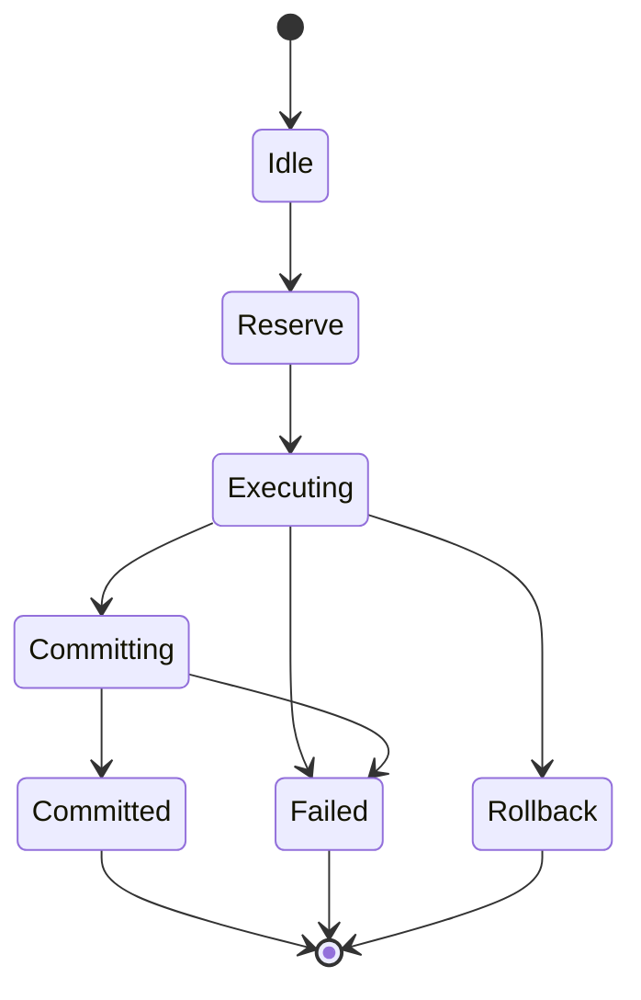

# 4. Operational Semantics and Ledger Safety

This section defines the small-step operational semantics for the ICE-UTxO ledger and establishes its safety invariants. All definitions and theorems are mechanized in `StarstreamPilot.lean`.

## 4.1 Transaction Lifecycle

*Running example.* Consider the collateralized loan liquidation from Section 1.1 and its PTB program from Section 3.5.5. The transaction would progress through the lifecycle below as follows: submit to pending (`addPending`), acquire locks on the oracle and borrower UTxOs (`lockInputs`), install the price handler (`installH`), raise the price query (`raiseE`), dispatch the handler (`handleE`), and finally commit with the IVC proof (`commit`).

A transaction proceeds through a lifecycle with seven phases:

1. **Idle**: not yet submitted to the ledger.
2. **Reserve**: select inputs, reserve them (locking mode) or take a snapshot (optimistic mode).
3. **Execute**: run the PTB program, producing effects and intermediate frames.
4. **Committing**: proofs are verified and commit preconditions are checked.
5. **Committed**: the transaction has been applied and added to history.
6. **Rollback**: abort and release locks (or discard optimistic effects).
7. **Failed**: execution or proof verification failed; the transaction cannot commit.

**Figure 7.** Transaction lifecycle state machine showing the seven phases from submission through commit or abort. The `ValidTxTransition` relation captures the intended phase discipline, but the `Step` constructors do not enforce it; phase ordering is a runtime responsibility (see Security Assumption 2).

**Definition 4.1 (Step).** The small-step relation $\mathit{Step} : \mathit{Mode} \to \mathit{Ledger} \to \mathit{Ledger} \to \text{Prop}$ has eight constructors:

| Constructor | Mode | Precondition | Effect |
|---|---|---|---|
| `addPending` | any | $\mathit{tx} \notin L.\mathit{pending}$, $\mathit{noDuplicatePendingProofs}(\mathit{tx})$ | Add $\mathit{tx}$ to pending set |
| `lockInputs` | locking | $\mathit{tx} \in \mathit{pending}$, inputs disjoint from locked, inputs live | $\mathit{locked} \mathrel{{:}{=}} \mathit{locked} \cup \mathit{tx.inputs}$ |
| `commit` | any | $\mathit{tx} \in \mathit{pending}$, $\mathit{commitEnabledStrong}$, $\mathit{precGraphAcyclicExt}(L.\mathit{history} \mathbin{+\!\!+} [\mathit{tx}])$, $\mathit{fullPrecGraphAcyclic}(L.\mathit{history} \mathbin{+\!\!+} [\mathit{tx}])$ | Apply commit (see below) |
| `abort` | any | $\mathit{tx} \in \mathit{pending}$ | Release locks, remove from pending |
| `installH` | any | (none) | Push handler onto interface stack |
| `uninstallH` | any | (none) | Pop handler from interface stack |
| `raiseE` | any | (none) | Push effect onto interface queue |
| `handleE` | any | Effect and handler present | Pop effect, route to handler |

The `commit` constructor requires the strongest preconditions: `commitEnabledStrong` (Section 4.2) and both acyclicity predicates (extended and full) after appending the transaction.

The `abort` constructor is intentionally nondeterministic: any pending transaction may abort at any time, modeling timeouts, cancellation, and resource limits. Safety is not "valid transactions must commit" but "only valid transactions *can* commit."

The `installH`, `uninstallH`, `raiseE`, and `handleE` constructors have no preconditions restricting their interleaving. In particular, an `uninstallH` step can remove a handler while a `raiseE` step targeting the same interface is pending. The model handles this by design: `handleE` requires both a pending effect and a handler to be present, so an uninstall-before-handle sequence simply leaves the effect unrouted, and the transaction must eventually abort or install a replacement handler. This is consistent with the nondeterministic abort semantics.

**Handler and effect scope.** In the mechanization, handler stacks and effect queues are ledger-level, per-interface structures ($L.\mathit{handlerStacks}$ and $L.\mathit{effects}$). They are not cleared by commit or abort; instead, the abstraction map (Definition 6.5) drops them when projecting to the serial specification, so these steps are treated as stuttering in the refinement proof. The formalization does not impose bounds on handler stack depth or effect queue length; in a deployment, resource limits (analogous to gas) would cap these to prevent unbounded accumulation. The model's safety properties hold regardless of queue depth, but a production implementation should enforce per-transaction limits on the number of `installH` and `raiseE` steps to prevent resource exhaustion.

Phantom reads (reading inconsistent intermediate state) cannot arise in the UTxO model because validators are pure functions of their input datums: reading the same UTxO twice yields the same datum. The conflict relation (Section 5.1) tracks write-write and read-write conflicts on UTxO *identity* (consumption and production of outputs), not on mutable state within a datum.

**Definition 4.2 (State Updates).**
$$\mathit{applyCommit}(L, \mathit{tx}) = L\left[\begin{array}{l}
\mathit{utxos} := (L.\mathit{utxos} \setminus \mathit{tx.inputs}) \cup \mathit{tx.outputs} \\
\mathit{consumed} := L.\mathit{consumed} \cup \mathit{tx.inputs} \\
\mathit{locked} := L.\mathit{locked} \setminus \mathit{tx.inputs} \\
\mathit{pending} := L.\mathit{pending} \setminus \{\mathit{tx}\} \\
\mathit{history} := L.\mathit{history} \mathbin{+\!\!+} [\mathit{tx}]
\end{array}\right]$$

$$\mathit{applyAbort}(L, \mathit{tx}) = L\left[\begin{array}{l}
\mathit{locked} := L.\mathit{locked} \setminus \mathit{tx.inputs} \\
\mathit{pending} := L.\mathit{pending} \setminus \{\mathit{tx}\}
\end{array}\right]$$

**Definition 4.3 (Multi-Step).** $\mathit{Steps} : \mathit{Mode} \to \mathit{Ledger} \to \mathit{Ledger} \to \text{Prop}$ is the reflexive-transitive closure of $\mathit{Step}$.

## 4.2 Commit Rule and Proof-Gating

The commit rule enforces that only proof-verified, structurally valid transactions can extend the ledger history.

**Definition 4.4 (All Proofs Verified).** A transaction has all proofs verified if its proof commitment list is non-empty and every commitment is in the `Verified` phase:
$$\mathit{allProofsVerified}(\mathit{tx}) \iff \mathit{tx.proofCommitments} \neq [] \wedge \forall p \in \mathit{tx.proofCommitments}.\; p.\mathit{phase} = \text{Verified}$$

> **Trust boundary.** The predicate $\mathit{allProofsVerified}$ checks phase flags set by an external ZK verifier. Cryptographic soundness --- that a `Verified` flag genuinely corresponds to a valid ZK proof --- is outside the scope of this formalization. The model proves: *if* the verifier sets flags correctly, *then* the ledger maintains its invariants.

**IVC proof failure and timeout.** A proof commitment that fails during generation or verification transitions to the `Failed` phase (Definition 3.3). Since `allProofsVerified` requires *every* commitment to be in the `Verified` phase, any single proof failure prevents the transaction from committing. The transaction remains in the pending set until it is aborted (via the `abort` constructor, which is always available). The formalization does not model proof generation time or timeouts; in a deployment, a proof generation timeout would trigger an abort, releasing any held locks. There is no partial-proof recovery: if $k$ of $n$ proofs verify but the remaining fail, the entire transaction must abort and retry.

**Security assumptions.** The formal guarantees established in this paper rest on three explicit assumptions that bound the trusted computing base:

1. **ZK verifier soundness.** The external ZK verification oracle is assumed to be sound: a proof commitment reaches the `Verified` phase only if the underlying computation genuinely satisfies the stated predicate. The mechanization treats `allProofsVerified` as an opaque predicate and does not model the cryptographic protocol. If this assumption is violated (e.g., a compromised verifier sets `Verified` flags without genuine proofs), all safety guarantees collapse: an attacker could commit transactions that bypass coordination checks entirely. The `commitHash` field in `ProofCommitment` (Definition 3.3) is intended to bind the proof to the transaction context, but the binding predicate is not formalized.

2. **Phase-transition integrity.** The `Step` inductive defines eight constructors but does not enforce that transaction phases progress in the correct order (e.g., that `lockInputs` precedes `commit`). The proofs are valid for any sequence of steps the inductive admits. In a deployment, the transaction executor (validator node or client runtime) is the trusted component responsible for enforcing the intended phase discipline. Enforcing phase progression at the type level would require an indexed inductive family `Step : TxPhase → Ledger → Ledger → Prop`; this refinement is left to future work.

3. **S-BAC shard honesty.** The cross-shard atomic commit protocol (Section 3.6) assumes that fewer than one-third of validators *per shard* are Byzantine (i.e., $f_s < n_s / 3$ for each shard $s$), consistent with the Chainspace fault model [Al-Bassam et al., 2018]. This is a per-shard threshold, not a global one: an adversary controlling fewer than $n_s/3$ validators in each of $k$ shards could in principle coordinate across shards, though this does not violate the per-shard assumption. Equivocation detection, data availability, and the TOCTOU window between the prepare and commit phases are not formalized. The mechanization proves properties of the ledger *given* that S-BAC delivers its specified guarantees.

**Definition 4.5 (Valid Transaction).** $\mathit{validTx}(L, \mathit{tx})$ requires:
- $\mathit{tx.inputs} \neq \emptyset$ and $\mathit{tx.outputs} \neq \emptyset$
- $\mathit{tx.inputs} \cap \mathit{tx.outputs} = \emptyset$ (inputs disjoint from outputs)
- $\mathit{tx.inputs} \subseteq L.\mathit{utxos}$ (inputs are live)
- $\mathit{tx.outputs} \cap (L.\mathit{utxos} \cup L.\mathit{consumed}) = \emptyset$ (outputs are fresh)

**Definition 4.6 (Commit Enabled --- Strong).** $\mathit{commitEnabledStrong}(m, L, \mathit{tx})$ holds if:
$$\mathit{allProofsVerified}(\mathit{tx}) \wedge \mathit{validTx}(L, \mathit{tx}) \wedge \mathit{tx.phase} = \text{Committing} \wedge \mathit{tx} \notin L.\mathit{history}$$
and additionally:
- **Locking mode**: $\mathit{tx.inputs} \subseteq L.\mathit{locked}$ and $\mathit{tx.readSet} \subseteq L.\mathit{utxos}$
- **Optimistic mode**: $\mathit{tx.readSet} \subseteq L.\mathit{utxos}$ and $\mathit{tx.outputs}$ are fresh

**Theorem 4.1 (Proof-Gated Commit).** Any step that extends the history requires proof verification:
$$\mathit{Step}(m, L, L') \wedge L'.\mathit{history} = L.\mathit{history} \mathbin{+\!\!+} [\mathit{tx}] \implies \mathit{proofOk}(\mathit{tx})$$

*Proof sketch.* Exhaustive case analysis on the eight `Step` constructors. Seven non-commit constructors leave the history unchanged, yielding a contradiction with the hypothesis $L'.\mathit{history} = L.\mathit{history} \mathbin{+\!\!+} [\mathit{tx}]$ via the lemma $\mathit{xs} \neq \mathit{xs} \mathbin{+\!\!+} [x]$. The commit constructor directly provides $\mathit{allProofsVerified}(\mathit{tx})$ from $\mathit{commitEnabledStrong}$. *(Mechanized: `commit_requires_proof`, StarstreamPilot.lean.)*

## 4.3 Concurrency Modes

ICE-UTxO supports two concurrency modes, selected per-transaction:

**Locking mode** ($m = \text{locking}$). Inputs are reserved before execution via the `lockInputs` step, which requires $\mathit{tx.inputs} \cap L.\mathit{locked} = \emptyset$ (no double-locking) and $\mathit{tx.inputs} \subseteq L.\mathit{utxos}$ (inputs live). At commit time, the commit guard checks $\mathit{tx.inputs} \subseteq L.\mathit{locked}$.

**Optimistic mode** ($m = \text{optimistic}$). No locks are acquired. Instead, at commit time, the guard checks that the read snapshot is still valid ($\mathit{tx.readSet} \subseteq L.\mathit{utxos}$) and outputs are still fresh. If the snapshot has been invalidated by a concurrent commit, the transaction fails.

Both modes are proof-gated: $\mathit{allProofsVerified}$ is required regardless of the concurrency mode.

**Adversarial contention in optimistic mode.** Under adversarial contention, the optimistic mode abort rate can approach 100%: an adversary who can commit transactions consuming UTxOs in a target transaction's read set can force repeated snapshot invalidation. The model captures this through the nondeterministic abort semantics --- the safety guarantee is that *only valid transactions can commit*, not that valid transactions *will* commit. Liveness under contention requires fairness assumptions outside the current formalization (see Section 9). In practice, a deployment would mitigate contention through backoff policies, priority queues, or fallback to locking mode for high-contention UTxOs.

## 4.4 Ledger Invariants

We define a composite ledger invariant and prove it is preserved by every step.

**Definition 4.7 (Ledger Invariant).** $\mathit{ledgerInvariant}(L)$ is the conjunction of:

1. **No double-spend**: $\mathit{Disjoint}(L.\mathit{utxos}, L.\mathit{consumed})$
2. **Locked subset active**: $L.\mathit{locked} \subseteq L.\mathit{utxos}$
3. **History nodup**: $L.\mathit{history}.\mathit{Nodup}$
4. **Committed implies verified**: $\forall \mathit{tx} \in L.\mathit{history}.\; \mathit{allProofsVerified}(\mathit{tx})$
5. **Extended precedence acyclic**: $\mathit{precGraphAcyclicExt}(L.\mathit{history})$
6. **Full precedence acyclic**: $\mathit{fullPrecGraphAcyclic}(L.\mathit{history})$

**Theorem 4.2 (Invariant Preservation).** Every step preserves the ledger invariant:
$$\mathit{Step}(m, L, L') \wedge \mathit{ledgerInvariant}(L) \implies \mathit{ledgerInvariant}(L')$$

*Proof sketch.* Floyd-Hoare style case analysis on the eight `Step` constructors:
- *addPending, installH, uninstallH, raiseE, handleE*: these steps do not modify $\mathit{utxos}$, $\mathit{consumed}$, or $\mathit{history}$, so all six invariant components are trivially preserved.
- *lockInputs*: $\mathit{locked}$ grows by $\mathit{tx.inputs}$, which are live ($\subseteq L.\mathit{utxos}$), preserving `lockedSubsetActive`. Other components unchanged.
- *abort*: $\mathit{locked}$ shrinks (subset preserved), pending shrinks, other components unchanged.
- *commit*: the most involved case. No-double-spend follows from `commit_preserves_no_double_spend`. Locked-subset-active follows because $L.\mathit{locked} \setminus \mathit{tx.inputs} \subseteq (L.\mathit{utxos} \setminus \mathit{tx.inputs}) \cup \mathit{tx.outputs}$. History nodup follows from the freshness guard $\mathit{tx} \notin L.\mathit{history}$ in `commitEnabledStrong`. Committed-implies-verified extends to the new history entry. Acyclicity is provided directly by the commit step's preconditions.

*(Mechanized: `step_preserves_invariant`, StarstreamPilot.lean.)*

**Lock lifetime.** The formalization does not impose lock expiration or time-based revocation. Locks persist until the holding transaction commits (releasing consumed inputs) or aborts (releasing all locked inputs). In practice, a deployment should enforce lock timeouts to prevent a crashed or malicious client from holding locks indefinitely. The model's safety properties are preserved under any abort policy, since the `abort` constructor is unconditionally available for any pending transaction. A timeout-based lock revocation is a special case of abort.

**Theorem 4.3 (No Double-Spend Preservation).**
$$\mathit{noDoubleSpend}(L) \wedge \mathit{outputsFresh}(L, \mathit{tx}) \wedge \mathit{inputsLive}(L, \mathit{tx}) \implies \mathit{noDoubleSpend}(\mathit{applyCommit}(L, \mathit{tx}))$$
*(Mechanized: `commit_preserves_no_double_spend`, StarstreamPilot.lean.)*

**Theorem 4.4 (Consumed Monotonicity).** The consumed set only grows: $\mathit{Step}(m, L, L') \implies L.\mathit{consumed} \subseteq L'.\mathit{consumed}$. This extends to multi-step: $\mathit{Steps}(m, L_0, L_n) \implies L_0.\mathit{consumed} \subseteq L_n.\mathit{consumed}$.
*(Mechanized: `consumed_monotone_step`, `consumed_monotone_steps`, StarstreamPilot.lean.)*

**Theorem 4.5 (Progress).** Any pending transaction can take a step (at minimum via abort):
$$\mathit{tx} \in L.\mathit{pending} \implies \exists L'.\; \mathit{Step}(m, L, L')$$
*(Mechanized: `pending_can_step`, StarstreamPilot.lean.)*

## 4.5 Reduction to eUTxO

When coroutines never yield, no effects are raised, and no coordination script is needed, ICE-UTxO reduces to standard eUTxO:

- The handler stacks and effect queues remain empty throughout execution.
- Each input UTxO is validated exactly once (no resume/yield cycle).
- The transaction applies atomically via a single `commit` step.
- The proof commitment degenerates to a trivial witness (single-step IVC proof).
- Standard UTxO safety properties (no double-spend, input liveness, output freshness) hold by Theorems 4.2--4.4.

This confirms that ICE-UTxO is a *conservative extension*: it adds new capabilities without breaking existing guarantees.

## 4.6 Conditional Liveness

The safety properties established above guarantee that only valid transactions can commit, but they do not guarantee that valid transactions *eventually do* commit. This section establishes conditional liveness properties under explicit fairness assumptions. The supporting lemmas are mechanized in Lean 4; the liveness theorems themselves are paper-level arguments grounded in these lemmas and validated by TLC model checking on bounded instances under the corresponding fairness conditions.

### 4.6.1 Fairness Assumptions

We adopt Lamport's temporal logic of actions (TLA) [Lamport, 1994] to state fairness conditions. For an action $A$:

- **Weak fairness** $\mathit{WF}(A)$: if $A$ is continuously enabled, it eventually fires. Formally, $\Box(\Box\,\mathit{ENABLED}(A) \Rightarrow \Diamond A)$.
- **Strong fairness** $\mathit{SF}(A)$: if $A$ is infinitely often enabled, it eventually fires. Formally, $\Box(\Box\Diamond\,\mathit{ENABLED}(A) \Rightarrow \Diamond A)$.

We assume:
1. $\mathit{WF}(\text{commit})$: if commit is continuously enabled for a transaction, the scheduler eventually executes it.
2. $\mathit{WF}(\text{abort})$: if abort is continuously enabled (i.e., a transaction remains pending), the scheduler eventually aborts it.
3. $\mathit{WF}(\text{handleE})$: if effect handling is continuously enabled for an interface, the scheduler eventually dispatches it.

These are scheduling policies, not ledger properties. They assert that the runtime does not starve enabled actions indefinitely.

### 4.6.2 Ledger-Level Progress (L1, L2)

**Theorem 4.6 (Eventual Commit Under Stability, L1).** Under $\mathit{WF}(\text{commit})$, if a transaction $\mathit{tx}$ remains pending and $\mathit{commitEnabledStrong}$ holds continuously (including both acyclicity conditions), then $\mathit{tx}$ eventually commits.

*Proof sketch.* By `commit_step_specific` (Lean), the commit step for $\mathit{tx}$ exists in every state where the preconditions hold, producing the specific successor state $\mathit{applyCommit}(L, \mathit{tx})$. Continuous enabledness plus $\mathit{WF}(\text{commit})$ forces the step to fire. By `commit_adds_to_history` (Lean), $\mathit{tx}$ enters the history. By `commit_removes_from_pending` (Lean), $\mathit{tx}$ leaves the pending set. $\square$

**Theorem 4.7 (Eventual Terminalization, L2).** Under $\mathit{WF}(\text{abort})$, every pending transaction eventually either commits or leaves the pending set.

*Proof sketch.* By `abort_enabled_of_pending` (Lean), abort is always enabled for any pending transaction. Under $\mathit{WF}(\text{abort})$, the abort step eventually fires unless another step (including commit) removes $\mathit{tx}$ from pending first. By `abort_removes_from_pending` (Lean), abort removes $\mathit{tx}$ from the pending set. In either case, $\mathit{tx}$ eventually leaves pending. $\square$

The starvation risk in optimistic concurrency control was identified by Kung and Robinson [1979]; the deadlock/livelock taxonomy for transaction processing is due to Bernstein, Hadzilacos, and Goodman [1987]. In the UTxO model, deadlock is impossible (no hold-and-wait), but livelock under contention is the real risk --- addressed here by the nondeterministic abort serving as a timeout-based abort policy [Gray and Reuter, 1993].

### 4.6.3 Effect-Handling Progress (L3)

**Theorem 4.8 (Effect Handling Progress, L3).** Under $\mathit{WF}(\text{handleE})$ for interface $i$, if a handler remains installed on $i$ and effects are pending on $i$, then the effect queue for $i$ eventually empties.

*Proof sketch.* By `handleEffect_succeeds` (Lean), $\text{handleE}$ is enabled when both an effect and a handler are present. By `handleEffect_decreases_effects` (Lean), each $\text{handleE}$ step strictly decreases the effect queue length for interface $i$. The queue length is a natural number, so by well-founded induction on $\mathbb{N}$, after at most $n$ steps (where $n$ is the initial queue length), the queue is empty. $\square$

This is a bounded liveness argument: the queue length serves as a variant function (ranking function), and the bound is computable from the initial state.

### 4.6.4 Coordination and Cross-Shard Progress (L4, L5)

**Proposition 4.9 (Coordination Completion, L4).** If a PTB program is conflict-free and all roles participate fairly, the induced event-structure trace can be extended to a complete configuration.

*Argument.* By `toScript_wellFormed` (Lean), the induced event structure has acyclic order (acyclicity follows from the $i < j$ constraint in `orderRel`). In any well-formed event structure, every non-maximal configuration has an enabled event --- a basic event-structure property following from acyclicity. Under fair role participation, enabled events are eventually executed. The trace extends until maximal. This follows the global progress argument of Coppo et al. [2016] instantiated in the event-structure setting of Castellani, Dezani-Ciancaglini, and Giannini [2024].

**Remark 4.10 (Cross-Shard Termination, L5).** Under partial synchrony (DLS model) with $f_s < n_s/3$ per shard, S-BAC eventually decides. This is a direct consequence of BFT consensus liveness per shard [Dwork, Lynch, and Stockmeyer, 1988] combined with the non-blocking atomic commit structure [Al-Bassam et al., 2018]. Cross-shard deadlock cannot arise because shards do not hold resources across transactions (Section 6.2).

### 4.6.5 Model Checking Validation

The liveness properties L1--L3 have been validated by TLC model checking on bounded instances (MAX\_UTXOS=3, MAX\_PENDING\_TXS=2) under the fairness assumptions stated above. The TLA+ specification defines `FairSpec` with weak fairness on commit, abort, and rollback actions, and `StrongFairSpec` with additional strong fairness on `HandleTxEffect`. TLC confirms that `LIVE_TxEventuallyTerminates`, `LIVE_EffectsEventuallyHandled`, and `LIVE_CanReturnToIdle` hold under these specifications. The TLA+ specification comprises approximately 4,600 lines across 18 modules, with 47 named safety invariants and 3 liveness properties.
