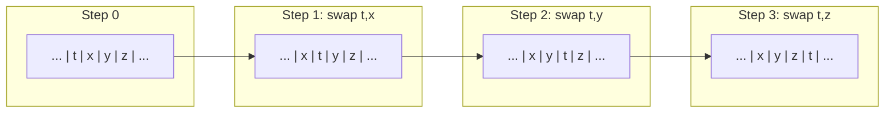

# 5. Conflict Serializability

This section establishes the main serializability theorem: if the full-conflict precedence graph of a committed history is acyclic, then *all* conflict-respecting permutations of that history produce the same core state. We call this the *universal diamond property*, which is strictly stronger than the existential property that *some* serial order agrees. The proof proceeds by a constructive bubble-sort argument. All results are mechanized in `StarstreamPilot.lean`.

## 5.1 Precedence Graph and Conflict Relations

*Running example.* If two loan liquidation transactions target the same collateral UTxO, they conflict on that UTxO's identity (both list it in their input sets). The precedence graph would contain an edge from whichever committed first to the other. Acyclicity of this graph guarantees that the final ledger state is the same regardless of which committed first.

**Definition 5.1 (Conflicts).** Two transactions conflict if they have overlapping read/write sets:
$$\mathit{conflicts}(t_1, t_2) \iff (t_1.\mathit{writeSet} \cap t_2.\mathit{readSet}) \neq \emptyset \;\lor\; (t_1.\mathit{readSet} \cap t_2.\mathit{writeSet}) \neq \emptyset \;\lor\; (t_1.\mathit{writeSet} \cap t_2.\mathit{writeSet}) \neq \emptyset$$

Here $\mathit{readSet}$ and $\mathit{writeSet}$ are *declared* fields on the `Tx` structure (Definition 3.4); the conflict relation operates on these declared sets rather than on dynamically observed access patterns. In the Lean mechanization, we do not enforce any link between $\mathit{writeSet}$ and $\mathit{inputs}/\mathit{outputs}$; treating $\mathit{writeSet}$ as $\mathit{inputs} \cup \mathit{outputs}$ is a modeling assumption used in the paper's narrative, not a derived fact of the core proofs. For UTxO-style validators, purity supports the interpretation of $\mathit{readSet}$ as a snapshot of immutable UTxOs, but the mechanized model still treats it as declared.

**Definition 5.2 (Full Conflicts).** The symmetric, comprehensive conflict relation includes all pairwise resource overlaps:
$$\mathit{fullConflicts}(t_1, t_2) \iff \mathit{conflicts}(t_1, t_2) \lor \mathit{conflicts}(t_2, t_1) \lor (t_1.\mathit{outputs} \cap t_2.\mathit{inputs}) \neq \emptyset \lor (t_2.\mathit{outputs} \cap t_1.\mathit{inputs}) \neq \emptyset \lor (t_1.\mathit{outputs} \cap t_2.\mathit{outputs}) \neq \emptyset$$

**Theorem 5.1 (Symmetry).** $\mathit{fullConflicts}(t_1, t_2) \implies \mathit{fullConflicts}(t_2, t_1)$. *(Mechanized: `fullConflicts_symm`.)*

**Definition 5.3 (Precedence).** For a history $\mathit{hist}$, define $\mathit{before}(\mathit{hist}, t_1, t_2) \iff \mathit{idxOf}(t_1) < \mathit{idxOf}(t_2)$ and:
$$\mathit{fullPrecEdge}(\mathit{hist}, t_1, t_2) \iff \mathit{before}(\mathit{hist}, t_1, t_2) \wedge \mathit{fullConflicts}(t_1, t_2)$$

**Definition 5.4 (Acyclicity).** $\mathit{fullPrecGraphAcyclic}(\mathit{hist}) \iff \forall t.\; \neg\, \mathit{TransGen}(\mathit{fullPrecEdge}(\mathit{hist}))(t, t)$.

## 5.2 Core State Abstraction and Commutativity

The key insight enabling serializability proofs is to project away the history from the ledger, yielding a *core state* where non-conflicting commits can be shown to commute.

**Definition 5.5 (Core State).** $\mathit{CoreState} = (\mathit{utxos} : \mathcal{P}_{\text{fin}}(\mathit{UTXOId}),\; \mathit{consumed} : \mathcal{P}_{\text{fin}}(\mathit{UTXOId}))$. The projection $\mathit{coreOf}(L) = (L.\mathit{utxos}, L.\mathit{consumed})$ extracts core state from a ledger.

**Definition 5.6 (Core Commit).** $\mathit{applyCoreCommit}(s, \mathit{tx}) = ((s.\mathit{utxos} \setminus \mathit{tx.inputs}) \cup \mathit{tx.outputs},\; s.\mathit{consumed} \cup \mathit{tx.inputs})$.

**Theorem 5.2 (Core Commutativity).** Non-conflicting transactions commute at the core state level:
$$\neg\,\mathit{fullConflicts}(t_1, t_2) \implies \mathit{applyCoreCommit}(\mathit{applyCoreCommit}(s, t_1), t_2) = \mathit{applyCoreCommit}(\mathit{applyCoreCommit}(s, t_2), t_1)$$

*Proof sketch.* Since $t_1$ and $t_2$ do not fully conflict, from the five negated disjuncts we extract in particular: $t_1.\mathit{outputs} \cap t_2.\mathit{inputs} = \emptyset$ and $t_2.\mathit{outputs} \cap t_1.\mathit{inputs} = \emptyset$. The proof then proceeds by extensional reasoning on `Finset` membership for both the `utxos` and `consumed` components of `CoreState`. For `utxos`, the key is that $(A \setminus B_1) \cup C_1) \setminus B_2) \cup C_2 = ((A \setminus B_2) \cup C_2) \setminus B_1) \cup C_1$ when $C_1 \cap B_2 = \emptyset$ and $C_2 \cap B_1 = \emptyset$. For `consumed`, union is commutative and associative. *(Mechanized: `core_commute`, StarstreamPilot.lean.)*

**Theorem 5.3 (Adjacent Swap).** Swapping adjacent non-conflicting transactions preserves core history:
$$\neg\,\mathit{fullConflicts}(t_1, t_2) \implies \mathit{applyCoreHistory}(s, \mathit{pre} \mathbin{+\!\!+} [t_1, t_2] \mathbin{+\!\!+} \mathit{suf}) = \mathit{applyCoreHistory}(s, \mathit{pre} \mathbin{+\!\!+} [t_2, t_1] \mathbin{+\!\!+} \mathit{suf})$$

*Proof.* Unfold `applyCoreHistory` as a left fold, factor through `pre`, apply `core_commute` at the pivot, then fold through `suf`. *(Mechanized: `core_swap_nonconflicting`.)*

## 5.3 Strong Serializability via Bubble-Sort

We now build the machinery to prove that *all* conflict-respecting permutations produce the same core state.

**Definition 5.7 (Conflict Equivalence).** The inductive relation $\mathit{ConflictEquiv}$ on transaction lists is generated by:
- $\mathit{refl}$: $\mathit{ConflictEquiv}(\ell, \ell)$
- $\mathit{swap}$: $\neg\,\mathit{fullConflicts}(t_1, t_2) \implies \mathit{ConflictEquiv}(\mathit{pre} \mathbin{+\!\!+} [t_1, t_2] \mathbin{+\!\!+} \mathit{suf},\; \mathit{pre} \mathbin{+\!\!+} [t_2, t_1] \mathbin{+\!\!+} \mathit{suf})$
- $\mathit{trans}$: $\mathit{ConflictEquiv}(\ell_1, \ell_2) \wedge \mathit{ConflictEquiv}(\ell_2, \ell_3) \implies \mathit{ConflictEquiv}(\ell_1, \ell_3)$

**Theorem 5.4 (Conflict Equivalence Preserves Core State).**
$$\mathit{ConflictEquiv}(\ell_1, \ell_2) \implies \mathit{applyCoreHistory}(s, \ell_1) = \mathit{applyCoreHistory}(s, \ell_2)$$

*Proof.* By induction on the derivation: `refl` is trivial; `swap` follows from `core_swap_nonconflicting`; `trans` is transitivity of equality. *(Mechanized: `conflict_equiv_same_core`.)*

**Lemma 5.5 (Bubble Past Suffix).** If $t$ does not fully conflict with any element of $\mathit{suf}$, then:
$$\mathit{ConflictEquiv}(\mathit{pre} \mathbin{+\!\!+} [t] \mathbin{+\!\!+} \mathit{suf},\; \mathit{pre} \mathbin{+\!\!+} \mathit{suf} \mathbin{+\!\!+} [t])$$

*Proof.* By induction on $\mathit{suf}$:
- Base ($\mathit{suf} = []$): trivial.
- Step ($\mathit{suf} = x :: \mathit{xs}$): first swap $t$ past $x$ (they don't conflict), then recursively bubble $t$ past $\mathit{xs}$ with prefix $\mathit{pre} \mathbin{+\!\!+} [x]$. Chain via transitivity.

*(Mechanized: `bubble_past_suffix`.)*

**Figure 8.** Bubble-sort swap illustration. Transaction $t$ does not conflict with $x$, $y$, or $z$, so iterated adjacent transpositions move $t$ past each non-conflicting neighbor while preserving core state at each step. This is the key inductive step in the strong serializability proof: any two conflict-respecting permutations can be connected by a sequence of such swaps.

**Definition 5.8 (Respects Conflict Order).**
$$\mathit{respectsConflictOrder}(\mathit{order}, \mathit{hist}) \iff \forall t_1, t_2.\; \mathit{fullConflicts}(t_1, t_2) \wedge \mathit{before}(\mathit{hist}, t_1, t_2) \implies \mathit{before}(\mathit{order}, t_1, t_2)$$

**Definition 5.9 (Strong Core Serializability).**
$$\mathit{strongCoreSerializable}(s_0, \mathit{hist}) \iff \forall \mathit{order}.\; \mathit{Perm}(\mathit{order}, \mathit{hist}) \wedge \mathit{respectsConflictOrder}(\mathit{order}, \mathit{hist}) \implies \mathit{applyCoreHistory}(s_0, \mathit{order}) = \mathit{applyCoreHistory}(s_0, \mathit{hist})$$

**Theorem 5.6 (Acyclic Implies Strong Serializability).** *Main theorem.*
$$\mathit{hist.Nodup} \wedge \mathit{fullPrecGraphAcyclic}(\mathit{hist}) \implies \mathit{strongCoreSerializable}(s_0, \mathit{hist})$$

*Proof.* By strong induction on $|\mathit{hist}|$ using `List.reverseRecOn`.

**Base case** ($\mathit{hist} = []$): any permutation of $[]$ is $[]$; trivial.

**Inductive case** ($\mathit{hist} = \mathit{init} \mathbin{+\!\!+} [t]$): given a conflict-respecting permutation $\mathit{order}$ of $\mathit{init} \mathbin{+\!\!+} [t]$:

1. **Locate $t$**: since $t \in \mathit{order}$, write $\mathit{order} = \mathit{pre} \mathbin{+\!\!+} [t] \mathbin{+\!\!+} \mathit{suf}$.

2. **Suffix is non-conflicting**: for each $x \in \mathit{suf}$, we have $\mathit{before}(\mathit{order}, t, x)$. If $\mathit{fullConflicts}(t, x)$ held, then by symmetry $\mathit{fullConflicts}(x, t)$, and since $x \in \mathit{init}$ (it's not $t$ due to Nodup) we would have $\mathit{before}(\mathit{hist}, x, t)$, so $\mathit{respectsConflictOrder}$ would force $\mathit{before}(\mathit{order}, x, t)$ --- contradicting $\mathit{before}(\mathit{order}, t, x)$. Hence $\neg\,\mathit{fullConflicts}(t, x)$ for all $x \in \mathit{suf}$.

3. **Bubble $t$ to end**: by Lemma 5.5, $\mathit{ConflictEquiv}(\mathit{order}, \mathit{pre} \mathbin{+\!\!+} \mathit{suf} \mathbin{+\!\!+} [t])$.

4. **Core state equivalence**: by Theorem 5.4, $\mathit{applyCoreHistory}(s_0, \mathit{order}) = \mathit{applyCoreHistory}(s_0, \mathit{pre} \mathbin{+\!\!+} \mathit{suf} \mathbin{+\!\!+} [t])$.

5. **Apply IH**: $\mathit{pre} \mathbin{+\!\!+} \mathit{suf}$ is a permutation of $\mathit{init}$ that respects its conflict order. By the induction hypothesis, $\mathit{applyCoreHistory}(s_0, \mathit{pre} \mathbin{+\!\!+} \mathit{suf}) = \mathit{applyCoreHistory}(s_0, \mathit{init})$.

6. **Chain**: $\mathit{applyCoreHistory}(s_0, \mathit{order}) = \mathit{applyCoreHistory}(s_0, \mathit{pre} \mathbin{+\!\!+} \mathit{suf} \mathbin{+\!\!+} [t]) = \mathit{applyCoreHistory}(\mathit{applyCoreHistory}(s_0, \mathit{pre} \mathbin{+\!\!+} \mathit{suf}), [t]) = \mathit{applyCoreHistory}(\mathit{applyCoreHistory}(s_0, \mathit{init}), [t]) = \mathit{applyCoreHistory}(s_0, \mathit{init} \mathbin{+\!\!+} [t])$.

*(Mechanized: `acyclic_strong_serializable`, StarstreamPilot.lean. Line counts are measured from the Lean source file and include the theorem statement, all tactic blocks, and auxiliary `have`/`suffices` steps within the proof body.)*

**Corollary 5.7 (Strong Serializability from Ledger Invariant).**
Since $\mathit{ledgerInvariant}(L)$ includes history nodup, we can state the corollary without an extra hypothesis:
$$\mathit{ledgerInvariant}(L) \implies \mathit{strongCoreSerializable}(\mathit{coreOf}(L_0), L.\mathit{history})$$
*(Mechanized: `acyclic_precgraph_strong_serializable`.)*

The universal diamond property: the committed history's core state is an invariant of the conflict-order class. Any two conflict-respecting serializations produce identical UTxO and consumed sets. By contrast, classical conflict serializability only asserts the existence of *some* equivalent serial order.
