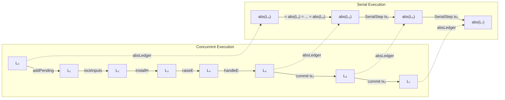

# 6. MPST-to-Ledger Bridge

This section connects the MPST coordination layer (Section 3) to the ledger commit mechanism (Section 4) through trace consistency, coordination witnesses, and a concurrent-to-serial refinement theorem.

## 6.1 Trace Consistency and Cross-Role Reconstruction

A central question is: can shard-local verification (checking each role's local trace) reconstruct the global trace consistency needed for commit? We formalize this via two notions.

**Definition 6.1 (Before).** $\mathit{Before}(\mathit{tr}, a, b) \iff \exists \ell_1, \ell_2.\; \mathit{tr} = \ell_1 \mathbin{+\!\!+} [a] \mathbin{+\!\!+} \ell_2 \wedge b \in \ell_2$.

**Definition 6.2 (Trace Consistency).** A trace $\mathit{tr}$ is *consistent* with script $S$, written $S.\mathit{traceConsistent}(\mathit{tr})$, if:
1. $\mathit{tr}$ is duplicate-free ($\mathit{tr.Nodup}$)
2. All events in $\mathit{tr}$ are in $S.\mathit{events}$
3. No event in $\mathit{tr}$ conflicts with any other event in $\mathit{tr}$ (pairwise $\neg(e \mathbin{\#} f) \wedge \neg(f \mathbin{\#} e)$)
4. For every order edge $e' < e$ with $e \in \mathit{tr}$, either $e'$ is already executed (in the accumulated configuration) or $\mathit{Before}(\mathit{tr}, e', e)$

We now introduce a second property, *cross-role consistency*, that together with local conformance (Definition 3.17) enables shard-local reconstruction of global traces (Theorem 6.1). Intuitively, this property ensures that events visible to disjoint role sets can be ordered consistently across shards without requiring global communication.

**Verification protocol.** In the S-BAC architecture, cross-role consistency is checked during the prepare phase. Each shard verifies local conformance for its own roles (Definition 3.17). The cross-role consistency property (Definition 6.3 below) is ensured by the coordination witness attached to the transaction: the IVC proof certifies that the trace was produced by a valid PTB execution, and Theorem 3.10 (`crossRoleSafe_of_access`) guarantees that conflicting commands always share at least one role. Together, these ensure that the only ordering constraints between disjoint-role events are causal dependencies, which are witnessed by the trace order itself. No additional inter-shard communication is needed beyond the S-BAC prepare/commit protocol.

**Definition 6.3 (Cross-Role Consistency).** A trace $\mathit{tr}$ is *cross-role consistent* if:
1. Events with disjoint role sets do not conflict: $\mathit{disjointRoles}(e, f) \implies \neg(e \mathbin{\#} f) \wedge \neg(f \mathbin{\#} e)$
2. Order between disjoint-role events is witnessed: $\mathit{disjointRoles}(e', e) \wedge e' < e \wedge e \in \mathit{tr} \implies \mathit{Before}(\mathit{tr}, e', e)$

**Theorem 6.1 (Local + Cross-Role $\Rightarrow$ Global Consistency).**
$$\mathit{WF}(S) \wedge \mathit{tr.Nodup} \wedge (\forall r \in S.\mathit{roles}.\; \mathit{localConform}(S, r, \mathit{traceProj}(S, r, \mathit{tr}))) \wedge \mathit{crossRoleConsistent}(S, \mathit{tr}) \implies S.\mathit{traceConsistent}(\mathit{tr})$$

*Proof sketch.* The main challenge is establishing pairwise conflict-freedom and order-respect in the global trace from local and cross-role evidence.

For *conflict-freedom*: given events $a, b$ in $\mathit{tr}$, either they share a role or have disjoint roles. If disjoint, cross-role consistency directly gives $\neg(a \mathbin{\#} b)$. If they share a role $r$, then $a$ and $b$ both appear in $\mathit{traceProj}(S, r, \mathit{tr})$, and $a$ precedes $b$ in the projected trace. Local conformance for $r$ implies the local trace is conflict-free, so $\neg(b \mathbin{\#} a)$ in the local script, which lifts to $\neg(b \mathbin{\#} a)$ globally (since local conflict is the restriction of global conflict). Symmetry gives the other direction.

For *order-respect*: given $e' < e$ with $e \in \mathit{tr}$, again case-split on whether $e'$ and $e$ share a role. If disjoint, cross-role consistency provides $\mathit{Before}(\mathit{tr}, e', e)$. If shared via role $r$, both events are relevant to $r$, so the order edge projects to the local script, and local trace validity (all predecessors present) ensures $e'$ appears before $e$ in the projected trace, which lifts to the global trace via `before_of_filter`.

*(Mechanized: `traceConsistent_of_local_and_cross`, Script.lean.)*

**Theorem 6.2 (Consistent Implies Valid Trace).** $S.\mathit{traceConsistent}(\mathit{tr}) \implies S.\mathit{validTrace}(\mathit{tr})$.

*Proof.* By induction on $\mathit{tr}$, converting consistency evidence into enablement at each step: predecessors present (from order-respect), no conflicts (from pairwise conflict-freedom), event membership (from events check). *(Mechanized: `traceConsistent_implies_validTrace`.)*

## 6.2 Coordination Witness and Commit

The SBAC bridge layer connects coordination witnesses to ledger commit guards.

**Theorem 6.3 (Bidirectional Witness Theorems).**
1. $\mathit{witnessGlobalOK}(W) \implies \mathit{witnessLocalOK}(W)$ *(top-down: global conformance projects to local)*
2. $\mathit{WF}(W.\mathit{script}) \wedge \mathit{witnessConsistent}(W) \implies \mathit{witnessGlobalOK}(W)$ *(bottom-up: local consistency reconstructs global)*

These are the two directions of the bridge:
- **Top-down** (Theorem 3.12): a globally valid witness can be verified shard-locally. This enables the S-BAC architecture where each shard checks only its roles.
- **Bottom-up** (Theorem 3.13): if the witness trace is consistent (which can be checked by combining local conformance with cross-role evidence), global conformance follows.

**Theorem 6.4 (Coordinated Commit Implies Local Commit).**
$$\mathit{coordCommitEnabled}(m, L, \mathit{ctx}) \implies \mathit{coordCommitEnabledLocal}(m, L, \mathit{ctx})$$

This justifies the S-BAC architecture: if the global commit guard passes, then every shard's local check also passes. *(Mechanized: `coordCommitEnabledLocal_of_global`.)*

**Cross-shard deadlock.** The S-BAC protocol is deadlock-free by construction: each transaction is submitted to all relevant shards simultaneously during the prepare phase, and shards respond independently with prepare-ok or abort. There is no circular wait because shards do not hold resources across transactions --- a shard either prepares (tentatively accepting) or aborts, and the final commit/abort decision is made by the coordinator after collecting all shard responses. If any shard aborts, all shards abort. The formalization models this as a single global commit predicate (`coordCommitEnabled`) that requires all shard-local checks to pass; the two-phase structure of the network protocol is not formalized, but the absence of cross-shard lock holding eliminates the precondition for deadlock.

## 6.3 Concurrent-to-Serial Refinement

We prove that the concurrent ICE-UTxO semantics refines a serial specification where transactions commit atomically one at a time.

**Definition 6.4 (Serial Step).** A serial step atomically commits a proof-verified, valid transaction:
$$\mathit{SerialStep}(m, L, L') \iff \exists \mathit{tx}.\; \mathit{allProofsVerified}(\mathit{tx}) \wedge \mathit{validTx}(L, \mathit{tx}) \wedge \mathit{tx.phase} = \text{Committing} \wedge L' = \mathit{applyCommit}(L, \mathit{tx})$$

**Definition 6.5 (Abstraction Map).** The abstraction map projects concurrent state to serial state by zeroing out concurrency-control fields:
$$\mathit{absLedger}(L) = L[\mathit{locked} := \emptyset,\; \mathit{pending} := \emptyset,\; \mathit{effects} := \lambda\_.\, [],\; \mathit{handlerStacks} := \lambda\_.\, []]$$

**Definition 6.6 (Stuttering).** A step is *stuttering* if $\mathit{absLedger}(L) = \mathit{absLedger}(L')$. Stuttering steps change only the concurrency-control fields (locks, pending set, effects, handlers) without modifying the core UTxO/consumed/history state.

**Theorem 6.5 (Concurrent Refines Serial).**
$$\mathit{Steps}(m, L_0, L_n) \wedge \mathit{ledgerInvariant}(L_0) \implies \mathit{SerialSteps}(m, \mathit{absLedger}(L_0), \mathit{absLedger}(L_n))$$

*Proof.* By induction on the `Steps` derivation. At each step, apply `step_preserves_invariant` to maintain the invariant for the induction hypothesis. Then case-split on the step constructor:

- **Stuttering cases** (7 of 8): `addPending`, `lockInputs`, `abort`, `installH`, `uninstallH`, `raiseE`, `handleE`. Each has a dedicated lemma showing $\mathit{absLedger}(L) = \mathit{absLedger}(L')$. The serial trace is unchanged.
- **Visible case** (1 of 8): `commit`. The commit step produces a `SerialStep` in the abstract trace. We construct it from the commit preconditions: $\mathit{allProofsVerified}$, $\mathit{validTx}$ (which transfers through the abstraction), phase = Committing, and $\mathit{absLedger}(\mathit{applyCommit}(L, \mathit{tx})) = \mathit{applyCommit}(\mathit{absLedger}(L), \mathit{tx})$.

*(Mechanized: `concurrent_refines_serial`, StarstreamPilot.lean.)*

**Figure 9.** Refinement diagram showing how concrete concurrent steps (top) map to abstract serial steps (bottom) via the abstraction function $\mathit{absLedger}$. Non-commit steps are stuttering (the abstract state is unchanged), while commit steps produce visible `SerialStep` transitions. This stuttering simulation is the basis of Theorem 6.5, which establishes that every concurrent execution refines the serial specification.

**Theorem 6.6 (Circuit Witness Implies Serial Step).**
$$\mathit{refinementWitness}(m, L, \mathit{tx}) \implies \mathit{SerialStep}(m, L, \mathit{applyCommit}(L, \mathit{tx}))$$

This connects the IVC circuit layer to serializability: a transaction with a valid circuit witness (all proofs verified, all proofs well-formed, valid transaction, correct phase) produces a valid serial step. *(Mechanized: `circuit_witness_implies_serial_step`.)*
