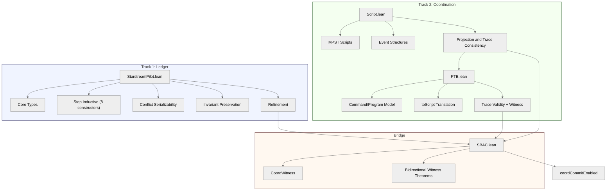

# 7. Lean Mechanization

The formal development accompanying this paper comprises about 4,500 lines of Lean 4 across eleven source files (including `test_axioms.lean`) plus `lakefile.lean`. The core ICE-UTxO mechanization mirrors the two-track architecture (ledger + coordination) with a small SBAC bridge, and a separate Oracle track formalizes the proof-verification oracle. The mechanization serves two purposes: it provides machine-checked evidence that the core safety properties hold without hidden assumptions, and it stress-tests the model by forcing every case split, every commutativity argument, and every invariant-preservation step through Lean's kernel. This section describes the architecture of the development, catalogs the principal theorems, reports quantitative metrics, and reflects on what the mechanization effort revealed about the model itself.

### 7.1 Architecture

#### File Structure

The Lean development is organized into four core files plus an Oracle subtrack:

1. **`StarstreamPilot.lean`** -- The main concurrent ledger model. This file defines the core types (`Tx`, `Ledger`, `Effect`, `Handler`, `ProofCommitment`), the state-update functions, the `Step` inductive type with eight constructors spanning the full transaction lifecycle, the precedence and conflict graphs, the `CoreState` abstraction, and all ledger-level theorems including conflict serializability, invariant preservation, and the refinement theorem relating concurrent and serial executions.

2. **`Starstream/Coordination/Script.lean`** -- The MPST coordination layer. This file introduces `Action` and `LocalAction` types, the `Script` and `LocalScript` structures, event-structure semantics (configurations, enablement, traces), the projection function from global to local scripts, and the trace-consistency theorems that guarantee cross-role coherence.

3. **`Starstream/Coordination/PTB.lean`** -- The PTB compilation layer. This file defines the `Command` and `Program` structures, four dependency relations (`dataDep`, `utxoDep`, `handlerDep`, `explicitConflict`), the derived `orderRel` and `conflictRel`, the `toScript` translation from programs to event structures, and the correctness theorems: `toScript_wellFormed` (compilation produces well-formed scripts), `validTrace_trace` and `validTrace_traceOf` (program-order traces are valid), `crossRoleSafe_of_access` (conflicting commands share roles), and `witnessGlobalOK_of` (well-formed programs produce valid coordination witnesses).

4. **`Starstream/Coordination/SBAC.lean`** -- The SBAC bridge connecting the two tracks. This file defines `CoordWitness`, the shard-local checking predicates, and the bidirectional witness theorems that allow global coordination guarantees to be decomposed into local shard checks and reconstructed.

5. **`Starstream/Oracle/*.lean`** -- The Oracle track. `Idealized.lean` and `API.lean` define an executable oracle model, while `Proofs/PhaseA-D.lean` contain correctness lemmas for the oracle phases. This track is currently independent of the ledger/coordination proofs.

The file `test_axioms.lean` exists solely to print axiom usage for audit, and `lakefile.lean` is the build configuration.

#### Two-Track Design

The mechanization follows a deliberate two-track architecture that separates concerns while providing a precise connection point:

**Track 1 (Ledger).** This track formalizes the transaction lifecycle from submission through proof verification, commit, and potential abort. The central objects are the `Step` inductive (eight constructors, one per state transition) and the six-part ledger invariant comprising no-double-spend, locked-subset-active, history nodup, committed-implies-verified, extended precedence acyclicity, and full precedence acyclicity. The culminating results are `step_preserves_invariant` (every step maintains the invariant) and `concurrent_refines_serial` (the concurrent execution model refines a serial specification via stuttering simulation).

**Track 2 (Coordination).** This track formalizes the MPST-based coordination protocol. Scripts describe the intended communication patterns among roles; event structures give a partial-order semantics to script execution; projection maps global scripts to local views; and trace consistency ensures that independently observed local traces are compatible with some global execution. The main results are `proj_localConform_of_globalConform` (projection preserves conformance) and `traceConsistent_of_local_and_cross` (local conformance plus cross-role consistency implies global consistency).

**Connection point.** The two tracks meet at the type `CoordTx`, which bundles a transaction `Tx` with a coordination witness `CoordWitness`. The predicate `coordCommitEnabled` requires *both* `commitEnabledStrong` (the ledger-track precondition: proof verification, transaction validity, phase/freshness checks, and mode-specific read/output constraints) *and* `witnessGlobalOK` (the coordination-track precondition: the witness certifies that all relevant roles have reached agreement per the MPST protocol). This decomposition is the formal embodiment of the paper's central claim: proof-carrying transactions require both computational correctness (via ZK proofs checked by the ledger) and coordination correctness (via session-typed protocols).

**Figure 10.** Module dependency graph of the Lean mechanization. Arrows indicate import dependencies; the absence of edges between Track 1 and Track 2 (except through the SBAC bridge) reflects the architectural separation that enabled independent development. The `coordCommitEnabled` predicate at the bottom is the sole point where both tracks' preconditions are conjoined. (The Oracle track is omitted for readability.)

### 7.2 Theorem Inventory

Table 1 catalogs the principal theorems in the development, grouped by track. The "Technique" column records the dominant proof strategy; in practice most proofs combine several techniques, but we report the one that required the most effort or ingenuity.

**Table 1.** Principal theorems in the Lean mechanization of ICE-UTxO, grouped by module.

| **Theorem** | **File** | **Statement (informal)** | **Technique** |
|---|---|---|---|
| `core_commute` | `StarstreamPilot` | Non-conflicting transactions commute at the `CoreState` level: if two transactions touch disjoint UTxO sets, applying them in either order yields the same core state. | Finset extensionality |
| `acyclic_strong_serializable` | `StarstreamPilot` | If the conflict graph over a set of committed transactions is acyclic, then *all* conflict-respecting permutations yield the same `CoreState`. | Bubble-sort induction |
| `commit_requires_proof` | `StarstreamPilot` | Only proof-verified transactions can extend the committed history; no `Step` constructor permits a commit without the proof-verified flag being set. | 8-way case analysis on `Step` |
| `step_preserves_invariant` | `StarstreamPilot` | Every `Step` constructor preserves the six-part ledger invariant (no double-spend, locked-subset-active, history nodup, committed-implies-verified, extended precedence acyclicity, full precedence acyclicity). | Floyd-Hoare-style case analysis |
| `concurrent_refines_serial` | `StarstreamPilot` | The concurrent execution model (arbitrary interleaving of `Step` transitions) refines the serial specification (one transaction at a time, in conflict-compatible order). | Stuttering simulation |
| `commit_preserves_no_double_spend` | `StarstreamPilot` | After a commit step, no UTxO is consumed by two distinct committed transactions. | Finset resource accounting |
| `proj_localConform_of_globalConform` | `Script` | If a global trace conforms to a global script, then its projection to any role conforms to the corresponding local script. | Structural induction on projection |
| `traceConsistent_of_local_and_cross` | `Script` | If each role's local trace conforms to its local script, and cross-role consistency holds at every shared synchronization point, then there exists a global trace consistent with the global script. | Decidable case split (localized `classical`) |
| `toScript_wellFormed` | `PTB` | If a PTB program satisfies role and role-kind conditions, the induced event-structure script is well-formed. Acyclicity follows from the $i < j$ constraint in `orderRel`. | 7-way predicate decomposition |
| `validTrace_trace` | `PTB` | The full program-order trace $[0, \ldots, n{-}1]$ is a valid trace of the induced script when the program has no conflicts. | Induction on program length |
| `witnessGlobalOK_of` | `PTB` | A well-formed, conflict-free PTB program produces a globally valid coordination witness (well-formed script + valid trace). | Composition of `toScript_wellFormed` and `validTrace_traceOf` |
| `witnessLocalOK_of_global` | `SBAC` | A globally valid coordination witness projects to a locally valid witness at every shard. | Direct from projection definition |
| `witnessGlobalOK_of_local_and_consistent` | `SBAC` | If each shard's local witness is valid and the witnesses are mutually consistent (well-formedness), then the global witness is valid. | Direct from consistency theorem |
| `commit_adds_to_history` | `StarstreamPilot` | After a commit step, the committed transaction appears in the history. | Simplification on `applyCommit` |
| `abort_removes_from_pending` | `StarstreamPilot` | After an abort step, the aborted transaction is no longer in the pending set. | Simplification on `applyAbort` |
| `handleEffect_decreases_effects` | `StarstreamPilot` | Each effect-handling step strictly decreases the effect queue length for the target interface (variant function for L3). | Case analysis on `handleEffect` |

Several entries in Table 1 deserve further comment. The theorem `acyclic_strong_serializable` is the strongest serializability result in the development. An earlier version, `coreSerializable`, established serializability using the identity permutation -- a statement that, while technically correct, is vacuously easy to prove and does not capture the intended guarantee that *all* conflict-compatible orderings agree. Community review identified this weakness. The replacement proof proceeds by bubble-sort induction: given any two conflict-respecting permutations, one can be transformed into the other by a sequence of adjacent transpositions of non-conflicting transactions, each of which preserves `CoreState` by `core_commute`. This argument required approximately 400 lines of auxiliary lemmas establishing properties of adjacent transpositions on lists, the well-foundedness of the bubble-sort measure, and the lifting of pairwise commutativity to global state equivalence.

The theorem `traceConsistent_of_local_and_cross` is notable for being a point where classical reasoning might seem necessary: one must decide, for each synchronization point, which roles participate. In practice, this case split is decidable (role sets are finite); the proof uses a single localized `classical` invocation to discharge the split and does not introduce `Classical.choice`. This is consistent with the broader constructivity discipline discussed in Section 7.3.

The liveness support lemmas (`commit_adds_to_history`, `abort_removes_from_pending`, `handleEffect_decreases_effects`, and four others) provide the finite-state foundations for the conditional liveness arguments in Section 4.6. They are single-step lemmas about enabledness and state effects, requiring no temporal logic or coinduction. The liveness theorems themselves are paper-level arguments that combine these mechanized lemmas with fairness assumptions (Section 4.6.1).

**TLA+ specification.** A parallel TLA+ specification (~4,600 lines across 18 modules) provides a complementary formal artifact. The TLA+ model defines 47 named safety invariants and 3 liveness properties (`LIVE_TxEventuallyTerminates`, `LIVE_EffectsEventuallyHandled`, `LIVE_CanReturnToIdle`), validated by TLC model checking on bounded instances under weak and strong fairness conditions. The TLA+ and Lean artifacts are cross-referenced in Section 4.6: Lean provides universal proofs of the supporting lemmas, while TLA+ validates the complete liveness properties on finite instances with explicit fairness.

The bridge theorems `witnessLocalOK_of_global` and `witnessGlobalOK_of_local_and_consistent` are deliberately short -- each is a direct consequence of the projection and consistency definitions, respectively. Their brevity is a feature, not a deficiency: it indicates that the two-track decomposition aligns with the natural structure of the model, so that the connection point requires minimal proof effort.

### 7.3 Lessons Learned

#### What Worked Well

**Constructivity discipline.** The development avoids `Classical.choice` and keeps classical reasoning isolated: a single local `classical` invocation appears in `Script.lean` (line 622) to split on finite role sets. This was a deliberate design choice that required care at several points -- particularly in conflict-graph reasoning, where case splits on whether two transactions conflict must be resolved by decidability instances on finite sets rather than by appeal to the law of excluded middle. The payoff is twofold: most theorems in the development have computational content in principle, and the axiom footprint is minimal (only the three standard Lean axioms: `propext`, `Quot.sound`, `funext`).[^classical]

[^classical]: The lone `classical` block in `Script.lean` (line 622) discharges a decidable case split over finite role sets. It does not introduce `Classical.choice` into the axiom footprint.

**The two-track architecture.** Separating ledger semantics from coordination semantics and connecting them through a narrow bridge (`CoordTx` and `coordCommitEnabled`) proved highly effective for managing proof complexity. Each track could be developed and debugged independently; changes to the event-structure semantics in Track 2 did not require re-checking any ledger proofs in Track 1, and vice versa. The bridge theorems are short and direct, which is a sign that the decomposition is natural rather than forced.

**Bubble-sort serializability.** The decision to prove strong serializability via bubble-sort induction, rather than relying on a topological-sort argument, produced a proof that is both more constructive and more informative. The bubble-sort proof explicitly constructs the sequence of transpositions witnessing state equivalence, whereas a topological-sort argument would merely assert the existence of a compatible linear order. The roughly 400 lines of auxiliary infrastructure (transposition lemmas, measure functions, induction principles for list permutations) are reusable and may be of independent interest for other conflict-serializability proofs in Lean.

#### Challenges

**The identity-permutation false start.** The most instructive episode in the mechanization was the initial `coreSerializable` theorem, which stated serializability using the identity permutation. The theorem was technically true and Lean accepted it without complaint, but it failed to capture the intended semantic guarantee. This illustrates a well-known hazard of mechanized verification: the type-checker guarantees that the proof is correct, but it cannot guarantee that the *statement* is the right one. Adversarial review -- whether by human experts or by structured rubric -- remains essential for catching specification-level errors that mechanical verification alone cannot detect.

**Nat-aliased identifiers.** All identifier types (`TxId`, `UTxOId`, `RoleId`, `ShardId`, etc.) are defined as `abbrev Nat`, which means Lean's type system does not distinguish them. A `TxId` can be silently used where a `UTxOId` is expected without any type error. This has no effect on the soundness of the existing proofs, but it weakens the specification's ability to catch modeling errors during development. Refactoring to use opaque types or newtypes is planned for a future revision.

**Floyd-Hoare case analysis at scale.** The proof of `step_preserves_invariant` requires analyzing each of the eight `Step` constructors against each of the six invariant conjuncts, yielding 48 proof obligations. While each obligation is individually straightforward, managing the combinatorial explosion required careful use of Lean's tactic combinators and occasional manual intervention. A more structured approach using a custom tactic framework for state-machine invariants would reduce this burden in future work.

### 7.4 Limitations

The mechanization has several known limitations that bound the strength of the guarantees it provides:

1. **ZK circuit soundness is assumed.** The predicate `allProofsVerified` is an oracle: it checks a phase flag set by an external ZK verifier, but the soundness of the ZK verification circuit itself is not modeled or proved. The mechanization establishes a conditional guarantee: *if* the external verifier is sound, *then* the ledger satisfies its safety properties.

2. **Phase transitions are not enforced in Step constructors.** The `Step` inductive defines eight constructors but does not enforce that transitions occur in the correct order. A more refined encoding using indexed inductive families would close this gap.

3. **Liveness and progress.** The mechanization provides finite-state supporting lemmas for the conditional liveness arguments in Section 4.6 (enabledness, step effects, variant functions), but the liveness theorems themselves are paper-level arguments. Full mechanization of temporal liveness --- requiring coinductive trace reasoning or a temporal logic embedding in Lean 4 --- remains future work.

4. **No computational extraction.** All predicates are `Prop`-valued. While the proofs are constructive, extracting executable code would require refactoring to `Bool`-valued or `Decidable` predicates. This has not been attempted.

5. **No language semantics for coordination effects.** The coordination layer models scripts and traces at the ledger level but does not formalize the programming-language semantics of coroutines or channels. The mechanization proves properties of the *footprint* of coordination on the ledger, not of the coordination *implementation*.

### 7.5 Metrics

Table 2 summarizes the quantitative characteristics of the Lean development. Counts include `lakefile.lean` and `test_axioms.lean`.

**Table 2.** Quantitative metrics for the Lean mechanization. Line counts were obtained via `wc -l` on source files; declaration counts were obtained by grepping for `theorem`, `lemma`, `def`, `instance`, and `example` keywords at the declaration level. Approximate counts (indicated by ~) reflect that some inline declarations in `where` clauses may not be captured by simple keyword matching.

| **Metric** | **Value** |
|---|---|
| Total lines of Lean 4 | ~4,590 |
| Total declarations | ~312 |
| -- Theorems | ~102 |
| -- Lemmas | ~49 |
| -- Definitions | ~159 |
| -- Instances | 0 |
| -- Examples | 0 |
| `sorry` occurrences | 0 |
| Custom axioms | 0 |
| `Classical.choice` invocations | 0 |
| `classical` tactic uses | 1 (`Script.lean`:622) |
| Standard axioms used | `propext`, `Quot.sound`, `funext` |

The zero count for `sorry` (Lean's escape hatch for incomplete proofs) and for custom axioms means the entire development is kernel-checked end-to-end, with no admitted gaps. The zero count for `Classical.choice` is particularly noteworthy given that the development imports Mathlib, which makes classical reasoning freely available; the single `classical` use is a localized decidable split, and the rest of the development relies on explicit decidability instances.

The axiom footprint -- `propext` (propositional extensionality), `Quot.sound` (quotient soundness), and `funext` (function extensionality) -- constitutes the standard Lean 4 trusted base. These axioms are shared by every Lean development that uses the standard library; our mechanization adds nothing to the trusted computing base beyond what Lean itself assumes.

To provide a multi-dimensional assessment of the mechanization quality beyond what line counts and axiom audits can convey, we report grades from a structured multi-persona review process in which five expert personas evaluated the development along orthogonal axes.

**Table 3.** Proof quality assessment by reviewer dimension.

| **Reviewer Persona** | **Focus** | **Grade** |
|---|---|---|
| Proof Theorist | Logical structure, axiom discipline, constructivity | A- |
| Mathlib Veteran | Idiomatic Lean style, library integration, naming conventions | B |
| Adversarial Reviewer | Specification adequacy, vacuous-truth risks, coverage gaps | D+ |
| Formalization Expert | Architecture, modularity, proof engineering practices | B+ |
| Constructivist | Classical-logic avoidance, computational content | A- |
| **Overall** | | **B+** |

The high marks from the Proof Theorist and Constructivist personas reflect the development's strong axiom discipline and mostly constructive proofs (with one localized classical split). The Formalization Expert's B+ acknowledges the clean two-track architecture while noting the `Nat`-aliasing issue and the lack of custom tactic automation for repetitive invariant proofs. The Mathlib Veteran's B reflects that the development is largely self-contained rather than building extensively on Mathlib's algebraic or order-theoretic libraries -- a pragmatic choice given the domain-specific nature of the formalization, but one that limits reusability and may lead to duplicated proof infrastructure.

The Adversarial Reviewer's D+ is the most informative grade and merits direct discussion. It reflects several substantive concerns: the identity-permutation serializability theorem (since replaced, but indicative of ongoing specification risk), the oracle treatment of ZK verification, the absence of phase-transition enforcement at the type level, and the `Nat`-aliased identifiers that weaken the specification's self-checking capacity. These are genuine weaknesses, and we present this grade transparently rather than eliding it. We view the D+ not as an indictment of the mechanization but as evidence that adversarial review is effective at surfacing specification-level issues that mechanical verification alone cannot catch. The gap between "the proofs are correct" (which Lean's kernel guarantees) and "the theorems say what we mean" (which requires human judgment and domain expertise) is precisely where adversarial review adds irreplaceable value.

**Summary.** The Lean mechanization provides machine-checked evidence for the core safety properties of ICE-UTxO: proof-carrying commit, conflict serializability, invariant preservation, and the coordination-ledger bridge. The two-track architecture cleanly separates concerns and connects them through a narrow, well-defined interface. The development is largely constructive (one localized classical split), axiom-minimal, and free of escape hatches. Its principal limitations -- the oracle treatment of ZK soundness, the lack of phase-transition enforcement, and the absence of liveness guarantees -- are explicitly documented and represent well-scoped assumptions rather than overlooked gaps. Perhaps most valuably, the mechanization effort itself surfaced a specification error (the identity-permutation serializability statement) that was invisible to informal reasoning, underscoring the complementary roles of formal verification and adversarial review in establishing confidence in a complex system model.
