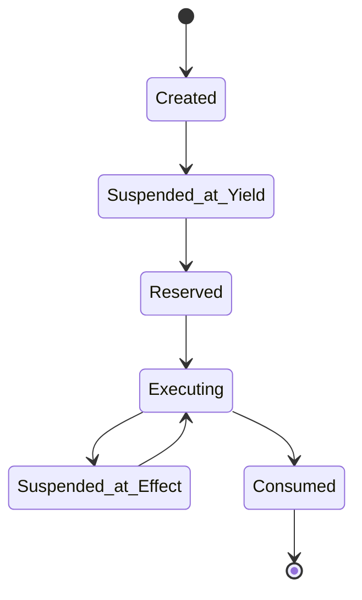

# Plan: Resolve All Feedback Issues in SPECIFICATION_DEEP_DIVE.md

## Overview

Address all 63 issues identified in `feedback.md` for the Starstream TLA+ specification deep dive document.

**Target File:** `tla/docs/SPECIFICATION_DEEP_DIVE.md` (1,198 lines)
**Reference:** `tla/docs/feedback.md` (619 lines)

---

## Phase 1: P0 Blocking Issues (4 items)

### 1.1 Add Continuation ID Security Requirements
**Location:** New Section 10.5 (after Section 10, ~line 300)

Add section covering:
- Minimum entropy requirement (128 bits)
- Required binding: `(utxoId, frameHash, chainId, nonce)`
- Collision resistance implications (birthday paradox)
- Implementation note: cryptographic commitment, not just PC value

### 1.2 Add Cross-Chain Trust Model
**Location:** New Section 24.5 (after Section 24, ~line 890)

Add section covering:
- Source chain finality requirements
- Relayer trust assumptions (honest majority vs trustless)
- Frame authentication requirements (proof of inclusion)
- Fork handling semantics

### 1.3 Add Timeout and Liveness Guarantees
**Location:** New Section 24.6 (after new 24.5)

Add section covering:
- Timeout mechanisms for locked UTXOs
- Recovery procedures for stalled effects
- Reference to liveness invariants in INVARIANTS.md
- Implementation guidance for timeout handlers

### 1.4 Add Effect Authorization Verification
**Location:** New Section 22.5 (after Section 22, ~line 834)

Add section covering:
- Handler authorization requirements
- Principle of least privilege for effect execution
- Cross-reference to INV_AUTH invariants

---

## Phase 2: P1 High Priority Issues (18 items)

### 2.1 Expand Glossary (6 → 25+ terms)
**Location:** Section 0.6, lines 26-44

Add terms organized by category:

**Verification Concepts:**
- TLC (TLA+ model checker tool)
- Model Checker / State Space
- Stuttering (no-op step)
- Weak Fairness / Strong Fairness
- Refinement / Refinement Mapping
- Invariant
- State Constraint

**TLA+ Syntax:**
- EXCEPT (record update syntax)
- Prime notation (next-state values)

**Protocol Concepts:**
- Frame Hash
- Program Counter (PC)
- Continuation ID
- Pending Effect
- Consumed Set / Live UTXO
- Token Bag / Balance Preservation
- Content-Bound Signature
- Model-Checking Bound

### 2.2 Enhance TLA+ Primer with Worked Examples
**Location:** Section 0.7, lines 46-66

Add:
- EXCEPT syntax explanation with example
- Line-by-line walkthrough of a simple invariant
- 5-10 line TLA+ snippet from spec with plain English explanation

### 2.3 Add Version/Date Metadata
**Location:** Document header (line 1)

Add YAML-style metadata:
```
---
Version: 1.0.0
Last Updated: 2026-01-26
Status: Draft
Specification Commit: [hash]
---
```

### 2.4 Fix Section Numbering
**Location:** Section 23.5 → renumber to Section 24

Renumber sections to eliminate x.5 numbering:
- Current 23.5 → 24 (Security Model)
- Current 24-27 → 25-28
- Update all internal references

### 2.5 Add Code Block Language Annotations
**Location:** Throughout document

Add ` ```tla ` annotations to all TLA+ code blocks for syntax highlighting.

### 2.6 Complete Part VI Instructions
**Location:** Section 28, lines 947-966

Add:
- Download link for tla2tools.jar
- Expected directory structure
- Sample successful output
- Expected timing guidance

### 2.7 Document Implementation Considerations
**Location:** New Section 27.5 (in Part V)

Add subsections for:
- Frame serialization constraints (which DatumValues are valid)
- Commit atomicity requirements (WAL guidance)
- Query concurrency semantics (snapshot isolation)
- Arithmetic precision (integer-only assumption)
- Transaction ID exhaustion handling

### 2.8 Add Nested Effect Trace Example
**Location:** Section 22, after effect handling description

Add worked example showing:
- Effect raised at PC=5
- Handler processes, raises nested effect
- Stack evolution diagram
- Resume sequence

---

## Phase 3: P2 Medium Priority Issues (26 items)

### 3.1 Restructure Part I
**Location:** Lines 1-136

Reorder for graduated disclosure:
1. What this document is (2-3 sentences)
2. Quick links / Reading paths
3. Prerequisites
4. Glossary (expanded)
5. TLA+ primer (enhanced)
6. Then philosophical context

### 3.2 Expand TOC with Subsections
**Location:** Lines 3-12

Add second-level headings to TOC, especially for Parts IV, V, VI.

### 3.3 Add State Machine Diagrams
**Location:** After Section 11 (UTXO states) and Section 13 (Tx phases)

Add Mermaid diagrams for:
- 6-state UTXO lifecycle
- 7-phase transaction lifecycle
- 5-phase coordination lifecycle

Example:


### 3.4 Add Reading Paths
**Location:** New section after TOC

Add table:
| Reader Type | Recommended Path | Skip |
|-------------|------------------|------|
| Auditor | Parts IV, V, Appendix | Part VI |
| Implementer | Parts II, III, VI | Part VII |
| Learner | Parts I, II in order | None |

### 3.5 Standardize Cross-References
**Location:** Throughout

Convert all references to consistent format:
- Internal: `[Section Name](#anchor)`
- External: `[FILENAME.md](FILENAME.md#section)`

### 3.6 Hyperlink External File References
**Location:** Lines referencing interleavingTypes.md, tlaplan.md, etc.

Add proper relative links.

### 3.7 Expand Appendix
**Location:** Lines 1145-1197

Add tables for:
- 6 UTXO states with descriptions
- 7 transaction phases with descriptions
- 5 coordination phases with descriptions
- Configuration constants with model vs production values

### 3.8 Add Invariant Prefix Category Table
**Location:** Before Part IV (after line 610)

| Prefix | Category | Purpose |
|--------|----------|---------|
| INV_TYPE_ | Structure | Well-formedness |
| INV_AUTH_ | Authorization | Owner/signature checks |
| INV_BALANCE_ | Token accounting | Conservation laws |
| INV_LINEAR_ | Linear types | No double-spend |
| INV_LOCK_ | Concurrency | Reservation integrity |
| INV_EFFECT_ | Effects | Handler correctness |
| INV_LIFECYCLE_ | States | Valid transitions |

---

## Phase 4: P3 Low Priority Issues (15 items)

### 4.1 Add Metaphors and Analogies
- Continuation as "bookmark"
- Effect handling as "async/await"
- Token bag as "multi-currency wallet"

### 4.2 Mark Advanced Sections
Add "(Advanced - Safe to Skip)" to:
- Section 36 (Serializable-trace refinement)
- Section 35 (Proof/MCC integration)

### 4.3 Add Glossary Cross-Links
First use of each term links to glossary: "(see [Glossary](#glossary))"

### 4.4 Improve Appendix Conciseness
Make Quick Reference one-liners with links to details.

---

## Verification

After implementation:
1. Verify all 4 P0 sections added with required content
2. Verify glossary has 25+ terms
3. Verify TLA+ primer has worked example
4. Verify all code blocks have ` ```tla ` annotation
5. Verify section numbering is sequential (no x.5)
6. Verify Mermaid diagrams render correctly
7. Verify all external links resolve
8. Check document still renders in markdown viewers

---

## Files to Modify

| File | Changes |
|------|---------|
| `SPECIFICATION_DEEP_DIVE.md` | All edits (primary target) |

## Files to Reference (read-only)

| File | Purpose |
|------|---------|
| `feedback.md` | Issue details and acceptance criteria |
| `INVARIANTS.md` | Cross-reference for effect/auth invariants |
| `USAGE.md` | Cross-reference for TLC instructions |
| `STATE_MACHINES.md` | Cross-reference for existing diagrams |
| `StarstreamTypes.tla` | Source for glossary terms |
| `StarstreamEffects.tla` | Source for continuation ID details |

---

## Estimated Scope

- **New content:** ~400-500 lines
- **Modifications:** ~100-150 lines
- **Final document:** ~1,600-1,700 lines
